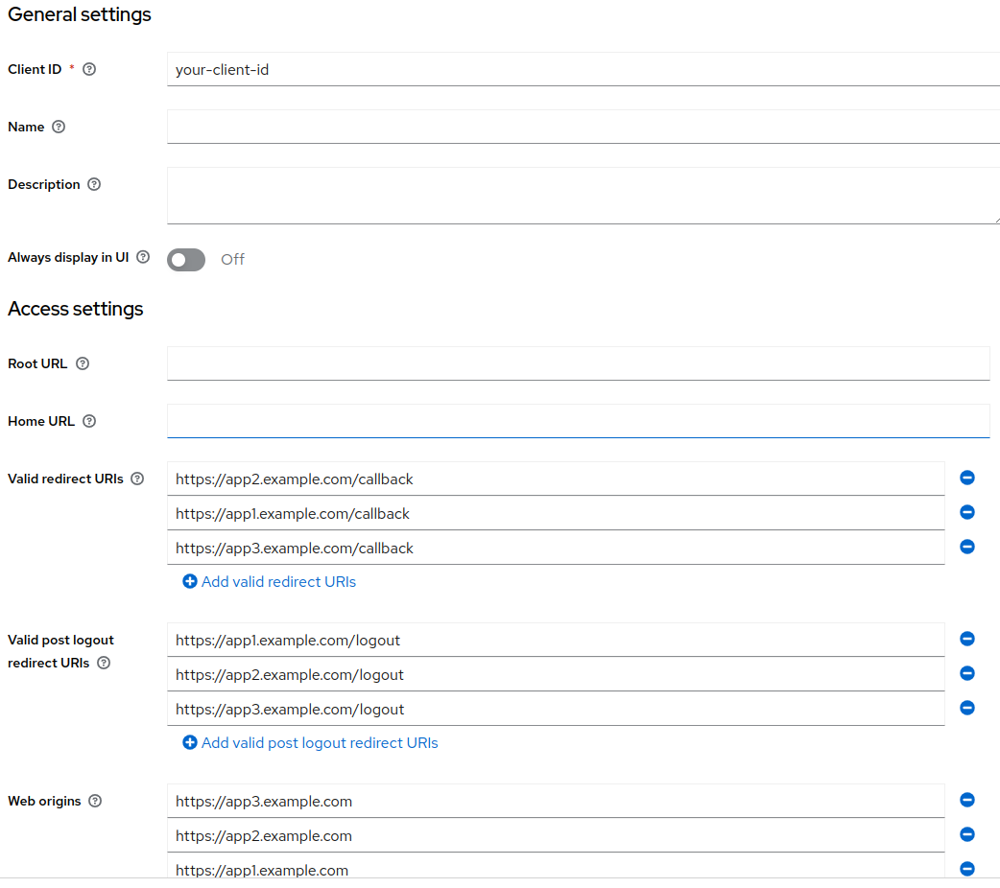

## Adding Multiple `post.logout.redirect.uris` in Keycloak Configuration.

To correctly import multiple `post.logout.redirect.uris`, you should use the `##` separators to concatenate URIs into a single string. Here's a step-by-step guide on how to do this:


### Open the Import File.

First, navigate to your JSON configuration file where the realm and clients are defined.

### Add Multiple Values for `post.logout.redirect.uris`.

In the attributes section where you want to add multiple `post.logout.redirect.uris`, ensure that you use the `##` separators. Here’s an example configuration:

Here is the syntax:

```json
"attributes": {
"post.logout.redirect.uris": "https://app1.example.com/logout##https://app2.example.com/logout##https://app3.example.com/logout"
},
```

This is a simple json example that can be used to see how it works.
```json
{
  "realm": "your-realm",
  "clients": [
    {
      "clientId": "your-client-id",
      "enabled": true,
      "redirectUris": [
        "https://app1.example.com/callback",
        "https://app2.example.com/callback",
        "https://app3.example.com/callback"
      ],
      "webOrigins": [
        "https://app1.example.com",
        "https://app2.example.com",
        "https://app3.example.com"
      ],
      "attributes": {
        "post.logout.redirect.uris": "https://app1.example.com/logout##https://app2.example.com/logout##https://app3.example.com/logout"
      },
      "protocol": "openid-connect",
      "publicClient": false,
      "standardFlowEnabled": true,
      "implicitFlowEnabled": false,
      "directAccessGrantsEnabled": true,
      "serviceAccountsEnabled": false,
      "authorizationServicesEnabled": false,
      "fullScopeAllowed": true
    }
  ]
}
```

In the above configuration, you specify multiple logout redirect URIs separated by `##`.

### Load the Configuration.

Once your configuration file is updated, load it into your Keycloak instance.

### Verify in the Keycloak Admin UI.


After loading the configuration, check the Keycloak Admin UI to verify that the `post.logout.redirect.uris` are correctly imported with multiple values. You should see the following URIs:

- `https://app1.example.com/logout`
- `https://app2.example.com/logout`
- `https://app3.example.com/logout`

### Conclusion

By following the above steps, you can successfully add multiple `post.logout.redirect.uris` in your Keycloak configuration. This approach ensures that all specified URIs are respected during logout redirection processes.

