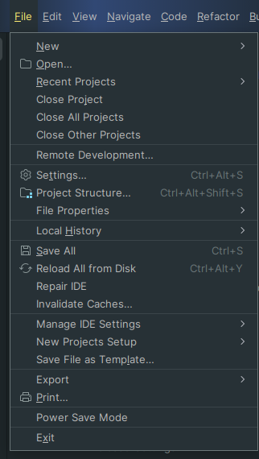
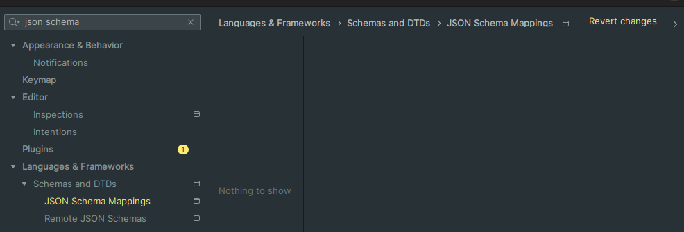
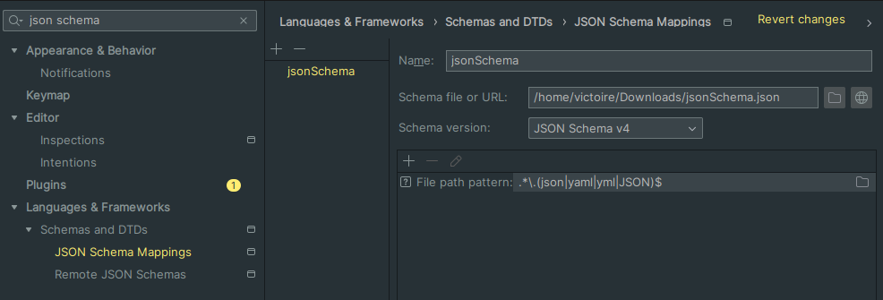
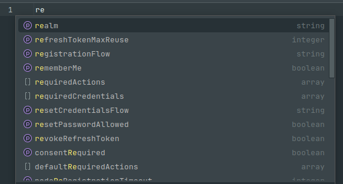

# Adding a JSON Schema Validator in IntelliJ

This guide walks you through the process of adding a JSON Schema validator in IntelliJ to enhance your JSON file validation and auto-completion.

### Step 1: Open IntelliJ Preferences
1. Open IntelliJ.
2. Navigate to **File > Settings** (or **IntelliJ IDEA > Preferences** on macOS).

### Step 2: Navigate to JSON Schema Settings
1. In the settings menu, search for **JSON Schema** in the search bar.
2. Click on **Languages & Frameworks > Schemas and DTDs > JSON Schema Mappings**.

### Step 3: Add a New JSON Schema
1. Click the **+** icon to add a new schema.
2. Choose **Schema File** and select one of the following options:
    - **From File**: If you have a local schema file, navigate to and select it.
    - **From URL**: If the schema is hosted online, enter the URL.
    - **Built-in Schema**: Select from IntelliJ's built-in options.

### Step 4: Map the Schema to Your Files
1. Under **Mapped Patterns**, click the **+** icon.
2. Add the file pattern or directory for which the schema should apply. For example, to apply the schema to all `config.json` files, add `config.json` as a pattern.
3. You can also use wildcard patterns like `.*\.(json|yaml|yml|JSON)$ ` or specify a folder like `src/config/*.json`.

### Step 5: Validate and Apply Changes
1. Click **OK** to save the schema configuration.
2. Open a JSON file to ensure IntelliJ is validating it against the schema. You should see:
    - Auto-completion suggestions.
    - Error messages for invalid fields or types.
   
