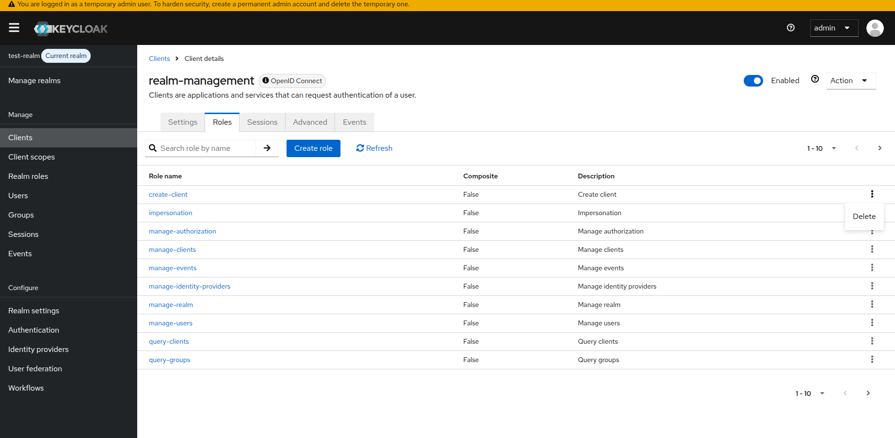
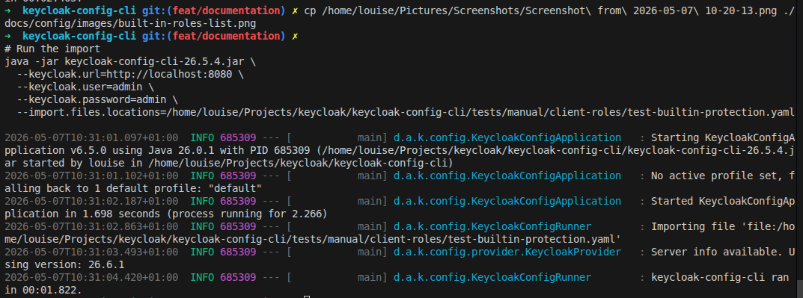
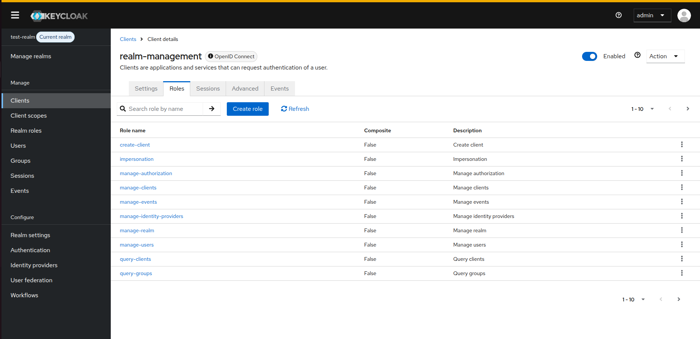
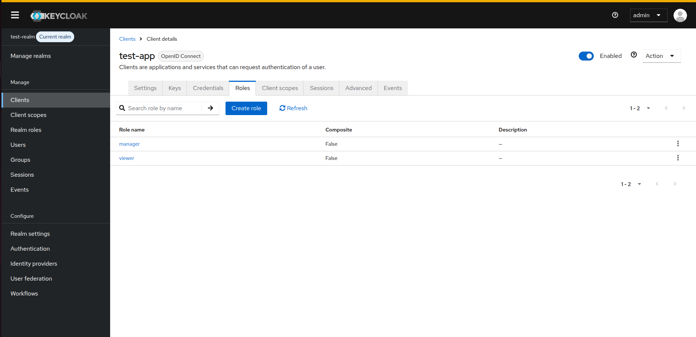

# Deleting Built-in Client Roles

When working with Keycloak clients, certain built-in roles are automatically created by Keycloak for specific client types. Understanding how keycloak-config-cli handles these built-in roles is important to avoid unexpected behavior during configuration imports.

Related issues: [#849](https://github.com/adorsys/keycloak-config-cli/issues/849)

## The Problem

Users often encounter confusion when trying to manage client roles because:
- Built-in roles are automatically created by Keycloak and cannot be deleted through standard configuration
- Attempting to remove built-in roles from configuration files doesn't delete them from Keycloak
- It's unclear which roles are built-in vs. custom
- The behavior differs between built-in and custom roles

## What Are Built-in Client Roles?

Built-in client roles are automatically created by Keycloak for certain clients, particularly:
- **realm-management client**: Contains roles like `view-users`, `manage-users`, `view-clients`, `manage-clients`, etc.
- **account client**: Contains roles like `manage-account`, `view-profile`
- **broker client**: Contains roles for identity brokering

These roles are restricted in `keycloak-config-cli` for safety reasons and are not deleted during configuration imports, although Keycloak itself does allow for their deletion directly through its Admin Console or REST API.




## Behavior with Remote State

| Client Role Type | With `import.remote-state.enabled=true` | With `import.remote-state.enabled=false` |
|------------------|----------------------------------------|------------------------------------------|
| **Built-in roles** | Cannot be deleted, remain in Keycloak | Can't be deleted, remain in Keycloak |
| **Custom roles** | Deleted if removed from config | Replaced with only roles in config |

## Usage

### Managing Custom Client Roles Only

**Scenario:** You want to manage only your custom client roles without affecting built-in roles.
```yaml
realm: "test-realm"
enabled: true
clients:
  - clientId: "my-app"
    enabled: true
roles:
  client:
    my-app:
      - name: "app-admin"
        description: "Application administrator"
      - name: "app-user"
        description: "Application user"
      - name: "app-viewer"
        description: "Read-only application access"
```

**Result:** With `import.remote-state.enabled=true` (default), keycloak-config-cli:
- Creates/updates the three custom roles
- Ignores any built-in roles
- Only manages roles it created

### Identifying Built-in Roles

Built-in roles typically have these characteristics:
- Created automatically when a client is created
- Skipped by `keycloak-config-cli` during configuration imports for safety
- Usually found in system clients like `realm-management`, `account`, `broker`

**Common built-in roles in `realm-management` client:**
- `view-realm`, `view-users`, `view-clients`, `view-events`
- `manage-realm`, `manage-users`, `manage-clients`, `manage-events`
- `create-client`, `impersonation`, `query-users`, `query-clients`

### What You Cannot Do

**Attempting to delete built-in roles (this will NOT work):**
```yaml
clients:
  - clientId: "realm-management"
roles:
  client:
    realm-management: []
```

**Result:** Built-in roles remain in Keycloak unchanged. keycloak-config-cli skips deleting these system roles for safety reasons.



**Verification in Admin Console:**
After the import, if you check the `realm-management` client roles, you will see that they have not been deleted:




## How keycloak-config-cli Handles Client Roles

### With Remote State Enabled (Default)
```yaml
clients:
  - clientId: "my-app"
roles:
  client:
    my-app:
      - name: "custom-role-1"
      - name: "custom-role-2"
```

**Behavior:**
1. keycloak-config-cli creates/updates `custom-role-1` and `custom-role-2`
2. Tracks these roles as "managed" by keycloak-config-cli
3. If you later remove `custom-role-2` from config, it will be deleted from Keycloak
4. Any roles created manually in Keycloak UI remain untouched
5. Built-in roles are never affected

### Without Remote State
```yaml
clients:
  - clientId: "my-app"
roles:
  client:
    my-app:
      - name: "custom-role-1"
```

**Behavior:**
1. keycloak-config-cli attempts to sync the roles list exactly
2. Custom roles not in the config may be removed
3. Built-in roles still will not be deleted by the CLI and remain in Keycloak

**Example of Custom Role Management:**

*Before Deletion (both roles in config):*


*After Deletion (one role removed from config):*


## Common Pitfalls

### 1. Expecting Built-in Roles to Be Deleted

**Problem:**
```yaml
clients:
  - clientId: "realm-management"
roles:
  client:
    realm-management: []
```

**Reality:** Built-in roles like `view-users`, `manage-realm` remain because `keycloak-config-cli` restricts their deletion for safety reasons.

**Solution:** Accept that built-in roles cannot be deleted via `keycloak-config-cli`. If you truly need to delete them, use the Keycloak Admin Console. Only manage custom roles through keycloak-config-cli.

---

### 2. Not Distinguishing Built-in from Custom Roles

**Problem:** Treating all client roles the same way.

**Solution:** 
- Document which roles are custom in your organization
- Use naming conventions for custom roles (e.g., `custom-*`, `app-*`)
- Don't attempt to manage built-in system roles

---

### 3. Exporting and Re-importing with All Roles

**Problem:** Exporting a realm that includes built-in roles, then trying to manage them all via config.
```yaml
clients:
  - clientId: "realm-management"
roles:
  client:
    realm-management:
      - name: "view-users"
      - name: "manage-users"
      - name: "custom-admin"
```

**Solution:** When creating configuration files from exports, remove built-in roles from the config. Only include custom roles you want to manage.

**Recommended approach:**
```yaml
clients:
  - clientId: "realm-management"
roles:
  client:
    realm-management:
      - name: "custom-admin"
```

## Best Practices

1. **Don't Include Built-in Roles in Config:** Only manage custom roles through keycloak-config-cli
2. **Use Naming Conventions:** Prefix custom roles (e.g., `app-`, `custom-`) to distinguish them from built-in roles
3. **Document Custom Roles:** Maintain a list of which roles are custom to your organization
4. **Use Remote State:** Keep `import.remote-state.enabled=true` to avoid accidentally affecting manually created roles
5. **Separate System Clients:** Avoid including system clients like `realm-management` in your configuration files unless necessary
6. **Clean Exported Configs:** When using Keycloak exports as a starting point, remove all built-in roles before using as configuration

## Configuration Options
```bash
# Enable remote state (default) - only manages roles it created
--import.remote-state.enabled=true

# Validate configuration before import
--import.validate=true
```

## Workarounds

If you need to manage permissions typically controlled by built-in roles:

### Option 1: Use Role Composites
Instead of deleting built-in roles, create custom composite roles that include built-in roles:
```yaml
roles:
  realm:
    - name: "my-admin-role"
      description: "Custom admin role"
      composite: true
      composites:
        client:
          realm-management:
            - "view-users"
            - "manage-users"
```

### Option 2: Use Fine-Grained Admin Permissions
For Keycloak 26.2+, use fine-grained admin permissions instead of relying on built-in roles. See [Keycloak fine-grained permissions documentation](https://www.keycloak.org/docs/latest/server_admin/#_fine_grain_permissions).

### Option 3: Manage Through Admin Console
For built-in roles and system clients, manage permissions directly through Keycloak Admin Console rather than via configuration files.

## Consequences

When working with client roles in keycloak-config-cli:

1. **Built-in Roles Are Protected by CLI:** System roles in clients like `realm-management`, `account`, and `broker` are not deleted by `keycloak-config-cli` to prevent accidental system breakage, though they can be removed manually via the Keycloak Admin Console if needed
2. **Custom Roles Are Manageable:** Roles you create can be fully managed (created, updated, deleted) through configuration files
3. **Remote State Recommended:** Using remote state tracking prevents accidental deletion of manually created roles
4. **Export Cleanup Required:** Keycloak exports include built-in roles which should be removed before using as configuration source

## Test Scenarios for Verification

To verify the behavior described above, you can use the following configuration files.

### 1. Verification of Built-in Protection
Use this file to attempt to clear roles from the `realm-management` client. The CLI should complete without deleting any roles.

```yaml
realm: "test-realm"
enabled: true
clients:
  - clientId: "realm-management"
roles:
  client:
    realm-management: []
```

### 2. Custom Role Management (Initialization)
Use this file to create custom roles in a new client.

```yaml
realm: "test-realm"
enabled: true
clients:
  - clientId: "test-app"
    enabled: true
roles:
  client:
    test-app:
      - name: "manager"
      - name: "viewer"
```

### 3. Custom Role Management (Deletion)
Update the previous configuration by removing the `viewer` role. The CLI should delete only the `viewer` role, leaving `manager` and any built-in roles untouched.

```yaml
realm: "test-realm"
enabled: true
clients:
  - clientId: "test-app"
    enabled: true
roles:
  client:
    test-app:
      - name: "manager"
```


## Related Issues

- [#849 - Deleting built-in client roles](https://github.com/adorsys/keycloak-config-cli/issues/849)
- [#940 - Client roles case sensitivity](https://github.com/adorsys/keycloak-config-cli/issues/940)

## Additional Resources

- [Managed Resources](../config/managed-resource.md) 
- [Keycloak Admin API Documentation](https://www.keycloak.org/docs-api/latest/rest-api/index.html)