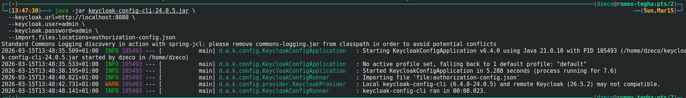
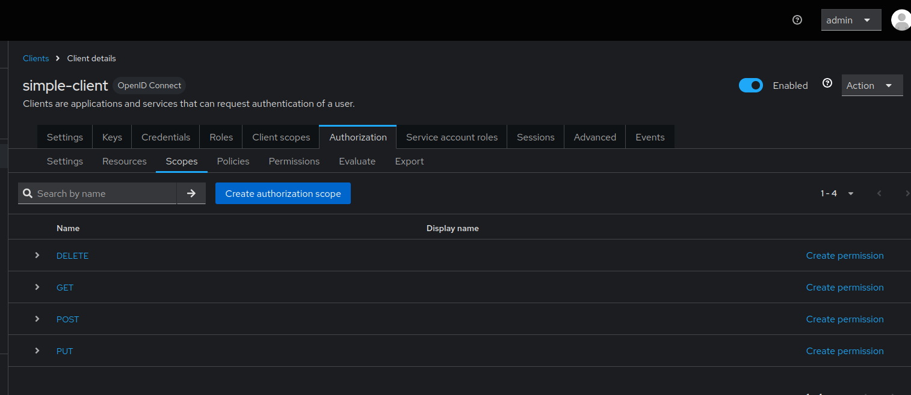
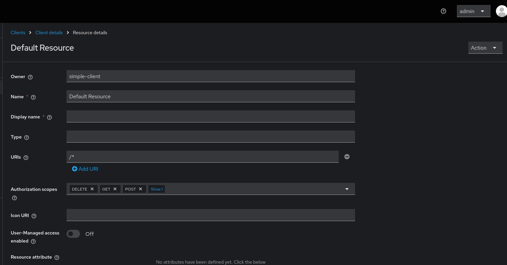
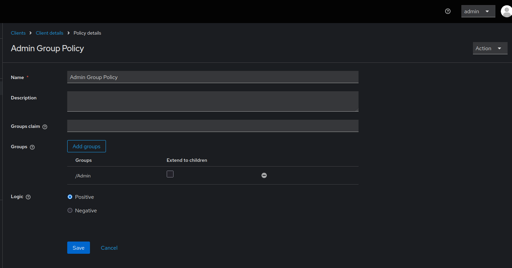

# Client Authorization Import Order

When importing Keycloak client authorization settings, the order in which resources, scopes, and policies are created matters. Prior to version 6.4.1, scopes needed to be created before resources could bind to them, and groups needed to exist before group policies could reference them. Understanding the correct import order prevents HTTP 403 errors and ensures proper authorization configuration.

Related issues: [#1008](https://github.com/adorsys/keycloak-config-cli/issues/1008), [#1444](https://github.com/adorsys/keycloak-config-cli/pull/1444)

## The Problem

Users encountered authorization import failures because:
- Resources tried to bind to scopes that didn't exist yet
- Group policies referenced groups that weren't created yet
- Import order was incorrect (resources before scopes)
- HTTP 403 errors occurred when evaluating permissions
- Authorization settings failed silently or partially
- Scopes were not properly bound to resources
- Group policies remained unlinked to actual groups

## Understanding Authorization Components

### Authorization Service Components

1. **Scopes** - Actions that can be performed (GET, POST, PUT, DELETE)
2. **Resources** - Protected resources with URIs
3. **Policies** - Rules that define access (user, role, group, time, etc.)
4. **Permissions** - Link between resources/scopes and policies

### Correct Import Order

**Before Fix (Caused Errors):**
1. Resources (trying to bind to non-existent scopes)
2. Scopes (created after resources)
3. Policies (referencing non-existent groups)

**After Fix (Correct Order):**
1. Groups (must exist first)
2. Scopes (must exist before resources)
3. Resources (can now bind to scopes)
4. Policies (can now reference groups)
5. Permissions (can now reference resources and policies)

---

## Complete Working Example

### Full Configuration with Authorization
```json
{
"realm": "simple",
"enabled": true,
"groups": [
{
"name": "Employee"
},
{
"name": "Admin"
},
{
"name": "NotAdmin"
}
],
"clients": [
{
"clientId": "simple-client",
"name": "simple-client",
"enabled": true,
"clientAuthenticatorType": "client-secret",
"secret": "nv6V42dsKJNotHereMyFriendmzZqabcd",
"serviceAccountsEnabled": true,
"authorizationServicesEnabled": true,
"authorizationSettings": {
"allowRemoteResourceManagement": false,
"policyEnforcementMode": "ENFORCING",
"decisionStrategy": "AFFIRMATIVE",
"scopes": [
{ "name": "GET" },
{ "name": "POST" },
{ "name": "PUT" },
{ "name": "DELETE" }
],
"resources": [
{
"name": "Default Resource",
"uris": ["/*"],
"scopes": [
{ "name": "DELETE" },
{ "name": "GET" },
{ "name": "POST" },
{ "name": "PUT" }
]
}
],
"policies": [
{
"name": "Admin Group Policy",
"type": "group",
"logic": "POSITIVE",
"decisionStrategy": "UNANIMOUS",
"config": {
"groups": "[{\"path\":\"/Admin\",\"extendChildren\":false}]"
}
},
{
"name": "Default Resource Permission",
"type": "resource",
"logic": "POSITIVE",
"decisionStrategy": "AFFIRMATIVE",
"config": {
"applyPolicies": "[\"Admin Group Policy\"]"
}
}
]
}
}
]
}
```
step1


step2


step3


step4


*Client authorization settings showing scopes (GET, POST, PUT, DELETE) properly bound to resources, and group policies correctly referencing the Employee/Admin group structure.*

---

## The Fix (PR #1444)

### What Changed

**Before (v6.4.0 and earlier):**
- Import order: Resources → Scopes → Policies
- Resources couldn't bind to scopes (scopes didn't exist yet)
- Group policies couldn't reference groups

**After (v6.4.1+):**
- Import order: Scopes → Resources → Policies
- Scopes created first, resources can bind to them
- Groups validated before group policies created

### Import Order in Code

The fix ensures this order in `ClientAuthorizationImportService`:

1. **Scopes** - Created first
2. **Resources** - Created second (can now reference scopes)
3. **Policies** - Created third (can now reference groups)
4. **Permissions** - Created last (can reference everything)

---

## Authorization Configuration Patterns

### Pattern 1: REST API Protection
```json
{
"clients": [
{
"clientId": "api-backend",
"authorizationServicesEnabled": true,
"authorizationSettings": {
"policyEnforcementMode": "ENFORCING",
"scopes": [
{ "name": "read" },
{ "name": "write" },
{ "name": "delete" }
],
"resources": [
{
"name": "User Resource",
"type": "urn:api:resources:user",
"uris": ["/api/users/*"],
"scopes": [
{ "name": "read" },
{ "name": "write" },
{ "name": "delete" }
]
},
{
"name": "Product Resource",
"type": "urn:api:resources:product",
"uris": ["/api/products/*"],
"scopes": [
{ "name": "read" },
{ "name": "write" }
]
}
],
"policies": [
{
"name": "Admin Role Policy",
"type": "role",
"logic": "POSITIVE",
"config": {
"roles": "[{\"id\":\"admin\",\"required\":true}]"
}
},
{
"name": "User Read Permission",
"type": "scope",
"logic": "POSITIVE",
"decisionStrategy": "UNANIMOUS",
"config": {
"resources": "[\"User Resource\"]",
"scopes": "[\"read\"]",
"applyPolicies": "[\"Admin Role Policy\"]"
}
}
]
}
}
]
}
```

---

### Pattern 2: Group-Based Access Control
```json
{
"realm": "corporate",
"groups": [
{
"name": "Engineering",
"subGroups": [
{ "name": "Backend" },
{ "name": "Frontend" },
{ "name": "DevOps" }
]
},
{
"name": "Management"
}
],
"clients": [
{
"clientId": "internal-app",
"authorizationServicesEnabled": true,
"authorizationSettings": {
"policyEnforcementMode": "ENFORCING",
"scopes": [
{ "name": "view" },
{ "name": "edit" },
{ "name": "approve" }
],
"resources": [
{
"name": "Code Repository",
"type": "urn:app:resources:repo",
"uris": ["/repos/*"],
"scopes": [
{ "name": "view" },
{ "name": "edit" }
]
}
],
"policies": [
{
"name": "Engineering Group Policy",
"type": "group",
"logic": "POSITIVE",
"config": {
"groups": "[{\"path\":\"/Engineering\",\"extendChildren\":true}]"
}
},
{
"name": "Management Group Policy",
"type": "group",
"logic": "POSITIVE",
"config": {
"groups": "[{\"path\":\"/Management\",\"extendChildren\":false}]"
}
},
{
"name": "Repository Access Permission",
"type": "resource",
"logic": "POSITIVE",
"config": {
"resources": "[\"Code Repository\"]",
"applyPolicies": "[\"Engineering Group Policy\",\"Management Group Policy\"]"
}
}
]
}
}
]
}
```

---

### Pattern 3: Time-Based and Aggregate Policies
```json
{
"clients": [
{
"clientId": "secure-app",
"authorizationServicesEnabled": true,
"authorizationSettings": {
"policyEnforcementMode": "ENFORCING",
"scopes": [
{ "name": "access" }
],
"resources": [
{
"name": "Sensitive Data",
"type": "urn:app:resources:sensitive",
"uris": ["/sensitive/*"],
"scopes": [{ "name": "access" }]
}
],
"policies": [
{
"name": "Admin Role Policy",
"type": "role",
"logic": "POSITIVE",
"config": {
"roles": "[{\"id\":\"admin\",\"required\":true}]"
}
},
{
"name": "Business Hours Policy",
"type": "time",
"logic": "POSITIVE",
"config": {
"hour": "9",
"hourEnd": "17",
"dayMonth": "",
"dayMonthEnd": "",
"month": "",
"monthEnd": "",
"year": "",
"yearEnd": ""
}
},
{
"name": "Secure Access Policy",
"type": "aggregate",
"logic": "POSITIVE",
"decisionStrategy": "UNANIMOUS",
"config": {
"applyPolicies": "[\"Admin Role Policy\",\"Business Hours Policy\"]"
}
},
{
"name": "Sensitive Data Permission",
"type": "resource",
"logic": "POSITIVE",
"config": {
"resources": "[\"Sensitive Data\"]",
"applyPolicies": "[\"Secure Access Policy\"]"
}
}
]
}
}
]
}
```

---

## Policy Types

### Available Policy Types

| Type | Description | Use Case |
|------|-------------|----------|
| `role` | Role-based access | Users with specific roles |
| `group` | Group membership | Users in specific groups |
| `user` | Specific users | Individual user access |
| `client` | Client-based | Service-to-service |
| `time` | Time-based | Business hours access |
| `aggregate` | Combine policies | Complex rules |
| `js` | JavaScript rules | Custom logic |

---

### Group Policy Configuration
```json
{
"name": "Department Access Policy",
"type": "group",
"logic": "POSITIVE",
"decisionStrategy": "UNANIMOUS",
"config": {
"groups": "[{\"path\":\"/Company/Engineering\",\"extendChildren\":true}]"
}
}
```

**Configuration options:**
- `path`: Full group path (e.g., `/Parent/Child`)
- `extendChildren`: `true` includes subgroups, `false` only exact group

---

### Role Policy Configuration
```json
{
"name": "Admin Access Policy",
"type": "role",
"logic": "POSITIVE",
"config": {
"roles": "[{\"id\":\"admin\",\"required\":true},{\"id\":\"manager\",\"required\":false}]"
}
}
```

**Configuration options:**
- `id`: Role name
- `required`: `true` (must have), `false` (optional)

---

### Time Policy Configuration
```json
{
"name": "Business Hours Only",
"type": "time",
"logic": "POSITIVE",
"config": {
"hour": "9",
"hourEnd": "17",
"dayMonth": "1",
"dayMonthEnd": "31",
"month": "1",
"monthEnd": "12"
}
}
```

---

## Common Pitfalls

### 1. Scopes Not Defined Before Resources

**Problem (Old versions):**
```json
{
"authorizationSettings": {
"resources": [
{
"name": "API",
"scopes": [{ "name": "read" }]
}
],
"scopes": [
{ "name": "read" }
]
}
}
```

**Error:** `Scope 'read' not found` or `HTTP 403 Forbidden`

**Solution:** Upgrade to v6.4.1+ where scopes are automatically created first.

---

### 2. Group Path Incorrect

**Problem:**
```json
{
"config": {
"groups": "[{\"path\":\"Employee/Admin\",\"extendChildren\":false}]"
}
}
```

**Error:** Group not found

**Solution:** Use absolute path with leading slash:
```json
{
"config": {
"groups": "[{\"path\":\"/Employee/Admin\",\"extendChildren\":false}]"
}
}
```

---

### 3. JSON Escaping in Config

**Problem:**
```json
{
"config": {
"groups": "[{"path":"/Employee/Admin"}]"
}
}
```

**Error:** JSON parsing error

**Solution:** Properly escape quotes:
```json
{
"config": {
"groups": "[{\"path\":\"/Employee/Admin\",\"extendChildren\":false}]"
}
}
```

---

### 4. Groups Not Created Before Policies

**Problem:**
```json
{
"clients": [
{
"authorizationSettings": {
"policies": [
{
"type": "group",
"config": {
"groups": "[{\"path\":\"/Admins\"}]"
}
}
]
}
}
],
"groups": [
{ "name": "Admins" }
]
}
```

**Solution:** Define groups before clients:
```json
{
"groups": [
{ "name": "Admins" }
],
"clients": [
{
"authorizationSettings": {
"policies": [...]
}
}
]
}
```

---

### 5. Missing Authorization Services Flag

**Problem:**
```json
{
"clientId": "my-client",
"authorizationSettings": {
"scopes": [...]
}
}
```

**Error:** Authorization settings ignored

**Solution:**
```json
{
"clientId": "my-client",
"authorizationServicesEnabled": true,
"authorizationSettings": {
"scopes": [...]
}
}
```

---

## Best Practices

1. **Always Define Groups First**
```json
{
"groups": [...],
"clients": [...]
}
```

2. **Use Descriptive Names**
```json
{
"name": "Admin Access to User Management",
"type": "scope"
}
```

3. **Enable Authorization Services**
```json
{
"serviceAccountsEnabled": true,
"authorizationServicesEnabled": true
}
```

4. **Use Absolute Group Paths**
```json
{
"groups": "[{\"path\":\"/Parent/Child\",\"extendChildren\":true}]"
}
```

5. **Test Permissions**

After import, test permissions via Admin Console or API.

6. **Use Policy Enforcement Mode**
```json
{
"policyEnforcementMode": "ENFORCING"
}
```

Options: `ENFORCING`, `PERMISSIVE`, `DISABLED`

7. **Document Authorization Rules**

Maintain clear documentation of your authorization model.

8. **Version Control Authorization Settings**

Track changes to authorization policies in git.

---

## Troubleshooting

### Scopes Not Bound to Resources

**Symptom:** Resources created but scopes not associated

**Diagnosis:**

Check in Admin Console:
- Clients → Select client → Authorization → Resources
- Check if scopes are listed for each resource

**Solution:** Upgrade to v6.4.1+ or manually bind scopes in Admin Console.

---

### Group Policy Not Working

**Symptom:** Users in group still denied access

**Diagnosis:**

1. Verify group path is correct (with leading `/`)
2. Check if `extendChildren` is set correctly
3. Verify users are actually in the group

**Solution:**
```json
{
"config": {
"groups": "[{\"path\":\"/Employee/Admin\",\"extendChildren\":false}]"
}
}
```

---

### HTTP 403 on Permission Evaluation

**Symptom:** Permission checks fail with 403

**Cause:** Import order issue in older versions

**Solution:** Upgrade to v6.4.1+ where import order is fixed.

---

### Permissions Not Applied

**Symptom:** Policies exist but permissions don't work

**Diagnosis:** Check if permission references correct resources and policies

**Solution:**
```json
{
"name": "Resource Permission",
"type": "resource",
"config": {
"resources": "[\"Resource Name\"]",
"applyPolicies": "[\"Policy Name\"]"
}
}
```

---

## Configuration Options
```bash
# Standard import
--import.files.locations=authorization-config.json

# Validate before import
--import.validate=true

# Remote state tracking
--import.remote-state.enabled=true
```

---

## Testing Authorization

### Test Permission via Admin Console

1. Clients → Select client → Authorization → Evaluate
2. Select user
3. Select resource
4. Click "Evaluate"

### Test via API
```bash
# Get token
TOKEN=$(curl -X POST "http://localhost:8080/realms/simple/protocol/openid-connect/token" \
-d "client_id=simple-client" \
-d "client_secret=nv6V42dsKJNotHereMyFriendmzZqabcd" \
-d "grant_type=client_credentials" | jq -r '.access_token')

# Request permission
curl -X POST "http://localhost:8080/realms/simple/protocol/openid-connect/token" \
-H "Authorization: Bearer $TOKEN" \
-d "grant_type=urn:ietf:params:oauth:grant-type:uma-ticket" \
-d "audience=simple-client"
```

---

## Consequences

When configuring client authorization:

1. **Import Order Matters:** In v6.4.0 and earlier, manual order adjustment needed
2. **Fixed in v6.4.1+:** Automatic correct import order
3. **Groups Must Exist:** Groups must be created before group policies
4. **Scopes Before Resources:** Scopes must exist before resources can bind to them
5. **Testing Required:** Always test authorization after import
6. **Version Dependency:** Use v6.4.1+ for automatic correct ordering

---

