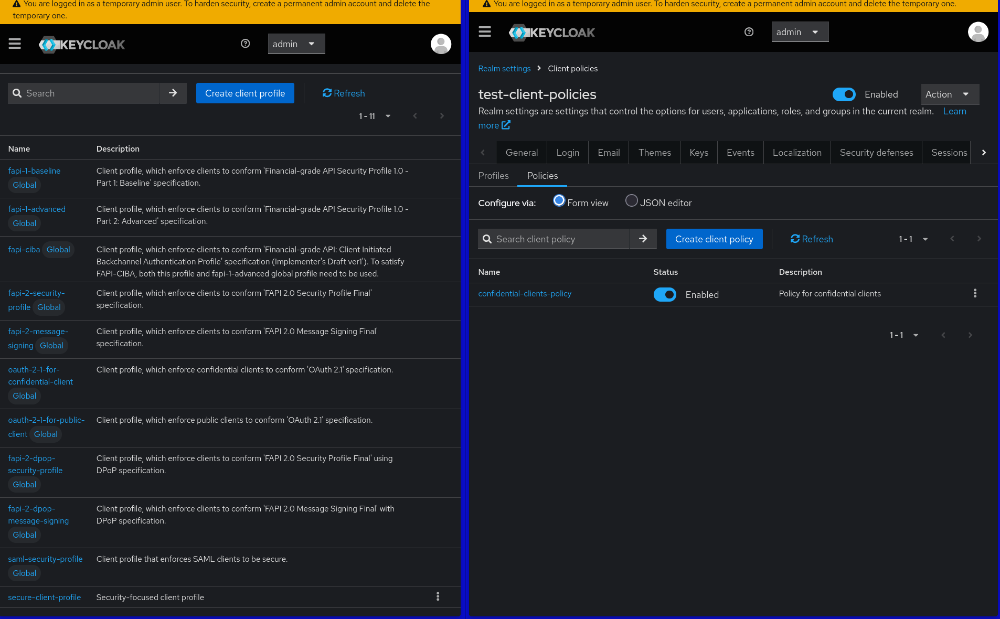
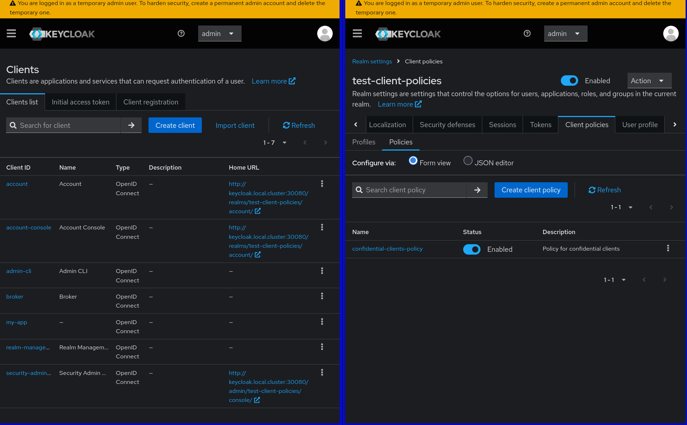
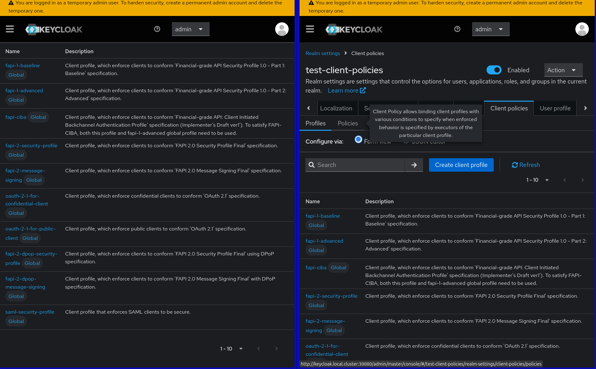

# Client Profiles and Client Policies Behavior

When working with client profiles and client policies in keycloak-config-cli, it's important to understand how they behave during multi-file imports. This documentation explains the current behavior and how to avoid unintended erasure of client policies.

Related issues: [#1357](https://github.com/adorsys/keycloak-config-cli/issues/1357)

## The Problem

Users encountered unexpected behavior where client profiles and client policies were erased when importing configuration files that didn't contain these sections, even when the files were unrelated to client policies.

**Scenario:**
1. Import a configuration file with `clientProfiles` and `clientPolicies` sections
2. Import another configuration file (even an empty JSON) 
3. Result: Client profiles and policies are erased

## Current Behavior

### Before Fix (v6.3.0 and earlier)
- Any import without `clientProfiles`/`clientPolicies` sections would erase existing configurations
- This occurred even with unrelated configuration files
- Splitting realm configuration across multiple files was risky

### After Fix (v6.5.1+)
- Client profiles and policies are preserved when not explicitly defined in import
- Only explicit empty arrays (`[]`) will remove configurations
- Safe to split realm configuration across multiple files

## Configuration Examples

### Creating Client Profiles and Policies

**Step 1: Create initial configuration file**

```json
{
  "enabled": true,
  "realm": "test-client-policies",
  "clientProfiles": {
    "profiles": [
      {
        "name": "secure-client-profile",
        "description": "Security-focused client profile",
        "executors": [
          {
            "executor": "secure-session",
            "configuration": {
              "clientSessionIdleTimeout": 7200,
              "clientOfflineSessionIdleTimeout": 172800
            }
          }
        ]
      }
    ]
  },
  "clientPolicies": {
    "policies": [
      {
        "name": "confidential-clients-policy",
        "description": "Policy for confidential clients",
        "enabled": true,
        "conditions": [
          {
            "condition": "client-access-type",
            "configuration": {
              "is-negative-logic": false,
              "type": ["confidential"]
            }
          }
        ],
        "profiles": ["secure-client-profile"]
      }
    ]
  }
}
```

**Step 2: Import the configuration**

```bash
java -jar keycloak-config-cli.jar \
  --keycloak.url=http://192.168.2.15:30080 \
  --keycloak.user=admin \
  --keycloak.password=admin123 \
  --import.files.locations=test-client-policies-01-initial.json
```

**Step 3: Verify in Keycloak admin console**



> Client profiles and policies configured in Keycloak admin console

---

### Importing Additional Configuration (Safe)

**Step 1: Create additional configuration file**

```json
{
  "enabled": true,
  "realm": "test-client-policies",
  "clients": [
    {
      "clientId": "my-app",
      "enabled": true,
      "redirectUris": ["http://localhost:8080/*"]
    }
  ]
}
```

**Step 2: Import additional configuration**

```bash
java -jar keycloak-config-cli.jar \
  --keycloak.url=http://192.168.2.15:30080 \
  --keycloak.user=admin \
  --keycloak.password=admin123 \
  --import.files.locations=test-client-policies-02-additional.json
```

**Step 3: Verify client policies are preserved**



> Client profiles and policies remain intact after importing additional configuration

---

### Removing Client Profiles and Policies

**Step 1: Create removal configuration file**

```json
{
  "enabled": true,
  "realm": "test-client-policies",
  "clientProfiles": {
    "profiles": []
  },
  "clientPolicies": {
    "policies": []
  }
}
```

**Step 2: Import removal configuration**

```bash
java -jar keycloak-config-cli.jar \
  --keycloak.url=http://192.168.2.15:30080 \
  --keycloak.user=admin \
  --keycloak.password=admin123 \
  --import.files.locations=test-client-policies-03-remove.json
```

**Step 3: Verify client policies are removed**



> Client profiles and policies explicitly removed

---

## Understanding the Bug

### The Problem (Pre-Fix Behavior)

In keycloak-config-cli versions before v6.5.1, importing any configuration file that didn't contain `clientProfiles` or `clientPolicies` sections would cause existing client profiles and policies to be **erased** from the realm.

**How the bug manifested:**
1. User imports a configuration file containing client profiles and policies
2. User imports a second configuration file (even unrelated or empty) that doesn't mention client policies
3. **Result**: All existing client profiles and policies are deleted

**Why this was problematic:**
- Splitting realm configuration across multiple files became risky
- Users couldn't safely update parts of their realm without losing client policies
- The behavior was counterintuitive - absence of configuration shouldn't mean deletion
- Multi-file import workflows became unreliable

**Example scenario that would trigger the bug:**
File 1: client-policies.json
```json
{
  "realm": "my-realm",
  "clientProfiles": { "profiles": [...] },
  "clientPolicies": { "policies": [...] }
}
```

File 2: update-clients.json with No clientProfiles/clientPolicies sections
```json
{
  "realm": "my-realm",
  "clients": [...] 
}
```

**Bug result**: After importing File 2, client profiles and policies would be deleted.

This behavior was fixed in v6.5.1 to preserve existing client profiles and policies when not explicitly mentioned in import files.

## Best Practices

### 1. Separate Client Policies Configuration

Keep client profiles and policies in dedicated files:
```
config/
├── 00_base_realm.json
├── 01_client_policies.json
├── 02_clients.json
├── 03_users.json
└── 04_roles.json
```

### 2. Import Order

Import client policies early in the process:
```bash
# Import base realm first
java -jar keycloak-config-cli.jar \
  --keycloak.url=http://localhost:8080 \
  --keycloak.user=admin \
  --keycloak.password=admin \
  --import.files.locations=00_base_realm.json

# Then client policies
java -jar keycloak-config-cli.jar \
  --keycloak.url=http://localhost:8080 \
  --keycloak.user=admin \
  --keycloak.password=admin \
  --import.files.locations=01_client_policies.json

# Then other configurations
java -jar keycloak-config-cli.jar \
  --keycloak.url=http://localhost:8080 \
  --keycloak.user=admin \
  --keycloak.password=admin \
  --import.files.locations=02_clients.json
```

### 3. Version Compatibility

Client policies are only available in Keycloak 24.0.0 and later. Ensure your Keycloak version supports this feature.

## Migration Guide

### From v6.3.0 to v6.5.1+

**No changes needed** for existing configurations. The fix is backward compatible and improves behavior without breaking existing functionality.

### From Multi-File to Single-File

If you were forced to use single-file configurations due to this issue:

1. **Split your configuration** into logical files
2. **Test the import sequence** in development
3. **Deploy with confidence** that client policies will be preserved

## Additional Resources

- [Keycloak Client Policies Documentation](https://www.keycloak.org/docs/latest/server_admin/#client-policies)
