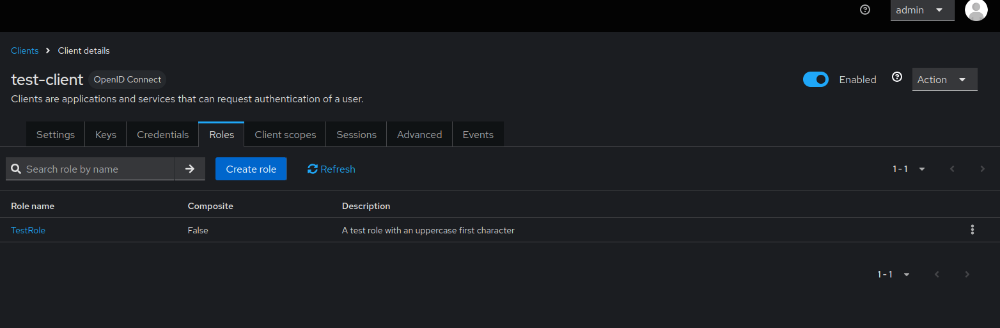
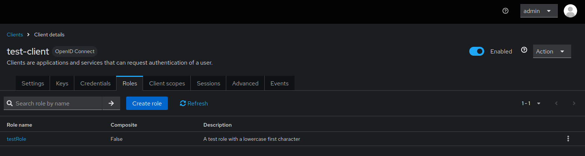

# Client Roles Case Sensitivity Issues

Keycloak treats client role names as case-sensitive, which can lead to unexpected behavior when managing client roles through keycloak-config-cli. Understanding how case sensitivity affects client role operations is essential for avoiding duplicate roles, failed imports, and inconsistent role assignments.

Related issues: [#940](https://github.com/adorsys/keycloak-config-cli/issues/940)

## The Problem

Users encounter case sensitivity issues with client role management because:

- Keycloak treats "Admin" and "admin" as different client roles
- Configuration files may have inconsistent capitalization
- Manual role creation in UI vs. config file can have different casing
- Role assignments can fail due to case mismatches
- Duplicate roles created unintentionally due to case variations
- HTTP 409 Conflict errors when trying to update existing roles with different case
- Error messages are not helpful in identifying the specific role conflict

### Visual Example: Duplicate Client Roles Due to Case

```
Client: my-application
├── Roles:
│   ├── Admin          (created manually in UI)
│   ├── admin          (defined in config file)
│   └── ADMIN          (another variation)
```

As shown above, Keycloak creates separate client roles for "Admin", "admin", and "ADMIN" - each is treated as a completely different role.

## Understanding Case Sensitivity in Client Roles

### How Keycloak Handles Client Role Names

Keycloak's client role system is strictly case-sensitive:

1. **Name Matching**
   - "Admin" ≠ "admin" ≠ "ADMIN"
   - Each variation is a separate, distinct client role
   - No case-insensitive matching available

2. **Client Association**
   - Roles are tied to specific clients
   - Case sensitivity applies within each client's role namespace
   - Different clients can have roles with same name but different case

3. **Role Operations**
   - Create, update, delete all use exact case matching
   - Role lookup fails if case doesn't match
   - Role assignments require exact name match

---

## The Error

### Typical Error Scenarios

**Scenario 1: HTTP 409 Conflict When Updating Role Case**

```bash
2023-11-06 02:18:06.823 ERROR 1 --- [ main] d.a.k.config.KeycloakConfigRunner : HTTP 409 Conflict
```

This occurs when:

- Role "Admin" exists in Keycloak (created manually)
- Config file defines role "admin" (different case)
- keycloak-config-cli tries to create "admin" but finds "Admin" already exists

**Real-world example from issue #940:**

**First import with uppercase role:**

```json
{
  "realm": "test-realm",
  "enabled": true,
  "clients": [
    {
      "clientId": "test-client",
      "enabled": true,
      "clientAuthenticatorType": "client-secret",
      "secret": "test-client-secret",
      "redirectUris": ["https://example.com/*"],
      "webOrigins": ["https://example.com"],
      "publicClient": false,
      "protocol": "openid-connect"
    }
  ],
  "roles": {
    "client": {
      "test-client": [
        {
          "name": "TestRole",
          "description": "A test role with an uppercase first character"
        }
      ]
    }
  }
}
```



**Second import with lowercase role (causes conflict):**

```json
{
  "realm": "test-realm",
  "enabled": true,
  "clients": [
    {
      "clientId": "test-client",
      "enabled": true,
      "clientAuthenticatorType": "client-secret",
      "secret": "test-client-secret",
      "redirectUris": ["https://example.com/*"],
      "webOrigins": ["https://example.com"],
      "publicClient": false,
      "protocol": "openid-connect"
    }
  ],
  "roles": {
    "client": {
      "test-client": [
        {
          "name": "testRole",
          "description": "A test role with a lowercase first character"
        }
      ]
    }
  }
}
```



**Scenario 2: Duplicate Roles in Configuration**

```yaml
clients:
  - clientId: my-application
    roles:
      - name: Admin
        description: Administrator role
      - name: admin
        description: Same role, different case
      - name: ADMIN
        description: Another duplicate
```

**Scenario 3: Role Assignment Failures**

```yaml
users:
  - username: john.doe
    clientRoles:
      my-application:
        - admin # Won't find "Admin" role
```

### Error Details

**HTTP 409 Conflict**

- **Cause**: Role already exists with different case
- **When**: Attempting to create role that conflicts with existing role
- **Impact**: Import fails, no changes applied

**Missing Role Assignment**

- **Cause**: Role reference case doesn't match actual role name
- **When**: Assigning roles to users or service accounts
- **Impact**: Users don't get expected permissions

---

3. **Export/Import Variations**
   - Different tools export with different casing
   - Manual editing of configuration files
   - Team members using different naming conventions

### Keycloak's Case Sensitivity Behavior

- **Strict Case Matching**: No automatic case normalization
- **No Case-Insensitive Search**: Must use exact case for lookups
- **Independent Role Names**: Each case variation is a separate role
- **No Automatic Merging**: Roles with different cases remain separate

---

## Solutions and Best Practices

### 1. Standardize Role Naming Convention

**Recommended Approach: Use Consistent Case**

**Naming Convention Options:**

- **lowercase-with-hyphens**: `app-admin`, `read-only`
- **UPPER_CASE_WITH_UNDERSCORES**: `APP_ADMIN`, `READ_ONLY`
- **CamelCase**: `appAdmin`, `readOnly`

**Choose one convention and stick to it across all environments.**

### 2. Audit Existing Roles Before Import

**Pre-Import Script Example**

```bash
# Check for existing roles with case variations
#!/bin/bash
REALM="my-realm"
CLIENT="my-application"

# Export existing roles
kcadm.sh get clients -r $REALM -q clientId=$CLIENT | jq -r '.[0].id' > client_id.txt
CLIENT_ID=$(cat client_id.txt)

kcadm.sh get roles -r $REALM -c $CLIENT_ID | jq -r '.[].name' | sort -f > existing_roles.txt

echo "Existing client roles (case-insensitive sort):"
cat existing_roles.txt
```

### 3. Use Role Normalization

**Configuration with Normalized Names**

```yaml
# Use consistent naming in configuration
clients:
  - clientId: my-application
    roles:
      - name: app-admin
        description: Administrator access
        attributes:
          original-name: "Admin" # Track original if needed
      - name: app-user
        description: Standard user access
```

### 4. Migration Strategy

**Step 1: Identify Case Conflicts**

```yaml
# Migration script to identify conflicts
migration:
  detect-case-conflicts: true
  clients:
    - clientId: my-application
      existing-roles: ["Admin", "admin", "ADMIN"]
```

**Step 2: Standardize Names**

```yaml
# Updated configuration with standardized names
clients:
  - clientId: my-application
    roles:
      - name: app-admin # Standardized name
        description: Administrator access
        # Map from old names if needed
        aliases: ["Admin", "admin", "ADMIN"]
```

**Step 3: Update References**

```yaml
# Update all role references
users:
  - username: john.doe
    clientRoles:
      my-application:
        - app-admin # Updated from "Admin"
```

---

## Configuration Examples

### Complete Working Example

```yaml
realm: my-realm

clients:
  - clientId: my-application
    name: My Application
    roles:
      # Standardized role names (lowercase with hyphens)
      - name: app-admin
        description: Full administrator access
        attributes:
          category: "administrative"
          level: "full"
      - name: app-user
        description: Standard user access
        attributes:
          category: "standard"
          level: "basic"
      - name: read-only
        description: Read-only access
        attributes:
          category: "limited"
          level: "readonly"

users:
  - username: admin.user
    enabled: true
    clientRoles:
      my-application:
        - app-admin
  - username: regular.user
    enabled: true
    clientRoles:
      my-application:
        - app-user
  - username: readonly.user
    enabled: true
    clientRoles:
      my-application:
        - read-only
```

### Migration Example

```yaml
# Before: Mixed case roles
clients:
  - clientId: legacy-app
    roles:
      - name: Admin
      - name: User
      - name: ReadOnly

# After: Standardized roles
clients:
  - clientId: legacy-app
    roles:
      - name: app-admin      # From "Admin"
      - name: app-user        # From "User"
      - name: read-only       # From "ReadOnly"
```

---

## Troubleshooting Guide

### Common Issues and Solutions

**Issue 1: HTTP 409 Conflict During Import**

**Symptoms:**

- Import fails with HTTP 409 Conflict
- No clear error message about which role conflicts
- Import process stops completely

**Solutions:**

1. Enable trace logging to identify conflicting role
2. Check existing roles in Keycloak admin console
3. Standardize role names in configuration
4. Delete duplicate roles manually if needed

**Issue 2: Users Missing Expected Roles**

**Symptoms:**

- Users don't have expected permissions
- Role assignments appear in configuration but don't work
- No error messages during import

**Solutions:**

1. Verify exact case of role names in Keycloak
2. Check role assignments in admin console
3. Ensure role references match exact case
4. Use consistent naming convention

**Issue 3: Duplicate Roles in Keycloak**

**Symptoms:**

- Multiple similar roles with different cases
- Confusion about which role to assign
- Inconsistent permissions

**Solutions:**

1. Audit all existing roles
2. Choose standard naming convention
3. Consolidate duplicate roles
4. Update all references

### Debugging Steps

**1. Check Existing Roles**

```bash
# List all client roles with case
kcadm.sh get roles -r my-realm -c <client-id> | jq -r '.[].name'
```

**2. Enable Detailed Logging**

```yaml
# In keycloak-config-cli configuration
logging:
  level:
    de.adorsys.keycloak.config: TRACE
```

**3. Validate Configuration**

```bash
# Test configuration before import
keycloak-config-cli --dry-run --validate-config
```

---

## Prevention Strategies

### 1. Establish Naming Standards

**Create Team Guidelines:**

- Document preferred naming convention
- Include case sensitivity rules
- Provide examples and templates
- Review configuration changes

### 2. Use Configuration Validation

**Pre-commit Hooks**

```bash
#!/bin/bash
# Check for case inconsistencies in client roles
grep -r "name:" clients/ | sort -f | uniq -d -i
```

**CI/CD Pipeline Checks**

```yaml
# GitHub Actions example
- name: Validate role naming
  run: |
    python scripts/validate-role-names.py
```

### 3. Regular Audits

**Monthly Role Audits:**

- Export all client roles
- Check for case variations
- Identify duplicates
- Update configurations as needed

### 4. Documentation and Training

**Team Training:**

- Educate team about case sensitivity
- Provide naming convention guidelines
- Share troubleshooting procedures
- Document best practices

---

## Advanced Topics

### Role Aliases and Mapping

**For complex migrations, consider role mapping:**

```yaml
# Advanced: Role mapping for legacy systems
clients:
  - clientId: enterprise-app
    roles:
      - name: system-administrator
        description: System administrator role
        aliases:
          - "Admin" # Legacy name
          - "admin" # Alternative case
          - "ADMIN" # Another variation
        attributes:
          legacy-names: '["Admin", "admin", "ADMIN"]'
```

### Programmatic Role Management

**Custom Scripts for Role Normalization:**

```python
#!/usr/bin/env python3
import sys
import yaml

def normalize_role_names(config):
    """Normalize client role names to lowercase with hyphens"""
    for client in config.get('clients', []):
        if 'roles' in client:
            for role in client['roles']:
                old_name = role['name']
                new_name = old_name.lower().replace('_', '-')
                role['name'] = new_name
                role['original_name'] = old_name
    return config

if __name__ == "__main__":
    with open(sys.argv[1], 'r') as f:
        config = yaml.safe_load(f)

    normalized = normalize_role_names(config)

    with open(sys.argv[2], 'w') as f:
        yaml.dump(normalized, f, default_flow_style=False)
```

---

## Summary

### Key Takeaways

1. **Client roles are case-sensitive** - "Admin" ≠ "admin"
2. **Standardize naming conventions** across all environments
3. **Audit existing roles** before importing new configurations
4. **Use consistent case** in role references and assignments
5. **Monitor for conflicts** during import operations

### Best Practices Checklist

- [ ] Establish and document role naming convention
- [ ] Audit existing roles for case variations
- [ ] Standardize all role names in configuration
- [ ] Update all role references to match exact case
- [ ] Enable detailed logging for troubleshooting
- [ ] Implement validation in CI/CD pipeline
- [ ] Train team on case sensitivity issues
- [ ] Schedule regular role audits

By following these guidelines and understanding Keycloak's case sensitivity behavior, you can avoid common pitfalls and ensure reliable client role management with keycloak-config-cli.
