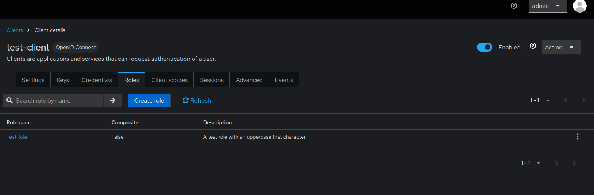
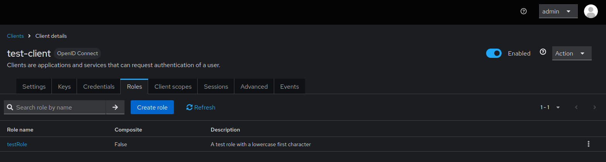

# Understanding Client Roles Case Sensitivity

Keycloak treats client role names as case-sensitive, which is expected behavior in Keycloak's design. Understanding how case sensitivity works with client roles is essential for effective role management with keycloak-config-cli. This guide explains the behavior and provides best practices for consistent role management.

Related discussion: [#940](https://github.com/adorsys/keycloak-config-cli/issues/940)

## Understanding Case Sensitivity Behavior

Keycloak's case-sensitive client role handling means that:

- "Admin" and "admin" are treated as different client roles
- Configuration files must use consistent capitalization for role updates
- Manual role creation in UI vs. config file requires exact case matching
- Role assignments succeed only with exact case matches
- Multiple roles with different cases can coexist
- HTTP 409 errors occur when trying to create roles that already exist with different case
- Error messages may require trace logging to identify specific conflicts

### Example: Multiple Client Roles with Different Cases

```
Client: my-application
├── Roles:
│   ├── Admin          (created manually in UI)
│   ├── admin          (defined in config file)
│   └── ADMIN          (another variation)
```

As shown above, Keycloak creates separate client roles for "Admin", "admin", and "ADMIN" - each is treated as a completely different role.

## Understanding Case Sensitivity in Client Roles

### How Keycloak Handles Client Role Names

Keycloak's client role system is strictly case-sensitive:

1. **Name Matching**
   - "Admin" ≠ "admin" ≠ "ADMIN"
   - Each variation is a separate, distinct client role
   - No case-insensitive matching available

2. **Client Association**
   - Roles are tied to specific clients
   - Case sensitivity applies within each client's role namespace
   - Different clients can have roles with same name but different case

3. **Role Operations**
   - Create, update, delete all use exact case matching
   - Role lookup fails if case doesn't match
   - Role assignments require exact name match

---

## Expected Behavior Examples

### Example 1: Creating Different Roles with Case Variations

When you create roles with different cases, Keycloak treats them as distinct roles:

**First import with uppercase role:**

```json
{
  "realm": "test-realm",
  "enabled": true,
  "clients": [
    {
      "clientId": "test-client",
      "enabled": true,
      "clientAuthenticatorType": "client-secret",
      "secret": "test-client-secret",
      "redirectUris": ["https://example.com/*"],
      "webOrigins": ["https://example.com"],
      "publicClient": false,
      "protocol": "openid-connect"
    }
  ],
  "roles": {
    "client": {
      "test-client": [
        {
          "name": "TestRole",
          "description": "A test role with an uppercase first character"
        }
      ]
    }
  }
}
```

This creates the role "TestRole" successfully.



**Second import with lowercase role:**

```json
{
  "realm": "test-realm",
  "enabled": true,
  "clients": [
    {
      "clientId": "test-client",
      "enabled": true,
      "clientAuthenticatorType": "client-secret",
      "secret": "test-client-secret",
      "redirectUris": ["https://example.com/*"],
      "webOrigins": ["https://example.com"],
      "publicClient": false,
      "protocol": "openid-connect"
    }
  ],
  "roles": {
    "client": {
      "test-client": [
        {
          "name": "testRole",
          "description": "A test role with a lowercase first character"
        }
      ]
    }
  }
}
```

This creates a separate role "testRole" - both roles now exist in Keycloak.



**Example 2: Multiple Roles in Same Configuration**

```yaml
clients:
  - clientId: my-application
    roles:
      - name: Admin
        description: Administrator role
      - name: admin
        description: Different role with lowercase name
      - name: ADMIN
        description: Another distinct role
```

This creates three separate client roles, each with different permissions.

**Example 3: Role Assignment with Exact Case Matching**

```yaml
users:
  - username: john.doe
    clientRoles:
      my-application:
        - Admin  # Must match exact role name
```

The user gets assigned the "Admin" role, not "admin" or "ADMIN".

### Behavior Details

**HTTP 409 Conflict**

- **Cause**: Attempting to create a role that already exists with different case
- **When**: Keycloak prevents creating duplicate roles (even with different case)
- **Result**: Import fails for that specific role, but other operations may continue
- **Solution**: Use exact case matching or delete the existing role first

**Role Assignment Behavior**

- **Cause**: Role reference case doesn't match actual role name
- **When**: Assigning roles to users or service accounts
- **Result**: Assignment fails if exact case match not found
- **Solution**: Ensure role references match exact case in Keycloak

---

## Best Practices for Client Role Management

### 1. Establish Consistent Naming Conventions

**Recommended Naming Patterns:**

- **lowercase-with-hyphens**: `app-admin`, `read-only`
- **UPPER_CASE_WITH_UNDERSCORES**: `APP_ADMIN`, `READ_ONLY`
- **CamelCase**: `appAdmin`, `readOnly`

**Choose one convention and apply it consistently across all environments.**

### 2. Audit Existing Roles Before Configuration Changes

**Pre-Configuration Check Example**

```bash
# Check for existing roles with case variations
#!/bin/bash
REALM="my-realm"
CLIENT="my-application"

# Export existing roles
kcadm.sh get clients -r $REALM -q clientId=$CLIENT | jq -r '.[0].id' > client_id.txt
CLIENT_ID=$(cat client_id.txt)

kcadm.sh get roles -r $REALM -c $CLIENT_ID | jq -r '.[].name' | sort -f > existing_roles.txt

echo "Existing client roles (case-insensitive sort):"
cat existing_roles.txt
```

### 3. Use Role Normalization

**Configuration with Normalized Names**

```yaml
# Use consistent naming in configuration
clients:
  - clientId: my-application
    roles:
      - name: app-admin
        description: Administrator access
        attributes:
          original-name: "Admin" # Track original if needed
      - name: app-user
        description: Standard user access
```

### 4. Migration Strategy

**Step 1: Identify Case Conflicts**

```yaml
# Migration script to identify conflicts
migration:
  detect-case-conflicts: true
  clients:
    - clientId: my-application
      existing-roles: ["Admin", "admin", "ADMIN"]
```

**Step 2: Standardize Names**

```yaml
# Updated configuration with standardized names
clients:
  - clientId: my-application
    roles:
      - name: app-admin # Standardized name
        description: Administrator access
        # Map from old names if needed
        aliases: ["Admin", "admin", "ADMIN"]
```

**Step 3: Update References**

```yaml
# Update all role references
users:
  - username: john.doe
    clientRoles:
      my-application:
        - app-admin # Updated from "Admin"
```

---

## Configuration Examples

### Complete Working Example

```yaml
realm: my-realm

clients:
  - clientId: my-application
    name: My Application
    roles:
      # Standardized role names (lowercase with hyphens)
      - name: app-admin
        description: Full administrator access
        attributes:
          category: "administrative"
          level: "full"
      - name: app-user
        description: Standard user access
        attributes:
          category: "standard"
          level: "basic"
      - name: read-only
        description: Read-only access
        attributes:
          category: "limited"
          level: "readonly"

users:
  - username: admin.user
    enabled: true
    clientRoles:
      my-application:
        - app-admin
  - username: regular.user
    enabled: true
    clientRoles:
      my-application:
        - app-user
  - username: readonly.user
    enabled: true
    clientRoles:
      my-application:
        - read-only
```

### Migration Example

```yaml
# Before: Mixed case roles
clients:
  - clientId: legacy-app
    roles:
      - name: Admin
      - name: User
      - name: ReadOnly

# After: Standardized roles
clients:
  - clientId: legacy-app
    roles:
      - name: app-admin      # From "Admin"
      - name: app-user        # From "User"
      - name: read-only       # From "ReadOnly"
```

---

## Configuration Guide

### Common Configuration Scenarios

**Scenario 1: Managing Existing Roles with Different Cases**

**Situation:** You have existing roles with inconsistent casing and want to standardize them.

**Approach:**
1. Identify all existing roles and their cases
2. Choose a standard naming convention
3. Update configurations to use the standard case
4. Delete old roles if no longer needed

**Scenario 2: Preventing Case Inconsistencies**

**Situation:** You want to ensure consistent role naming across your team.

**Approach:**
1. Document your naming convention
2. Use configuration validation
3. Implement team training and guidelines

**Scenario 3: Working with Multiple Environments**

**Situation:** You need to manage roles across dev, staging, and production environments.

**Approach:**
1. Use the same configuration files across environments
2. Apply consistent naming conventions
3. Test configurations in non-production first

### Configuration Verification Steps

**1. List Existing Roles**

```bash
# List all client roles with exact case
kcadm.sh get roles -r my-realm -c <client-id> | jq -r '.[].name'
```

**2. Validate Configuration Files**

```bash
# Test configuration before applying
keycloak-config-cli --dry-run --validate-config
```

**3. Enable Detailed Logging (if needed)**

```yaml
# In keycloak-config-cli configuration
logging:
  level:
    de.adorsys.keycloak.config: TRACE
```

---

## Configuration Management Best Practices

### 1. Establish Team Standards

**Create Team Guidelines:**

- Document preferred naming convention
- Include case sensitivity rules in team documentation
- Provide configuration templates and examples
- Review configuration changes in pull requests

### 2. Implement Configuration Validation

**Pre-commit Hooks**

```bash
#!/bin/bash
# Check for case inconsistencies in client roles
grep -r "name:" clients/ | sort -f | uniq -d -i
```

**CI/CD Pipeline Validation**

```yaml
# GitHub Actions example
- name: Validate role naming consistency
  run: |
    python scripts/validate-role-names.py
```

### 3. Regular Configuration Audits

**Monthly Role Management Reviews:**

- Export all client roles from each environment
- Check for case variations and inconsistencies
- Identify opportunities for standardization
- Update configurations as needed

### 4. Team Education and Documentation

**Knowledge Sharing:**

- Include case sensitivity behavior in team training
- Provide naming convention guidelines
- Share configuration examples and templates
- Document role management procedures

---

## Advanced Topics

### Role Aliases and Mapping

**For complex migrations, consider role mapping:**

```yaml
# Advanced: Role mapping for legacy systems
clients:
  - clientId: enterprise-app
    roles:
      - name: system-administrator
        description: System administrator role
        aliases:
          - "Admin" # Legacy name
          - "admin" # Alternative case
          - "ADMIN" # Another variation
        attributes:
          legacy-names: '["Admin", "admin", "ADMIN"]'
```

### Programmatic Role Management

**Custom Scripts for Role Normalization:**

```python
#!/usr/bin/env python3
import sys
import yaml

def normalize_role_names(config):
    """Normalize client role names to lowercase with hyphens"""
    for client in config.get('clients', []):
        if 'roles' in client:
            for role in client['roles']:
                old_name = role['name']
                new_name = old_name.lower().replace('_', '-')
                role['name'] = new_name
                role['original_name'] = old_name
    return config

if __name__ == "__main__":
    with open(sys.argv[1], 'r') as f:
        config = yaml.safe_load(f)

    normalized = normalize_role_names(config)

    with open(sys.argv[2], 'w') as f:
        yaml.dump(normalized, f, default_flow_style=False)
```

---

## Summary

### Key Takeaways

1. **Client roles are case-sensitive by design** - "Admin" ≠ "admin" ≠ "ADMIN"
2. **This is expected Keycloak behavior**, not a bug in keycloak-config-cli
3. **Consistent naming conventions** prevent confusion across environments
4. **Exact case matching** is required for role updates and assignments
5. **Configuration validation** helps maintain consistency

### Best Practices Checklist

- [ ] Establish and document role naming convention
- [ ] Audit existing roles for case variations
- [ ] Use consistent case in all configuration files
- [ ] Ensure role references match exact case in Keycloak
- [ ] Validate configurations before applying
- [ ] Implement validation in CI/CD pipeline
- [ ] Train team on case sensitivity behavior
- [ ] Schedule regular configuration reviews

By understanding Keycloak's case-sensitive design and following these guidelines, you can effectively manage client roles with keycloak-config-cli across all environments.
