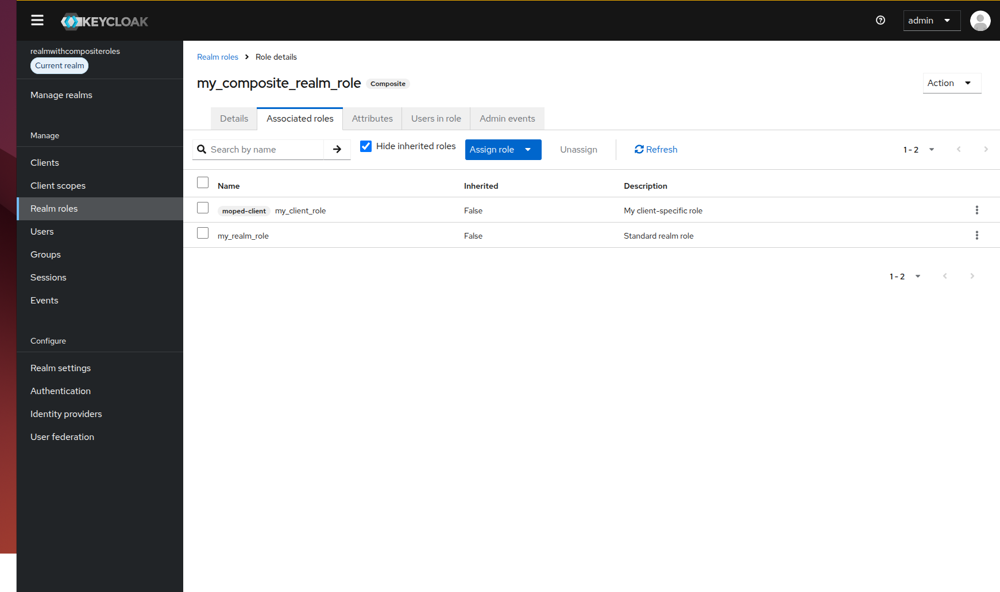
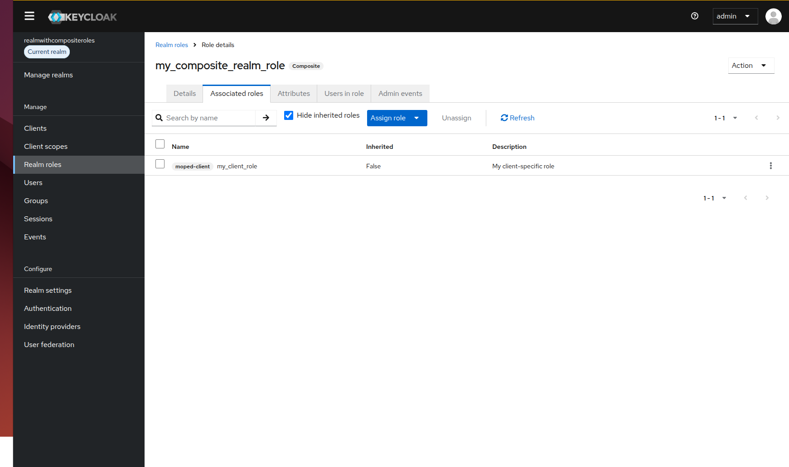

# Composite Realm Roles Configuration

When managing composite roles in Keycloak, they allow a role to contain other realm or client-level roles. A common requirement is dynamically adding and removing roles from a composition. 

Keycloak-config-cli synchronizes composite role configurations with Keycloak. However, in older versions, removing all realm-level roles from a composite role did not clear them in the target Keycloak instance.

Related issue: [#1300](https://github.com/adorsys/keycloak-config-cli/issues/1300) • Related PR: [#1366](https://github.com/adorsys/keycloak-config-cli/pull/1366)

---

## The Problem

Previously, the configuration import service did not clear existing realm-level composite roles if the configuration was modified to remove all realm roles from a composite role. 

This happened because:
- The configuration parser skipped updating the composite roles mapping when the `composites.realm` field was either empty or omitted entirely from the configuration file.
- The `RealmRoleCompositeImportService` checked for the presence of the `realm` field using `Optional.ofNullable(...).ifPresent(...)`. When the field was null, no update operation was performed, leaving the stale role assignments intact on the Keycloak server.

---

## The Solution

Starting with keycloak-config-cli **v6.4.1** (PR #1366):
- `RealmRoleCompositeImportService` has been updated to handle missing or null composite list definitions.
- If `composites` or the `composites.realm` list is omitted or set to null in your configuration, keycloak-config-cli defaults to an empty set (`Set.of()`).
- The update operation is then triggered with the empty set, successfully clearing the composite role mappings in Keycloak to align with your local configuration files.

---

## Usage Scenarios

Below is a step-by-step example showing how to configure, update, and clear composite realm roles.

### Step 1: Creating a Composite Realm Role

To create a composite realm role containing other realm roles and client roles, structure your configuration file as follows:

```yaml
realm: "realmwithcompositeroles"
enabled: true
roles:
  realm:
    - name: "my_realm_role"
      description: "Standard realm role"
    - name: "my_other_realm_role"
      description: "Another standard realm role"
    - name: "my_composite_realm_role"
      description: "My composite realm role"
      composite: true
      composites:
        realm:
          - "my_realm_role"
          - "my_other_realm_role"
        client:
          moped-client:
            - "my_client_role"
  client:
    moped-client:
      - name: "my_client_role"
        description: "My client-specific role"

clients:
  - clientId: "moped-client"
    enabled: true
```

#### Result in Keycloak
- `my_composite_realm_role` is created.
- It is marked as a composite role.
- It has two realm roles (`my_realm_role` and `my_other_realm_role`) and one client role (`my_client_role` from client `moped-client`) associated.


*(Screenshot Placeholder: Show the Keycloak Admin Console page for 'my_composite_realm_role' under Realm Roles, verifying that both realm roles and the client role are assigned as associated roles.)*

---

### Step 2: Removing a Single Role from Composition

If you want to remove one of the realm roles (e.g. `my_other_realm_role`) but keep `my_realm_role`, update the `composites.realm` list to only include the remaining role:

```yaml
realm: "realmwithcompositeroles"
enabled: true
roles:
  realm:
    - name: "my_realm_role"
    - name: "my_other_realm_role"
    - name: "my_composite_realm_role"
      composite: true
      composites:
        realm:
          - "my_realm_role"
        client:
          moped-client:
            - "my_client_role"
```

#### Result in Keycloak
- `my_composite_realm_role` no longer contains `my_other_realm_role`.
- `my_realm_role` and the client role `my_client_role` remain associated.


*(Screenshot Placeholder: Show the Keycloak Admin Console role detail page showing only 'my_realm_role' and the client role remaining under Associated Roles.)*

---

### Step 3: Clearing All Realm Roles from Composition

To clear **all** realm-level roles from the composite role while leaving client-level composite roles intact, update your configuration by removing or omitting the `realm` key inside `composites`:

```yaml
realm: "realmwithcompositeroles"
enabled: true
roles:
  realm:
    - name: "my_realm_role"
    - name: "my_other_realm_role"
    - name: "my_composite_realm_role"
      composite: true
      composites:
        client:
          moped-client:
            - "my_client_role"
```

#### Result in Keycloak
- Stale realm roles (`my_realm_role`) are removed from the composite.
- The client role association is preserved.


*(Screenshot Placeholder: Show the Keycloak Admin Console detail page showing no associated realm roles, while 'my_client_role' is still active.)*

---

## Best Practices

1. **Explicit Empty Configuration**: If you want to clarify that a composite role shouldn't contain any realm roles, omitting the key entirely or updating to empty configuration is fully supported.
2. **Review Changes with Dry Run**: Always run keycloak-config-cli in dry-run mode (`--dry-run` or setting `remote-state.enabled`) to audit how composite role changes are calculated before applying them to a production system.
3. **Validate Role Dependency Ordering**: Ensure the referenced roles (both realm and client roles) are defined in the configuration before or within the same import block so Keycloak can locate them during association.
