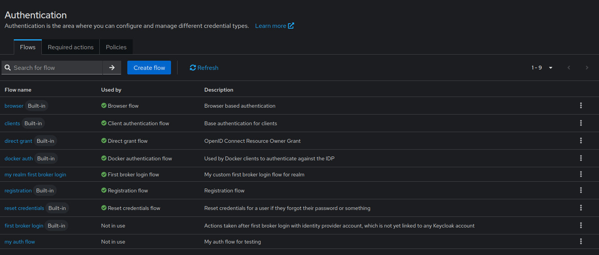

# First Broker Login Flow Configuration

Starting with Keycloak 24, you can configure a custom first broker login flow at the realm level. This allows you to define custom authentication behavior for users logging in through an external identity provider for the first time, before their accounts are linked to any existing Keycloak account.


## The Problem

Before Keycloak 24, the first broker login flow could only be configured per identity provider using the `firstBrokerLoginFlowAlias` property. This meant:

- Each identity provider had to be individually configured
- No realm-wide default for first broker login behavior
- Inconsistent user experience across different identity providers
- More complex configuration management

## The Solution

Keycloak 24+ introduces the ability to set a default first broker login flow at the realm level using the `firstBrokerLoginFlow` property. This allows you to:

- Define a single custom flow for the entire realm
- Override the default "first broker login" behavior
- Ensure consistent authentication experience across all identity providers
- Simplify configuration by setting it once at the realm level

## Configuration

### Basic Structure

```json
{
  "enabled": true,
  "realm": "my-realm",
  "firstBrokerLoginFlow": "my custom first broker login",
  "authenticationFlows": [
    {
      "alias": "my custom first broker login",
      "description": "Custom first broker login flow for realm",
      "providerId": "basic-flow",
      "topLevel": true,
      "builtIn": false,
      "authenticationExecutions": [
        {
          "authenticator": "idp-create-user-if-unique",
          "requirement": "ALTERNATIVE",
          "priority": 0
        },
        {
          "authenticator": "idp-auto-link",
          "requirement": "REQUIRED",
          "priority": 1
        }
      ]
    }
  ]
}
```

### Key Components

#### firstBrokerLoginFlow

The `firstBrokerLoginFlow` property at the realm level specifies which authentication flow to use when a user logs in via an external identity provider for the first time.

#### Authentication Flow

The referenced flow must be defined in the `authenticationFlows` section with:
- `topLevel: true` - It must be a top-level flow
- `builtIn: false` - Custom flows should not be marked as built-in
- Appropriate `authenticationExecutions` - Define the authentication steps

## Complete Example

### Step 1: Create a Custom First Broker Login Flow

**File:** `create_custom_first_broker_login_flow.json`

```json
{
  "enabled": true,
  "realm": "realmWithFlow",
  "firstBrokerLoginFlow": "my realm first broker login",
  "authenticationFlows": [
    {
      "alias": "my auth flow",
      "description": "My auth flow for testing",
      "providerId": "basic-flow",
      "topLevel": true,
      "builtIn": false,
      "authenticationExecutions": [
        {
          "authenticator": "auth-username-password-form",
          "requirement": "REQUIRED",
          "priority": 0
        }
      ]
    },
    {
      "alias": "my realm first broker login",
      "description": "My custom first broker login flow for realm",
      "providerId": "basic-flow",
      "topLevel": true,
      "builtIn": false,
      "authenticationExecutions": [
        {
          "authenticator": "idp-create-user-if-unique",
          "requirement": "ALTERNATIVE",
          "priority": 0
        },
        {
          "authenticator": "idp-auto-link",
          "requirement": "REQUIRED",
          "priority": 1
        }
      ]
    }
  ]
}
```

**Import:**

```bash
java -jar keycloak-config-cli.jar \
  --keycloak.url=http://localhost:8080 \
  --keycloak.user=admin \
  --keycloak.password=admin \
  --import.files.locations=create_custom_first_broker_login_flow.json
```

**Result:**

The custom first broker login flow is created and set as the realm's default first broker login flow.



*The Keycloak Admin Console showing "my realm first broker login" set as the First broker login flow for the realm.*

## Use Cases

### Use Case 1: Custom User Creation Behavior

**Scenario:** You want to customize how new users are created when they first log in via an external identity provider.

**Configuration:**

```json
{
  "realm": "corporate",
  "firstBrokerLoginFlow": "custom-user-onboarding",
  "authenticationFlows": [
    {
      "alias": "custom-user-onboarding",
      "description": "Custom onboarding for external users",
      "providerId": "basic-flow",
      "topLevel": true,
      "builtIn": false,
      "authenticationExecutions": [
        {
          "authenticator": "idp-create-user-if-unique",
          "requirement": "ALTERNATIVE",
          "priority": 0
        },
        {
          "authenticator": "idp-auto-link",
          "requirement": "ALTERNATIVE",
          "priority": 1
        },
        {
          "authenticator": "idp-confirm-link",
          "requirement": "ALTERNATIVE",
          "priority": 2
        }
      ]
    }
  ]
}
```

**Result:** All identity providers in the realm will use this custom flow for first-time broker logins.

---

### Use Case 2: Enhanced Security for External Users

**Scenario:** You want to add additional verification steps for users logging in via external identity providers.

**Configuration:**

```json
{
  "realm": "secure-realm",
  "firstBrokerLoginFlow": "enhanced-first-broker-login",
  "authenticationFlows": [
    {
      "alias": "enhanced-first-broker-login",
      "description": "Enhanced security for external authentication",
      "providerId": "basic-flow",
      "topLevel": true,
      "builtIn": false,
      "authenticationExecutions": [
        {
          "authenticator": "idp-create-user-if-unique",
          "requirement": "REQUIRED",
          "priority": 0
        },
        {
          "authenticator": "auth-otp-form",
          "requirement": "REQUIRED",
          "priority": 1
        }
      ]
    }
  ]
}
```

**Result:** External users must complete OTP verification on their first login.

## Important Notes

### Keycloak Version Requirement

The `firstBrokerLoginFlow` property at the realm level is only available in **Keycloak 24 and later**. Attempting to use this feature on earlier versions will be ignored.

### Precedence

- If an identity provider has `firstBrokerLoginFlowAlias` set, it takes precedence over the realm-level `firstBrokerLoginFlow`
- If the identity provider doesn't specify a flow, the realm-level `firstBrokerLoginFlow` is used
- If neither is set, Keycloak uses the built-in "first broker login" flow

### Flow Requirements

The referenced authentication flow must:
- Exist in the same realm
- Be a top-level flow (`topLevel: true`)
- Have appropriate authenticators configured for broker login scenarios

## Common Pitfalls

### 1. Flow Not Found

**Problem:** The specified flow doesn't exist.

```json
{
  "realm": "my-realm",
  "firstBrokerLoginFlow": "non-existent-flow"
}
```

**Result:** Error during import - the flow must be defined in the same configuration.

**Solution:** Define the flow before referencing it:

```json
{
  "realm": "my-realm",
  "firstBrokerLoginFlow": "my-custom-flow",
  "authenticationFlows": [
    {
      "alias": "my-custom-flow",
      "providerId": "basic-flow",
      "topLevel": true,
      "builtIn": false,
      "authenticationExecutions": [...]
    }
  ]
}
```

---

### 2. Not a Top-Level Flow

**Problem:** Referencing a sub-flow instead of a top-level flow.

**Solution:** Ensure `topLevel: true` is set on the flow.

---

### 3. Keycloak Version Compatibility

**Problem:** Trying to use this feature on Keycloak < 24.

**Result:** The property is ignored; the default "first broker login" flow is used.

**Solution:** Upgrade to Keycloak 24+ or use per-identity-provider configuration with `firstBrokerLoginFlowAlias`.

---

## Troubleshooting

### Flow Not Applied

**Symptom:** The realm still shows "first broker login" (built-in) as the configured flow.

**Diagnosis:**

1. Check Keycloak version: Navigate to Server Info → Profile in the admin console
2. Verify the flow exists: Check Authentication → Flows
3. Check for errors in keycloak-config-cli logs

**Solution:**

- Ensure running Keycloak 24+
- Verify flow alias matches exactly (case-sensitive)
- Check that the flow is top-level (`topLevel: true`)

---

### Identity Provider Override

**Symptom:** Realm-level flow is not being used for a specific identity provider.

**Diagnosis:** Check if the identity provider has `firstBrokerLoginFlowAlias` set:

```json
{
  "identityProviders": [
    {
      "alias": "my-idp",
      "firstBrokerLoginFlowAlias": "different-flow"
    }
  ]
}
```

**Solution:** Remove the per-provider override if you want to use the realm default:

```json
{
  "identityProviders": [
    {
      "alias": "my-idp"
    }
  ]
}
```

## Additional Resources

- [Keycloak Identity Provider Documentation](https://www.keycloak.org/docs/latest/server_admin/#_identity_broker)
- [Keycloak Authentication Flows](https://www.keycloak.org/docs/latest/server_admin/#_authentication-flows)
- [First Broker Login Flow](https://www.keycloak.org/docs/latest/server_admin/#_identity_broker_first_login)
