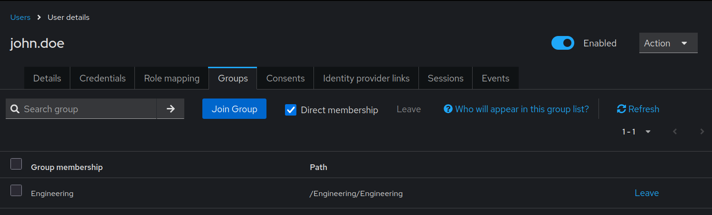

# Group Case Sensitivity Issues

Keycloak treats group names as case-sensitive, which can lead to unexpected behavior when managing groups through keycloak-config-cli. Understanding how case sensitivity affects group operations is essential for avoiding duplicate groups, failed imports, and inconsistent group hierarchies.

Related issues: [#1019](https://github.com/adorsys/keycloak-config-cli/issues/1019)

## The Problem

Users encounter case sensitivity issues with group management because:
- Keycloak treats "Developers" and "developers" as different groups
- Configuration files may have inconsistent capitalization
- Exports from different sources use different casing conventions
- Group paths are case-sensitive at every level
- Group membership assignments can fail due to case mismatches
- Duplicate groups created unintentionally due to case variations
- It's unclear whether groups should be referenced by name or path
- Search and lookup operations are case-sensitive

### Visual Example: Duplicate Groups Due to Case

As shown above, Keycloak creates separate groups for "Engineering", "engineering", and "ENGINEERING" - each is treated as a completely different group.

## Understanding Case Sensitivity in Groups

### How Keycloak Handles Group Names

Keycloak's group system is strictly case-sensitive:

1. **Name Matching**
   - "Engineering" ≠ "engineering" ≠ "ENGINEERING"
   - Each variation is a separate, distinct group
   - No case-insensitive matching available

2. **Path Matching**
   - "/Engineering/Backend" ≠ "/engineering/backend"
   - Every component in path must match exactly
   - Paths are constructed from group names

3. **Group Operations**
   - Create, update, delete all use exact case matching
   - Group lookup fails if case doesn't match
   - Membership assignments require exact path match

---

## The Error

### Typical Error Scenarios

**Scenario 1: Duplicate Groups Due to Case**
```yaml
realm: "myrealm"
groups:
  - name: "Developers"
    path: "/Developers"
  
  - name: "developers"
    path: "/developers"
```

**Result:**
- Two separate groups created
- "/Developers" and "/developers" both exist
- Users may be assigned to wrong group
- Confusion about which group to use


---

**Scenario 2: Group Not Found Due to Case Mismatch**
```yaml
groups:
  - name: "Engineering"
    path: "/Engineering"

users:
  - username: "john.doe"
    groups:
      - "/engineering"
```

**Error:**
```
Group '/engineering' not found
```


**Why it fails:** Group was created as "/Engineering" but referenced as "/engineering"

---

**Scenario 3: Subgroup Hierarchy Mismatch**
```yaml
groups:
  - name: "Engineering"
    path: "/Engineering"
    subGroups:
      - name: "Backend"
        path: "/Engineering/backend"
```

**Error:**
```
Invalid subgroup path: /Engineering/backend
Expected: /Engineering/Backend
```

**Why it fails:** Parent path is "/Engineering" but subgroup path uses lowercase "backend"

---

**Scenario 4: User Group Assignment Failure**
```yaml
groups:
  - name: "Developers"
    path: "/Developers"

users:
  - username: "jane.doe"
    groups:
      - "/developers"
```

**Error:**
```
Failed to add user 'jane.doe' to group '/developers'
Group not found
```


---

## Solutions

### Solution 1: Establish Naming Convention (Recommended)

**Strategy:** Define and enforce consistent case convention across all configurations.

**Convention Options:**

**Option A: PascalCase (Recommended)**
```yaml
groups:
  - name: "Engineering"
    path: "/Engineering"
    subGroups:
      - name: "Backend"
        path: "/Engineering/Backend"
      - name: "Frontend"
        path: "/Engineering/Frontend"
  
  - name: "Sales"
    path: "/Sales"
    subGroups:
      - name: "Enterprise"
        path: "/Sales/Enterprise"
      - name: "SmallBusiness"
        path: "/Sales/SmallBusiness"
```

**Benefits:**
- Clear, readable
- Professional appearance
- Common in organizational structures
- Easy to distinguish from usernames

---

**Option B: lowercase**
```yaml
groups:
  - name: "engineering"
    path: "/engineering"
    subGroups:
      - name: "backend"
        path: "/engineering/backend"
      - name: "frontend"
        path: "/engineering/frontend"
  
  - name: "sales"
    path: "/sales"
```

**Benefits:**
- Simple, consistent
- No capitalization confusion
- Easy to type
- Matches many Unix/Linux conventions

---

**Option C: kebab-case**
```yaml
groups:
  - name: "engineering-team"
    path: "/engineering-team"
    subGroups:
      - name: "backend-team"
        path: "/engineering-team/backend-team"
      - name: "frontend-team"
        path: "/engineering-team/frontend-team"
```

**Benefits:**
- URL-friendly
- Clear word separation
- No space ambiguity

---

### Solution 2: Document Group Names

**Create a group registry:**
```markdown
# GROUP_REGISTRY.md

## Group Naming Convention
- Use PascalCase for all group names
- Use descriptive, full names (not abbreviations)
- Follow hierarchy: Department → Team → Role

## Defined Groups

### Engineering Department
- Path: `/Engineering`
- Subgroups:
  - `/Engineering/Backend`
  - `/Engineering/Frontend`
  - `/Engineering/DevOps`
  - `/Engineering/QA`

### Sales Department
- Path: `/Sales`
- Subgroups:
  - `/Sales/Enterprise`
  - `/Sales/SMB`
  - `/Sales/Partners`

### Support
- Path: `/Support`
- Subgroups:
  - `/Support/L1`
  - `/Support/L2`
  - `/Support/L3`
```

**Reference this in all configuration files:**
```yaml
realm: "corporate"

groups:
  - name: "Engineering"
    path: "/Engineering"
```

---

### Solution 3: Use Consistent Paths Everywhere

**Rule:** Always reference groups by their exact path as created.

**Configuration:**
```yaml
realm: "myrealm"

groups:
  - name: "Engineering"
    path: "/Engineering"
    attributes:
      department: ["engineering"]
    subGroups:
      - name: "Backend"
        path: "/Engineering/Backend"
      - name: "Frontend"
        path: "/Engineering/Frontend"

users:
  - username: "john.doe"
    email: "john@example.com"
    groups:
      - "/Engineering/Backend"
  
  - username: "jane.smith"
    email: "jane@example.com"
    groups:
      - "/Engineering/Frontend"

roles:
  realm:
    - name: "developer"
      description: "Developer role"

groupRoleMappings:
  "/Engineering/Backend":
    - "developer"
  "/Engineering/Frontend":
    - "developer"
```



---

### Solution 4: Validate Configuration Before Import

**Use a pre-import validation script:**
```python
#!/usr/bin/env python3
"""
Validate group case consistency in Keycloak config files.
"""
import yaml
import sys
from pathlib import Path

def validate_group_case(config_file):
    """Check for case inconsistencies in group definitions and references."""
    
    with open(config_file) as f:
        config = yaml.safe_load(f)
    
    defined_groups = set()
    if 'groups' in config:
        for group in config['groups']:
            defined_groups.add(group['path'])
            if 'subGroups' in group:
                for subgroup in group['subGroups']:
                    defined_groups.add(subgroup['path'])
    
    referenced_groups = set()
    if 'users' in config:
        for user in config['users']:
            if 'groups' in user:
                referenced_groups.update(user['groups'])
    
    errors = []
    for ref in referenced_groups:
        if ref not in defined_groups:
            ref_lower = ref.lower()
            matches = [g for g in defined_groups if g.lower() == ref_lower]
            if matches:
                errors.append(
                    f"Case mismatch: '{ref}' referenced but defined as '{matches[0]}'"
                )
            else:
                errors.append(f"Group not found: '{ref}'")
    
    if errors:
        print(f"❌ Validation failed for {config_file}:")
        for error in errors:
            print(f"  - {error}")
        return False
    else:
        print(f"✅ {config_file} validation passed")
        return True

if __name__ == "__main__":
    if len(sys.argv) < 2:
        print("Usage: validate_groups.py <config.yaml>")
        sys.exit(1)
    
    valid = validate_group_case(sys.argv[1])
    sys.exit(0 if valid else 1)
```

**Usage:**
```bash
python validate_groups.py realm-config.yaml

java -jar keycloak-config-cli.jar \
  --import.files.locations=realm-config.yaml
```

---

### Solution 5: Normalize Groups on Export

**When exporting from Keycloak, normalize case:**
```python
#!/usr/bin/env python3
"""
Normalize group names to consistent case in exported config.
"""
import yaml
import sys

def normalize_groups(config_file, output_file, case_style='pascal'):
    """Normalize group names to consistent case."""
    
    with open(config_file) as f:
        config = yaml.safe_load(f)
    
    def normalize_name(name, style):
        if style == 'pascal':
            return ''.join(word.capitalize() for word in name.split())
        elif style == 'lower':
            return name.lower()
        elif style == 'upper':
            return name.upper()
        return name
    
    def normalize_group(group):
        original_name = group['name']
        normalized_name = normalize_name(original_name, case_style)
        group['name'] = normalized_name
        
        path_parts = group['path'].split('/')
        path_parts[-1] = normalized_name
        group['path'] = '/'.join(path_parts)
        
        if 'subGroups' in group:
            for subgroup in group['subGroups']:
                normalize_group(subgroup)
        
        return group
    
    if 'groups' in config:
        config['groups'] = [normalize_group(g) for g in config['groups']]
    
    if 'users' in config:
        for user in config['users']:
            if 'groups' in user:
                user['groups'] = [
                    '/'.join(normalize_name(part, case_style) 
                            for part in path.split('/') if part)
                    for path in user['groups']
                ]
    
    with open(output_file, 'w') as f:
        yaml.dump(config, f, default_flow_style=False)
    
    print(f"✅ Normalized groups in {config_file} → {output_file}")

if __name__ == "__main__":
    if len(sys.argv) < 3:
        print("Usage: normalize_groups.py <input.yaml> <output.yaml> [pascal|lower|upper]")
        sys.exit(1)
    
    case_style = sys.argv[3] if len(sys.argv) > 3 else 'pascal'
    normalize_groups(sys.argv[1], sys.argv[2], case_style)
```

---

## Complete Group Configuration Examples

### Example 1: Organizational Hierarchy (PascalCase)
```yaml
realm: "corporate"
enabled: true

groups:
  - name: "Engineering"
    path: "/Engineering"
    attributes:
      department: ["Engineering"]
      costCenter: ["ENG-001"]
    subGroups:
      - name: "Backend"
        path: "/Engineering/Backend"
        attributes:
          team: ["Backend"]
      
      - name: "Frontend"
        path: "/Engineering/Frontend"
        attributes:
          team: ["Frontend"]
      
      - name: "DevOps"
        path: "/Engineering/DevOps"
        attributes:
          team: ["DevOps"]
      
      - name: "QA"
        path: "/Engineering/QA"
        attributes:
          team: ["QA"]
  
  - name: "Sales"
    path: "/Sales"
    attributes:
      department: ["Sales"]
      costCenter: ["SALES-001"]
    subGroups:
      - name: "Enterprise"
        path: "/Sales/Enterprise"
        attributes:
          segment: ["Enterprise"]
      
      - name: "SMB"
        path: "/Sales/SMB"
        attributes:
          segment: ["Small-Medium Business"]
  
  - name: "Support"
    path: "/Support"
    attributes:
      department: ["Support"]
      costCenter: ["SUP-001"]
    subGroups:
      - name: "L1"
        path: "/Support/L1"
      
      - name: "L2"
        path: "/Support/L2"
      
      - name: "L3"
        path: "/Support/L3"

users:
  - username: "john.doe"
    email: "john@corporate.com"
    firstName: "John"
    lastName: "Doe"
    enabled: true
    groups:
      - "/Engineering/Backend"
  
  - username: "jane.smith"
    email: "jane@corporate.com"
    firstName: "Jane"
    lastName: "Smith"
    enabled: true
    groups:
      - "/Engineering/Frontend"
  
  - username: "bob.johnson"
    email: "bob@corporate.com"
    firstName: "Bob"
    lastName: "Johnson"
    enabled: true
    groups:
      - "/Sales/Enterprise"

roles:
  realm:
    - name: "developer"
      description: "Developer role"
    - name: "sales-rep"
      description: "Sales representative"
    - name: "support-agent"
      description: "Support agent"

clients:
  - clientId: "corporate-app"
    enabled: true
    defaultClientScopes:
      - "groups"
```

---

### Example 2: Flat Structure (lowercase)
```yaml
realm: "development"
enabled: true

groups:
  - name: "developers"
    path: "/developers"
    attributes:
      environment: ["dev"]
  
  - name: "testers"
    path: "/testers"
    attributes:
      environment: ["dev"]
  
  - name: "admins"
    path: "/admins"
    attributes:
      environment: ["dev"]

users:
  - username: "dev1"
    email: "dev1@dev.local"
    enabled: true
    groups:
      - "/developers"
  
  - username: "tester1"
    email: "tester1@dev.local"
    enabled: true
    groups:
      - "/testers"
```

---

### Example 3: Multi-Level Hierarchy (kebab-case)
```yaml
realm: "saas-platform"
enabled: true

groups:
  - name: "tenant-admin"
    path: "/tenant-admin"
    attributes:
      role-type: ["admin"]
  
  - name: "tenant-user"
    path: "/tenant-user"
    attributes:
      role-type: ["user"]
    subGroups:
      - name: "premium-user"
        path: "/tenant-user/premium-user"
        attributes:
          subscription: ["premium"]
      
      - name: "free-user"
        path: "/tenant-user/free-user"
        attributes:
          subscription: ["free"]

users:
  - username: "admin-user"
    email: "admin@example.com"
    enabled: true
    groups:
      - "/tenant-admin"
  
  - username: "premium-customer"
    email: "premium@example.com"
    enabled: true
    groups:
      - "/tenant-user/premium-user"
```

---

## Common Pitfalls

### 1. Inconsistent Case Across Files

**Problem:**

**File 1: groups.yaml**
```yaml
groups:
  - name: "Engineering"
    path: "/Engineering"
```

**File 2: users.yaml**
```yaml
users:
  - username: "john.doe"
    groups:
      - "/engineering"
```

**Solution:** Use consistent case in all files:
```yaml
groups:
  - name: "Engineering"
    path: "/Engineering"

users:
  - username: "john.doe"
    groups:
      - "/Engineering"
```

---

### 2. Copy-Paste Errors with Case

**Problem:**
```yaml
groups:
  - name: "Backend"
    path: "/Engineering/Backend"
  
  - name: "Frontend"
    path: "/Engineering/backend"
```

**Solution:** Always verify path components match group names:
```yaml
groups:
  - name: "Backend"
    path: "/Engineering/Backend"
  
  - name: "Frontend"
    path: "/Engineering/Frontend"
```

---

### 3. Exported Groups with Mixed Case

**Problem:** Exporting from Keycloak UI where users created groups inconsistently

**Export result:**
```yaml
groups:
  - name: "developers"
  - name: "Developers"
  - name: "DEVELOPERS"
```

**Solution:** Normalize before importing:
```bash
python normalize_groups.py exported.yaml normalized.yaml pascal

java -jar keycloak-config-cli.jar \
  --import.files.locations=normalized.yaml
```

---

### 4. Path vs Name Confusion

**Problem:**
```yaml
groups:
  - name: "Backend"
    path: "/Engineering/backend"
```

**Rule:** Last component of path must match name exactly:
```yaml
groups:
  - name: "Backend"
    path: "/Engineering/Backend"
```

---

### 5. Subgroup Path Construction

**Problem:**
```yaml
groups:
  - name: "Engineering"
    path: "/Engineering"
    subGroups:
      - name: "Backend"
        path: "/Backend"
```

**Solution:** Subgroup paths must include full parent path:
```yaml
groups:
  - name: "Engineering"
    path: "/Engineering"
    subGroups:
      - name: "Backend"
        path: "/Engineering/Backend"
```

---

## Best Practices

1. **Choose One Case Convention and Stick to It**
```yaml
   groups:
     - name: "Engineering"
     - name: "Sales"
     - name: "Support"
```

2. **Document Your Convention**
   Create a GROUP_NAMING.md file explaining your chosen convention

3. **Validate Before Every Import**
```bash
   python validate_groups.py config.yaml && \
     java -jar keycloak-config-cli.jar \
       --import.files.locations=config.yaml
```

4. **Use Configuration Templates**
```yaml
   - name: "TEMPLATE_NAME"
     path: "/TEMPLATE_PATH"
     attributes:
       department: ["TEMPLATE_DEPT"]
```

5. **Avoid Abbreviations**
```yaml
   - name: "Engineering"
   - name: "Backend"
```

6. **Use Meaningful Hierarchies**
```yaml
   /Engineering/Backend/APIs
   /Engineering/Frontend/WebApp
   /Sales/Enterprise/EMEA
```

7. **Test with Exact Case**
```bash
   curl "http://localhost:8080/admin/realms/myrealm/groups" \
     -H "Authorization: Bearer $TOKEN" | \
     jq '.[] | select(.path == "/Engineering")'
```

8. **Keep Group Names Human-Readable**
```yaml
   - name: "Backend Engineers"
     path: "/Engineering/Backend Engineers"
```

---

## Troubleshooting

### Group Not Found Despite Existing

**Symptom:** Error says group doesn't exist, but it's visible in Admin Console

**Diagnosis:**
```bash
curl -s "http://localhost:8080/admin/realms/myrealm/groups" \
  -H "Authorization: Bearer $TOKEN" | \
  jq '.[] | .path'
```

**Your config:**
```yaml
users:
  - username: "john.doe"
    groups:
      - "/engineering"
```

**Solution:** Use exact case:
```yaml
users:
  - username: "john.doe"
    groups:
      - "/Engineering"
```

---

### Duplicate Groups Created

**Symptom:** Multiple groups with similar names

**Example:**
```
/Developers
/developers
/DEVELOPERS
```

**Diagnosis:**
```bash
curl -s "http://localhost:8080/admin/realms/myrealm/groups" \
  -H "Authorization: Bearer $TOKEN" | \
  jq '.[] | select(.name | test("(?i)developers"))'
```

**Solution:**
1. Choose canonical version: `/Developers`
2. Move users from duplicates to canonical
3. Delete duplicate groups
4. Update all configs to use canonical version
```yaml
groups:
  - name: "Developers"
    path: "/Developers"
```

---

### Subgroup Path Mismatch

**Symptom:** Subgroup creation fails

**Error:**
```
Invalid subgroup path: /Engineering/backend
Parent path: /Engineering
Expected: /Engineering/Backend
```

**Solution:** Fix subgroup path to match name:
```yaml
groups:
  - name: "Engineering"
    path: "/Engineering"
    subGroups:
      - name: "Backend"
        path: "/Engineering/Backend"
```

---

### User Group Assignment Fails

**Symptom:** User creation succeeds but not added to group

**Error:**
```
Warning: Failed to add user 'john.doe' to group '/engineering/backend'
Group not found
```

**Solution:** Check exact group path:
```bash
curl -s "http://localhost:8080/admin/realms/myrealm/groups" \
  -H "Authorization: Bearer $TOKEN" | \
  jq -r '.[] | .path' | grep -i backend
```

Update config with exact path:
```yaml
users:
  - username: "john.doe"
    groups:
      - "/Engineering/Backend"
```

---

## Configuration Options
```bash
--import.validate=true

--import.remote-state.enabled=true
```

---

## Consequences

When dealing with case sensitivity in group management:

1. **Exact Match Required:** Group names and paths must match exactly, including case
2. **No Case-Insensitive Lookup:** Keycloak provides no case-insensitive group search
3. **Duplicates Possible:** Different cases create separate groups
4. **Path Components Matter:** Every level of hierarchy must match exactly
5. **User Assignment Fragile:** Single character case difference causes failure
6. **Convention Critical:** Team must agree on and follow naming convention

---
