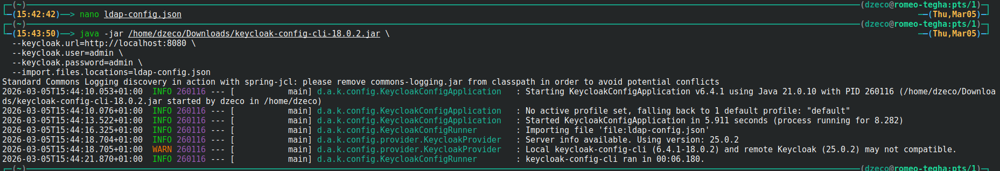
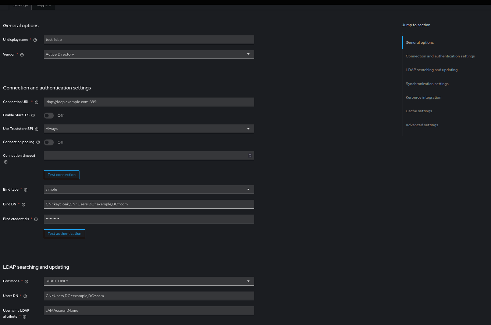
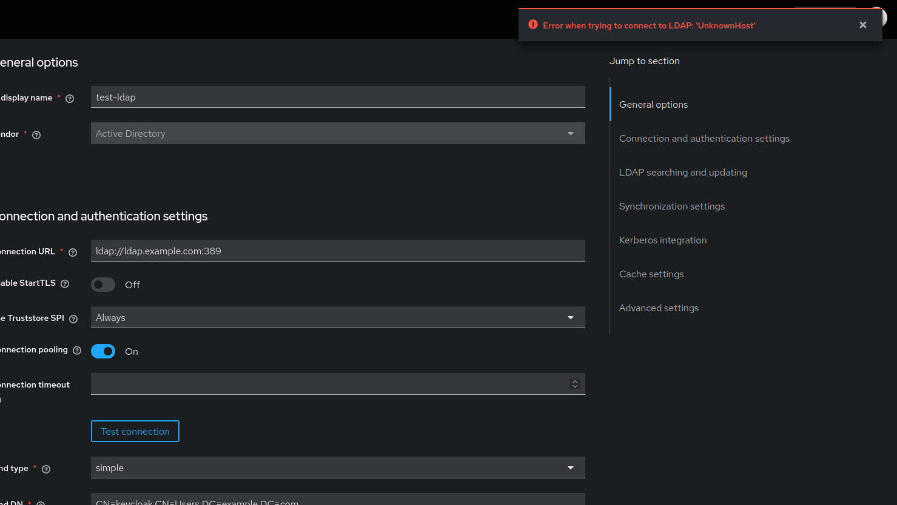
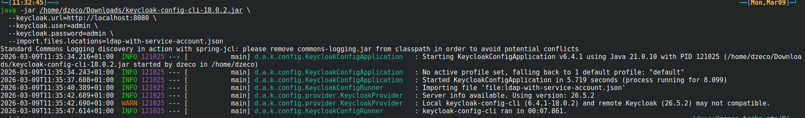
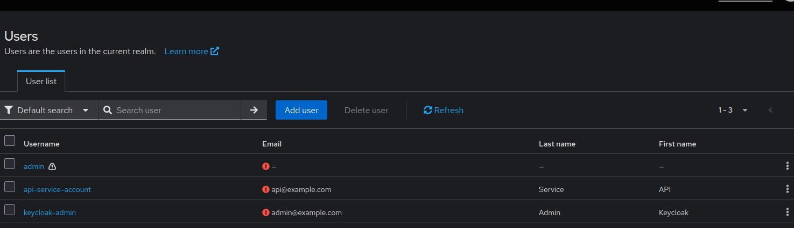

# LDAP User Creation Conflicts

When a Keycloak realm is configured with LDAP user federation, attempting to create local users directly through keycloak-config-cli or the Admin API often results in 400 Bad Request errors. Understanding the relationship between LDAP federation and local user management is essential for avoiding conflicts and properly managing users in LDAP-enabled realms.

Related issues: [#1291](https://github.com/adorsys/keycloak-config-cli/issues/1291)

## The Problem

Users encounter 400 errors when creating users in LDAP-enabled realms because:
- LDAP user federation makes the realm read-only for user management
- Local user creation conflicts with LDAP as the source of truth
- Keycloak attempts to create users in LDAP, which may fail due to permissions or configuration
- It's unclear whether users should be created in LDAP or Keycloak
- Error messages don't clearly indicate LDAP is the cause
- Existing configuration files assume local user management
- Federated users have different attribute handling than local users

## Understanding LDAP User Federation

### How LDAP Federation Works

When LDAP user federation is enabled:

1. **LDAP as Source of Truth**
   - User data is stored in LDAP directory
   - Keycloak synchronizes users from LDAP
   - Authentication happens against LDAP

2. **Read-Only User Management**
   - Users cannot be created directly in Keycloak
   - User modifications sync back to LDAP (if configured)
   - Some attributes become read-only

3. **Synchronization**
   - Full sync: Imports all LDAP users
   - Changed sync: Imports only modified users
   - Periodic or on-demand sync

---

## The Error

### LDAP Configuration Example

**Import LDAP configuration:**
```json
{
  "realm": "master",
  "components": {
    "org.keycloak.storage.UserStorageProvider": [
      {
        "name": "test-ldap",
        "providerId": "ldap",
        "config": {
          "enabled": ["true"],
          "priority": ["0"],
          "vendor": ["Active Directory"],
          "connectionUrl": ["ldap://ldap.example.com:389"],
          "bindDn": ["CN=keycloak,CN=Users,DC=example,DC=com"],
          "bindCredential": ["password123"],
          "usersDn": ["CN=Users,DC=example,DC=com"],
          "usernameLDAPAttribute": ["sAMAccountName"],
          "rdnLDAPAttribute": ["cn"],
          "uuidLDAPAttribute": ["objectGUID"],
          "editMode": ["READ_ONLY"]
        }
      }
    ]
  }
}
```

step1


step2


*LDAP user federation configured with READ_ONLY edit mode. Connection test shows "Error when trying to connect to LDAP: 'UnknownHost'" because ldap.example.com doesn't exist. This demonstrates a common LDAP configuration issue.*

---

### Typical Error Message

**Attempting to create a user:**
```bash
java -jar keycloak-config-cli.jar \
  --keycloak.url=http://localhost:8080 \
  --keycloak.user=admin \
  --keycloak.password=admin \
  --import.files.locations=user-with-ldap.json
```

**Configuration:**
```json
{
  "realm": "master",
  "users": [
    {
      "username": "john.doe",
      "email": "john.doe@example.com",
      "enabled": true,
      "firstName": "John",
      "lastName": "Doe"
    }
  ]
}
```



*Connection error when LDAP server is unreachable. In production, you might see "400 Bad Request: User creation failed - LDAP write operations not permitted" when LDAP is in READ_ONLY mode.*

**Common error messages:**
```
400 Bad Request: User creation failed
Could not create user: LDAP write operations not permitted
```

Or:
```
400 Bad Request: Insufficient permissions to create user in LDAP
```

Or:
```
500 Internal Server Error: LDAP connection failed during user creation
```

Or:
```
Error when trying to connect to LDAP: 'UnknownHost'
```

---

### Why It Happens

**Result:** Keycloak attempts to create the user, but:
- LDAP may not allow user creation via Keycloak
- LDAP write permissions may not be configured
- User creation requires specific LDAP attributes not provided
- LDAP connection may be read-only or unreachable

---

## Solutions

### Solution 1: Create Users in LDAP Directly (Recommended)

**Best Practice:** Manage users in LDAP, not in Keycloak.

**Configuration (No Local Users):**
```json
{
  "realm": "corporate",
  "enabled": true,
  "components": {
    "org.keycloak.storage.UserStorageProvider": [
      {
        "name": "corporate-ldap",
        "providerId": "ldap",
        "config": {
          "enabled": ["true"],
          "priority": ["0"],
          "vendor": ["Active Directory"],
          "connectionUrl": ["ldap://ldap.corporate.com:389"],
          "bindDn": ["CN=keycloak-service,CN=Users,DC=corporate,DC=com"],
          "bindCredential": ["password123"],
          "usersDn": ["CN=Users,DC=corporate,DC=com"],
          "userObjectClasses": ["person", "organizationalPerson", "user"],
          "usernameLDAPAttribute": ["sAMAccountName"],
          "rdnLDAPAttribute": ["cn"],
          "uuidLDAPAttribute": ["objectGUID"],
          "fullSyncPeriod": ["86400"],
          "changedSyncPeriod": ["3600"],
          "authType": ["simple"],
          "editMode": ["READ_ONLY"]
        }
      }
    ]
  }
}
```

**Result:**
- Users are synchronized from LDAP automatically
- No 400 errors on import
- LDAP remains source of truth
- User management happens in LDAP tools

**Create users in LDAP using:**
- Active Directory Users and Computers
- `ldapadd` command
- LDAP management tools
- Corporate user provisioning system

---

### Solution 2: Separate Local and Federated Users

**Scenario:** Need both LDAP users and local service accounts.

**Strategy:** Use LDAP for regular users, local users for service accounts only.
```json
{
  "realm": "master",
  "enabled": true,
  "components": {
    "org.keycloak.storage.UserStorageProvider": [
      {
        "name": "corporate-ldap",
        "providerId": "ldap",
        "config": {
          "enabled": ["true"],
          "priority": ["1"],
          "vendor": ["Active Directory"],
          "connectionUrl": ["ldap://ldap.corporate.com:389"],
          "bindDn": ["CN=keycloak-service,CN=Users,DC=corporate,DC=com"],
          "bindCredential": ["password123"],
          "usersDn": ["CN=Users,DC=corporate,DC=com"],
          "usernameLDAPAttribute": ["sAMAccountName"],
          "editMode": ["READ_ONLY"]
        }
      }
    ]
  },
  "users": [
    {
      "username": "keycloak-admin",
      "email": "admin@example.com",
      "firstName": "Keycloak",
      "lastName": "Admin",
      "enabled": true,
      "credentials": [
        {
          "type": "password",
          "value": "AdminPassword123",
          "temporary": false
        }
      ],
      "realmRoles": ["admin"]
    },
    {
      "username": "api-service-account",
      "email": "api@example.com",
      "firstName": "API",
      "lastName": "Service",
      "enabled": true,
      "serviceAccountClientId": "admin-cli"
    }
  ]
}
```
step1



step2



*Local service accounts (keycloak-admin, api-service-account) successfully created in the realm. These accounts are stored locally in Keycloak and don't conflict with LDAP federation.*

**Result:**
- LDAP users for human users (priority 1)
- Local users for service accounts (priority 0 - default)
- No conflicts between federation and local users
- Local users not synced to LDAP

**Important:** Local service accounts won't authenticate against LDAP.

---

### Solution 3: Configure LDAP for Write Operations

**Scenario:** Need Keycloak to create users in LDAP.

**Requirements:**
- LDAP service account with write permissions
- Proper DN structure configured
- All required LDAP attributes mapped
```json
{
  "realm": "corporate",
  "components": {
    "org.keycloak.storage.UserStorageProvider": [
      {
        "name": "corporate-ldap",
        "providerId": "ldap",
        "config": {
          "enabled": ["true"],
          "priority": ["0"],
          "vendor": ["Active Directory"],
          "connectionUrl": ["ldap://ldap.corporate.com:389"],
          "bindDn": ["CN=keycloak-admin,CN=Users,DC=corporate,DC=com"],
          "bindCredential": ["AdminPassword123"],
          "usersDn": ["CN=Users,DC=corporate,DC=com"],
          "userObjectClasses": ["person", "organizationalPerson", "user"],
          "usernameLDAPAttribute": ["sAMAccountName"],
          "rdnLDAPAttribute": ["cn"],
          "uuidLDAPAttribute": ["objectGUID"],
          "editMode": ["WRITABLE"],
          "firstNameLDAPAttribute": ["givenName"],
          "lastNameLDAPAttribute": ["sn"],
          "emailLDAPAttribute": ["mail"]
        }
      }
    ]
  },
  "users": [
    {
      "username": "john.doe",
      "email": "john.doe@corporate.com",
      "firstName": "John",
      "lastName": "Doe",
      "enabled": true,
      "credentials": [
        {
          "type": "password",
          "value": "TempPassword123",
          "temporary": true
        }
      ]
    }
  ]
}
```

**Important Considerations:**
- LDAP service account needs appropriate permissions
- All required LDAP attributes must be provided
- Password policies must match LDAP requirements
- User creation may still fail if LDAP has additional constraints

---

### Solution 4: Skip Federated User Attributes

**Scenario:** Updating federated users but hitting read-only attribute errors.

**Use the skip-attributes flag:**
```bash
java -jar keycloak-config-cli.jar \
  --keycloak.url=http://localhost:8080 \
  --keycloak.user=admin \
  --keycloak.password=admin \
  --import.behaviors.skip-attributes-for-federated-user=true \
  --import.files.locations=realm-config.json
```

**Configuration:**
```json
{
  "realm": "corporate",
  "components": {
    "org.keycloak.storage.UserStorageProvider": [
      {
        "name": "ldap",
        "providerId": "ldap",
        "config": {
          "editMode": ["READ_ONLY"]
        }
      }
    ]
  },
  "users": [
    {
      "username": "existing.ldap.user",
      "realmRoles": ["user"]
    }
  ]
}
```

**Result:**
- Attributes set to null for federated users
- Avoids read-only conflicts
- Role assignments still work
- Useful for managing roles/groups without touching LDAP attributes

---

## LDAP Edit Modes

Understanding edit modes is crucial:

| Edit Mode | User Creation | User Updates | Use Case |
|-----------|---------------|--------------|----------|
| `READ_ONLY` | Not allowed | Not allowed | LDAP is authoritative, no Keycloak modifications |
| `WRITABLE` | Via LDAP | Sync to LDAP | Keycloak can modify LDAP |
| `UNSYNCED` | Local only | Local only | Users fetched from LDAP but changes stay local |

### READ_ONLY (Recommended for Most Cases)
```json
{
  "config": {
    "editMode": ["READ_ONLY"]
  }
}
```

**Behavior:**
- Users imported from LDAP
- No user creation in Keycloak
- No user modifications synced to LDAP
- LDAP remains single source of truth

**Use when:**
- LDAP is managed by another team
- Corporate directory is authoritative
- No LDAP write permissions available

---

### WRITABLE
```json
{
  "config": {
    "editMode": ["WRITABLE"]
  }
}
```

**Behavior:**
- Users can be created in Keycloak
- User changes sync back to LDAP
- Requires LDAP write permissions

**Use when:**
- Keycloak manages user lifecycle
- LDAP write permissions available
- Need user self-service features

**Requirements:**
- Service account with LDAP write permissions
- All required LDAP attributes configured
- Matching password policies

---

### UNSYNCED
```json
{
  "config": {
    "editMode": ["UNSYNCED"]
  }
}
```

**Behavior:**
- Users imported from LDAP once
- Local modifications don't sync to LDAP
- Changes only in Keycloak database

**Use when:**
- Need local user modifications
- Cannot write to LDAP
- Hybrid approach required

**Warning:** Creates divergence between LDAP and Keycloak data.

---

## Complete LDAP Configuration Examples

### Example 1: Active Directory (Read-Only)
```json
{
  "realm": "corporate",
  "enabled": true,
  "components": {
    "org.keycloak.storage.UserStorageProvider": [
      {
        "name": "corporate-ad",
        "providerId": "ldap",
        "config": {
          "enabled": ["true"],
          "priority": ["0"],
          "vendor": ["Active Directory"],
          "connectionUrl": ["ldaps://ad.corporate.com:636"],
          "startTls": ["false"],
          "authType": ["simple"],
          "bindDn": ["CN=keycloak-svc,CN=Service Accounts,DC=corporate,DC=com"],
          "bindCredential": ["ServiceAccountPassword"],
          "usersDn": ["CN=Users,DC=corporate,DC=com"],
          "userObjectClasses": ["person", "organizationalPerson", "user"],
          "usernameLDAPAttribute": ["sAMAccountName"],
          "rdnLDAPAttribute": ["cn"],
          "uuidLDAPAttribute": ["objectGUID"],
          "firstNameLDAPAttribute": ["givenName"],
          "lastNameLDAPAttribute": ["sn"],
          "emailLDAPAttribute": ["mail"],
          "editMode": ["READ_ONLY"],
          "fullSyncPeriod": ["86400"],
          "changedSyncPeriod": ["3600"],
          "searchScope": ["2"],
          "useTruststoreSpi": ["ldapsOnly"]
        }
      }
    ]
  }
}
```

---

### Example 2: OpenLDAP (Writable)
```json
{
  "realm": "development",
  "enabled": true,
  "components": {
    "org.keycloak.storage.UserStorageProvider": [
      {
        "name": "dev-ldap",
        "providerId": "ldap",
        "config": {
          "enabled": ["true"],
          "priority": ["0"],
          "vendor": ["Other"],
          "connectionUrl": ["ldap://ldap.dev.local:389"],
          "authType": ["simple"],
          "bindDn": ["cn=admin,dc=dev,dc=local"],
          "bindCredential": ["admin123"],
          "usersDn": ["ou=users,dc=dev,dc=local"],
          "userObjectClasses": ["inetOrgPerson"],
          "usernameLDAPAttribute": ["uid"],
          "rdnLDAPAttribute": ["uid"],
          "uuidLDAPAttribute": ["entryUUID"],
          "firstNameLDAPAttribute": ["givenName"],
          "lastNameLDAPAttribute": ["sn"],
          "emailLDAPAttribute": ["mail"],
          "editMode": ["WRITABLE"],
          "fullSyncPeriod": ["-1"],
          "changedSyncPeriod": ["-1"]
        }
      }
    ]
  },
  "users": [
    {
      "username": "developer1",
      "email": "dev1@dev.local",
      "firstName": "Developer",
      "lastName": "One",
      "enabled": true,
      "credentials": [
        {
          "type": "password",
          "value": "DevPassword123",
          "temporary": false
        }
      ]
    }
  ]
}
```

---

### Example 3: Hybrid (LDAP + Local Service Accounts)
```json
{
  "realm": "production",
  "enabled": true,
  "components": {
    "org.keycloak.storage.UserStorageProvider": [
      {
        "name": "employee-ldap",
        "providerId": "ldap",
        "config": {
          "enabled": ["true"],
          "priority": ["1"],
          "vendor": ["Active Directory"],
          "connectionUrl": ["ldaps://ad.company.com:636"],
          "bindDn": ["CN=keycloak,CN=Service Accounts,DC=company,DC=com"],
          "bindCredential": ["${LDAP_PASSWORD}"],
          "usersDn": ["OU=Employees,DC=company,DC=com"],
          "usernameLDAPAttribute": ["sAMAccountName"],
          "editMode": ["READ_ONLY"],
          "customUserSearchFilter": ["(&(objectClass=user)(!(userAccountControl:1.2.840.113556.1.4.803:=2)))"]
        }
      }
    ]
  },
  "users": [
    {
      "username": "monitoring-service",
      "email": "monitoring@company.com",
      "enabled": true,
      "serviceAccountClientId": "monitoring-client"
    },
    {
      "username": "backup-service",
      "email": "backup@company.com",
      "enabled": true,
      "serviceAccountClientId": "backup-client"
    },
    {
      "username": "break-glass-admin",
      "email": "admin@company.com",
      "enabled": true,
      "credentials": [
        {
          "type": "password",
          "value": "${ADMIN_PASSWORD}",
          "temporary": false
        }
      ],
      "realmRoles": ["admin"]
    }
  ]
}
```

---

## Common Pitfalls

### 1. Creating Local Users in LDAP-Enabled Realm

**Problem:**
```json
{
  "components": {
    "org.keycloak.storage.UserStorageProvider": [
      {
        "name": "ldap",
        "providerId": "ldap",
        "config": {
          "editMode": ["READ_ONLY"]
        }
      }
    ]
  },
  "users": [
    {
      "username": "john.doe"
    }
  ]
}
```

**Error:** `400 Bad Request: User creation not permitted`

**Solution:** Remove users from config, create in LDAP instead.

---

### 2. Missing Required LDAP Attributes

**Problem:**
```json
{
  "users": [
    {
      "username": "john.doe",
      "enabled": true
    }
  ]
}
```

**Error:** `400 Bad Request: Required LDAP attributes missing`

**Solution:** Provide all required attributes:
```json
{
  "users": [
    {
      "username": "john.doe",
      "firstName": "John",
      "lastName": "Doe",
      "email": "john.doe@company.com",
      "enabled": true
    }
  ]
}
```

---

### 3. Insufficient LDAP Permissions

**Problem:** Service account lacks write permissions

**Error:** `500 Internal Server Error: Insufficient permissions to create user in LDAP`

**Solution:**
- Grant write permissions to LDAP service account
- Or use `READ_ONLY` mode and create users in LDAP directly

---

### 4. Trying to Modify Federated User Attributes

**Problem:**
```json
{
  "users": [
    {
      "username": "existing.ldap.user",
      "email": "newemail@company.com"
    }
  ]
}
```

**Error:** `400 Bad Request: Cannot modify read-only attribute`

**Solution:** Use skip-attributes flag:
```bash
--import.behaviors.skip-attributes-for-federated-user=true
```

---

### 5. Wrong User DN Structure

**Problem:**
```json
{
  "config": {
    "usersDn": ["CN=Users,DC=corporate,DC=com"]
  }
}
```

**Result:** Users not found, sync fails

**Solution:** Verify correct DN in LDAP:
```bash
ldapsearch -H ldap://ldap.corporate.com \
  -D "CN=admin,DC=corporate,DC=com" \
  -w password \
  -b "DC=corporate,DC=com" \
  "(objectClass=user)"
```

---

## Best Practices

1. **Use READ_ONLY Mode for Corporate Directories**
```json
{
  "config": {
    "editMode": ["READ_ONLY"]
  }
}
```

2. **Separate Local Service Accounts**
   - LDAP for human users
   - Local users for service accounts
   - Clear separation of concerns

3. **Don't Include User Definitions with LDAP**

Good:
```json
{
  "components": {
    "org.keycloak.storage.UserStorageProvider": [
      {
        "name": "ldap",
        "providerId": "ldap",
        "config": {}
      }
    ]
  }
}
```

Bad:
```json
{
  "components": {
    "org.keycloak.storage.UserStorageProvider": [
      {
        "name": "ldap",
        "providerId": "ldap"
      }
    ]
  },
  "users": [
    {
      "username": "john.doe"
    }
  ]
}
```

4. **Use Environment Variables for Credentials**
```json
{
  "bindCredential": ["${LDAP_PASSWORD}"]
}
```

5. **Configure Proper Sync Schedules**
```json
{
  "fullSyncPeriod": ["86400"],
  "changedSyncPeriod": ["3600"]
}
```

6. **Test LDAP Connection First**
```bash
ldapsearch -H ldap://ldap.company.com \
  -D "CN=keycloak,CN=Users,DC=company,DC=com" \
  -w password \
  -b "DC=company,DC=com" \
  "(objectClass=user)"
```

7. **Use SSL/TLS for LDAP Connections**
```json
{
  "connectionUrl": ["ldaps://ldap.company.com:636"],
  "useTruststoreSpi": ["ldapsOnly"]
}
```

8. **Document LDAP Schema Requirements**
   - Required attributes
   - Object classes
   - DN structure
   - Keep in repository

---

## Troubleshooting

### Users Not Syncing from LDAP

**Symptom:** LDAP configured but no users appear

**Diagnosis:**

1. Check LDAP connection in Admin Console:
   - User Federation → ldap → Test connection
   - User Federation → ldap → Test authentication

2. Check sync status:
   - User Federation → ldap → Synchronize all users

3. Verify search base:
```json
{
  "usersDn": ["CN=Users,DC=company,DC=com"]
}
```

**Solution:**
- Fix connection settings
- Verify usersDn is correct
- Check LDAP service account permissions
- Review Keycloak logs for LDAP errors

---

### User Creation Fails with 400

**Symptom:** `400 Bad Request` when importing users

**Diagnosis:**
```bash
curl -s "http://localhost:8080/admin/realms/myrealm/components" \
  -H "Authorization: Bearer $TOKEN" | \
  jq '.[] | select(.providerType=="org.keycloak.storage.UserStorageProvider")'
```

**Solution:**
- If LDAP present: Remove users from config or switch to WRITABLE mode
- If no LDAP: Check for other user federation (SSSD, Kerberos, etc.)

---

### LDAP Write Operations Fail

**Symptom:** Users configured with WRITABLE mode but creation fails

**Possible causes:**
1. Insufficient LDAP permissions
2. Missing required attributes
3. LDAP password policy violations
4. Wrong DN structure

**Solution:**
```json
{
  "users": [
    {
      "username": "john.doe",
      "firstName": "John",
      "lastName": "Doe",
      "email": "john@company.com",
      "credentials": [
        {
          "type": "password",
          "value": "ComplexP@ssw0rd123",
          "temporary": false
        }
      ]
    }
  ]
}
```

---

### Federated User Attributes Read-Only

**Symptom:** Cannot update user attributes

**Solution:** Use skip-attributes flag:
```bash
--import.behaviors.skip-attributes-for-federated-user=true
```

Or change to UNSYNCED mode:
```json
{
  "config": {
    "editMode": ["UNSYNCED"]
  }
}
```

---

## Configuration Options
```bash
--import.behaviors.skip-attributes-for-federated-user=true

--import.behaviors.sync-user-federation=true
```

---

## Consequences

When using LDAP user federation:

1. **User Management Shifts to LDAP:** Cannot create users in Keycloak with READ_ONLY mode
2. **Attribute Limitations:** Some attributes become read-only
3. **Authentication Dependence:** LDAP must be available for authentication
4. **Sync Delays:** User changes in LDAP may not appear immediately in Keycloak
5. **Local vs Federated Complexity:** Need to manage two types of users separately
6. **Password Policies:** LDAP password policies take precedence

---