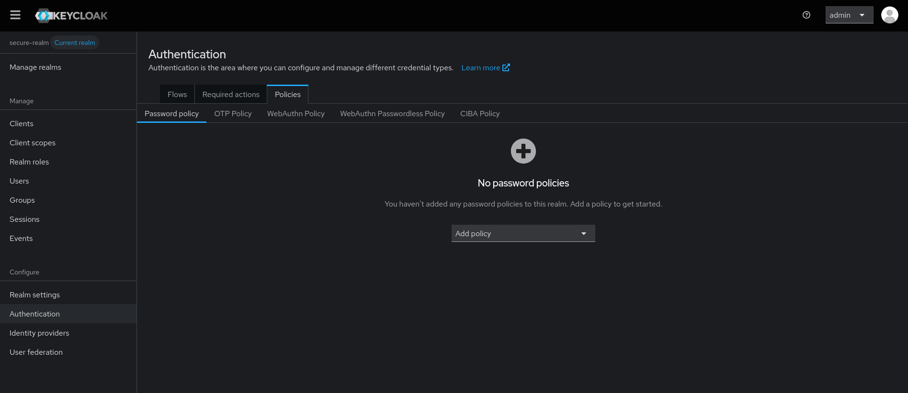
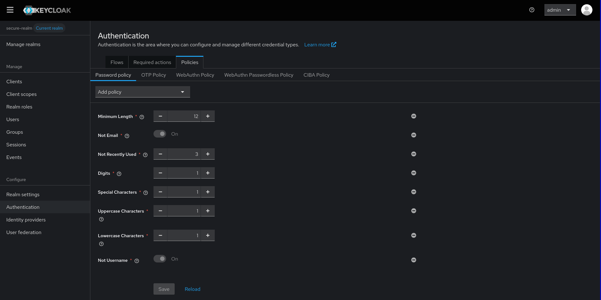

# Password Policy Configuration Issues

When configuring password policies in keycloak-config-cli, certain policy combinations can cause HTTP 400 Bad Request errors during import. This documentation explains the issue and provides workarounds.

## The Problem

Users encounter HTTP 400 Bad Request errors when importing realm configurations with specific password policy combinations, particularly those containing:

- `passwordHistory(5)` - Password history policy
- `specialChars(1)` - Special characters requirement

**Error Scenario:**
```json
{
  "realm": "secure-realm",
  "enabled": true,
  "passwordPolicy": "specialChars(1) and forceExpiredPasswordChange(365) and length(12) and lowerCase(1) and upperCase(1) and digits(1) and maxLength(128) and notUsername(undefined) and notEmail(undefined) and passwordHistory(5) and specialChars(1)"
}
```

**Result:** HTTP 400 Bad Request during import

## Root Cause

The issue occurs when keycloak-config-cli attempts to create realms with complex password policy configurations in a single operation. The exact cause is related to how Keycloak handles password policy validation during realm creation versus updates.

## Workaround: Split Configuration Files

The most reliable solution is to split the realm configuration into separate files and import them in sequence.

### Step 1: Create Base Realm Configuration

**File: `00_master-realm-config.json`**
```json
{
  "realm": "secure-realm",
  "enabled": true,
  "passwordPolicy": "",
  "clients": [
    {
      "clientId": "example-client",
      "enabled": true,
      "clientAuthenticatorType": "client-secret",
      "secret": "your-client-secret",
      "redirectUris": ["https://your-app.example.com/*"],
      "webOrigins": ["https://your-app.example.com"]
    }
  ],
  "roles": {
    "realm": [
      {
        "name": "user",
        "description": "Default user role"
      }
    ]
  }
}
```

### Step 2: Create Global Configuration

**File: `00_master-realm-global.json`**
```json
{
  "realm": "secure-realm",
  "enabled": true,
  "passwordPolicy": "length(12) and notEmail(undefined) and passwordHistory(3) and digits(1) and specialChars(1) and upperCase(1) and lowerCase(1) and notUsername(1)",
  "sslRequired": "external",
  "registrationAllowed": false,
  "registrationEmailAsUsername": false,
  "rememberMe": false,
  "verifyEmail": false,
  "loginWithEmailAllowed": true,
  "duplicateEmailsAllowed": false,
  "resetPasswordAllowed": false,
  "editUsernameAllowed": false,
  "bruteForceProtected": true,
  "permanentLockout": false,
  "maxFailureWaitSeconds": 900,
  "minimumQuickLoginWaitSeconds": 60,
  "waitIncrementSeconds": 60,
  "quickLoginCheckMilliSeconds": 1000,
  "maxDeltaTimeSeconds": 43200,
  "failureFactor": 10
}
```

### Step 3: Import Configuration Files

**Important:** The second file must include the complete realm configuration, not just the password policy. Keycloak requires the full realm state when updating password policies.

```bash
# Import base realm configuration first
java -jar keycloak-config-cli.jar \
  --keycloak.url=http://localhost:8080 \
  --keycloak.user=admin \
  --keycloak.password=admin \
  --import.files.locations=00_master-realm-config.json

# Then import global configuration (executed last due to naming)
java -jar keycloak-config-cli.jar \
  --keycloak.url=http://localhost:8080 \
  --keycloak.user=admin \
  --keycloak.password=admin \
  --import.files.locations=00_master-realm-global.json
```

**Import sequence showing successful execution:**



> Base realm configuration imported successfully without password policy.



> Password policy with complex requirements successfully configured using the split configuration approach.

## Working Password Policy Examples

### Simple Policies (Work in Single File)
```json
{
  "realm": "test-realm",
  "enabled": true,
  "passwordPolicy": "length(12) and digits(1) and upperCase(1) and lowerCase(1)"
}
```

### Complex Policies (Require Split Configuration)
```json
{
  "realm": "test-realm",
  "enabled": true,
  "passwordPolicy": "length(12) and notEmail(undefined) and passwordHistory(3) and digits(1) and specialChars(1) and upperCase(1) and lowerCase(1) and notUsername(1)"
}
```

## Best Practices

### 1. Use Split Configuration for Complex Policies
Always separate realm creation from password policy configuration when using:
- `passwordHistory()` policies
- `specialChars()` policies
- Multiple policy combinations

### 2. Follow Naming Convention
Use numeric prefixes to control import order:
- `00_*_config.json` - Base realm configuration
- `00_*_global.json` - Global settings including password policies

### 2.1. Include Complete Realm Configuration
**Critical:** The second import file must include the complete realm configuration, not just the password policy. Keycloak requires the full realm state when updating password policies.

### 3. Test in Development
Always test password policy configurations in development before production deployment.

## Common Policy Combinations

### Working Single-File Policies
- `length(12)`
- `length(12) and digits(1)`
- `length(12) and digits(1) and upperCase(1)`
- `length(12) and digits(1) and upperCase(1) and lowerCase(1)`

### Policies Requiring Split Configuration
- Any combination with `passwordHistory()`
- Any combination with `specialChars()`
- Complex policies with 5+ conditions

## Version Compatibility

| Keycloak Version | keycloak-config-cli Version | Issue Status |
|------------------|----------------------------|--------------|
| 21.1.2+ | 5.8.0+ | Issue confirmed |
| 22.0.0+ | 6.0.0+ | Issue confirmed |
| 23.0.0+ | 6.5.0+ | Issue confirmed |

**Note:** This issue affects multiple versions. The split configuration workaround works across all affected versions.

## Migration Guide

### From Single-File to Split Configuration

1. **Identify problematic policies** in your existing configuration
2. **Create base configuration** without password policies
3. **Create global configuration** with password policies
4. **Test import sequence** in development
5. **Deploy to production** with verified configuration

### Example Migration

**Before (problematic):**
```json
{
  "realm": "secure-realm",
  "enabled": true,
  "passwordPolicy": "length(12) and passwordHistory(5) and specialChars(1)"
}
```

**After (working):**

**first import**

```json
{
  "realm": "secure-realm",
  "enabled": true,
  "passwordPolicy": ""
}
```

**second import**

```json
{
  "realm": "secure-realm",
  "enabled": true,
  "passwordPolicy": "length(12) and passwordHistory(5) and specialChars(1)"
}
```

**Important:** The second import must include the complete realm configuration, not just the password policy. Keycloak requires the full realm state when updating.


---

## Summary

When working with complex password policies in keycloak-config-cli:

1. **Use split configuration** for policies with `passwordHistory()` or `specialChars()`
2. **Follow naming conventions** to control import order
3. **Test thoroughly** in development environments

This approach ensures reliable password policy configuration across different Keycloak and keycloak-config-cli versions.
