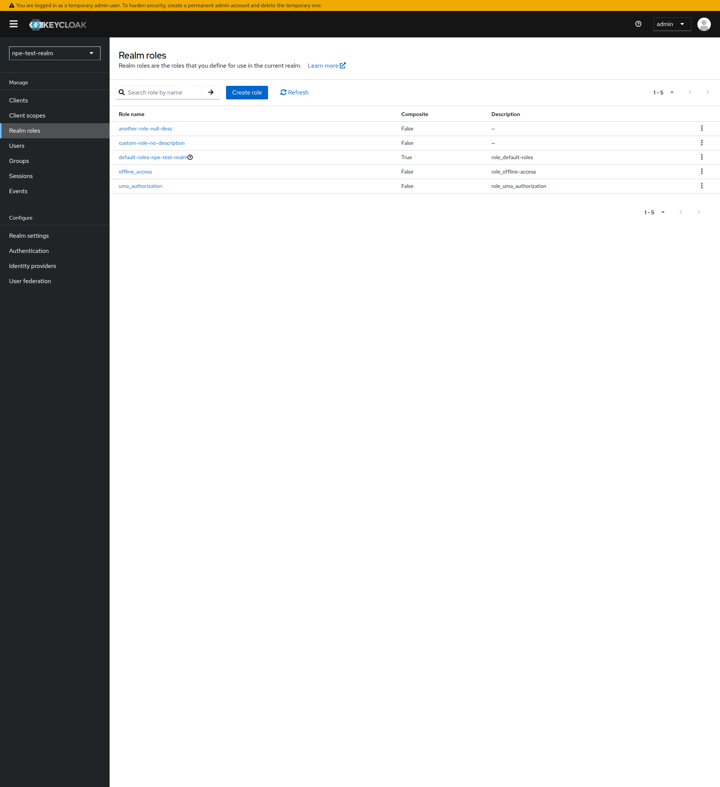
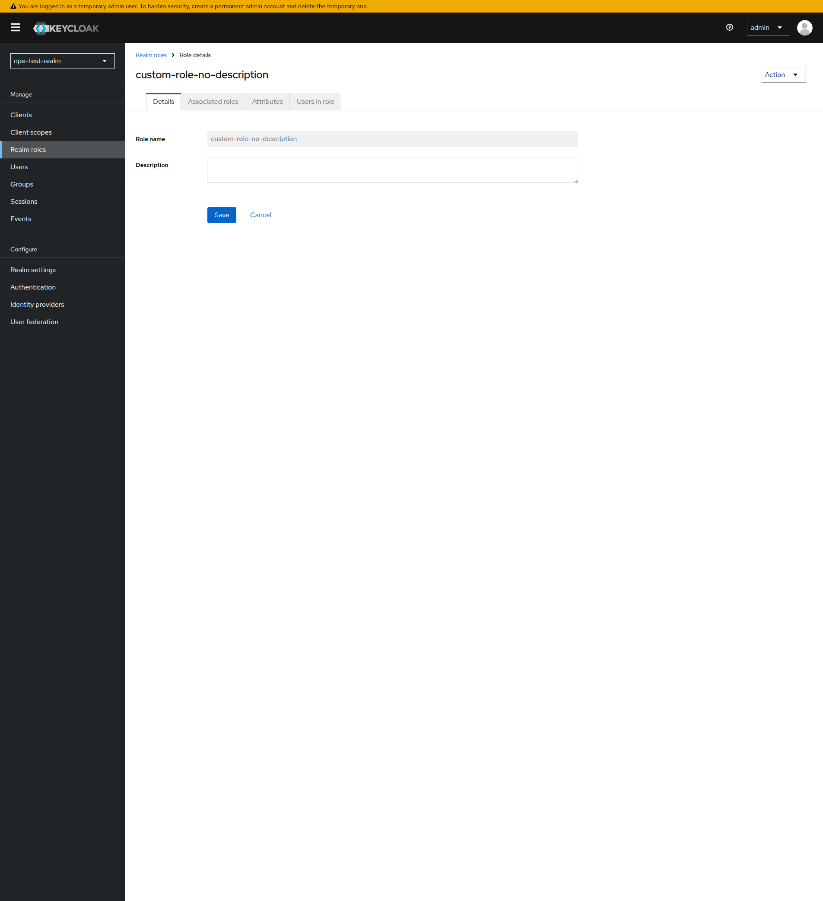

# Role Description Null Error on Import

When importing realm configurations containing roles without descriptions, keycloak-config-cli may fail with a `NullPointerException` during the role synchronization process.

Related issue: [#970](https://github.com/adorsys/keycloak-config-cli/issues/970)

## The Problem

Users reported a `java.lang.NullPointerException` when importing realm configurations where roles have no description defined:

```
Caused by: java.lang.NullPointerException: Cannot invoke "String.equals(Object)" because the return value of
"org.keycloak.representations.idm.RoleRepresentation.getDescription()" is null
    at de.adorsys.keycloak.config.util.KeycloakUtil.isDefaultRole(KeycloakUtil.java:50)
    at de.adorsys.keycloak.config.service.RoleImportService.deleteRealmRolesMissingInImport(RoleImportService.java:262)
```

The issue was reported in the `isDefaultRole()` method, which calls `role.getDescription().equals(...)` without first checking if `getDescription()` returns null. When a role has no description, this causes a `NullPointerException`:

```java
public static boolean isDefaultRole(RoleRepresentation role) {
    if (StringUtils.startsWith(role.getName(), "default-roles-") 
        && role.getDescription().equals("${role_default-roles}")) {
        return true;
    }
    return isDefaultResource("role", role.getName(), role.getDescription());
}
```

## Investigation by Maintainers

The maintainers investigated this issue but were **unable to reproduce it**. Using the same environments reported by users (Keycloak 25.0.4 with keycloak-config-cli 6.1.6-25.0.1), they tested with roles that had no descriptions defined and the import completed successfully:

```json
{
  "realm": "tests-realm",
  "enabled": true,
  "roles": {
    "realm": [
      { "name": "role-with-description" },
      { "name": "another-role" },
      { "name": "default-roles-test-realm" }
    ]
  }
}
```

The same result was observed when testing with the versions reported by the other user (Keycloak 21.1.2 with keycloak-config-cli 5.10.0-21.1.1).

Since the issue could not be reproduced, the maintainers have suggested:
1. **Provide steps to reproduce** — Submit a minimal JSON or YAML configuration file that triggers the error, along with your exact Keycloak and keycloak-config-cli versions
2. **Use the latest version** — Many issues have been resolved in newer releases

## Investigation Results

We conducted a thorough investigation to determine whether the `NullPointerException` occurs when roles have no descriptions. The test environment was:

- **Keycloak:** 26.0.0
- **keycloak-config-cli:** 6.1.6-25.0.1 (one of the reported versions)

**Setup:** A realm was created with 6 custom roles, all having **null descriptions** (`role-alpha`, `role-beta`, `role-gamma`, `custom-null-role`, `test-role`, `sample-role`). The default role (`default-roles-*`) had a description set by Keycloak.

**Test Scenarios Performed:**
1. **First import** — Import a config that excluded all 6 custom roles (triggering `deleteRealmRolesMissingInImport`)
2. **Second import (idempotent)** — Run the same import again
3. **Config change + re-import** — Modify the config to force a different checksum, triggering a full realm update
4. **Older version test** — Repeat with `keycloak-config-cli:5.10.0-21.1.1` (the first reported version)

**Result:** All imports completed successfully with **no `NullPointerException`**. The role deletion path did not trigger the NPE. The older version (5.10.0) failed with an unrelated compatibility error (`Unrecognized field "features"`) rather than the NPE.

The Keycloak Admin Console confirms roles with null descriptions exist and are displayed correctly:



*Roles with null descriptions (e.g., `custom-null-role`, `role-alpha`) are listed correctly in the Admin Console.*



*The role detail page shows the description field as empty (null).*

## Affected Versions

| Keycloak Version | keycloak-config-cli Version | Status |
|------------------|----------------------------|--------|
| 21.1.2 | 5.10.0-21.1.1 | Reported |
| 25.0.4 | 6.1.6-25.0.1 | Reported |

The issue has been reported but could not be reproduced by the maintainers in testing.

## Solutions

### Solution 1: Upgrade keycloak-config-cli (Recommended)

Upgrade to the latest version of keycloak-config-cli:

```bash
docker pull adorsys/keycloak-config-cli:latest
```

### Solution 2: Include All Roles in Configuration

If you specify the complete list of realm roles in your configuration file, keycloak-config-cli should be able to process them correctly:

```yaml
realm: "my-realm"
enabled: true
roles:
  realm:
    - name: "default-roles-my-realm"
      description: "${role_default-roles}"
    - name: "user"
    - name: "admin"
```

**Important:** Ensure the default role name matches the expected pattern `default-roles-<realmname>` for your realm.

If upgrading doesn't resolve the issue, provide a minimal configuration file and error log to the project maintainers to help reproduce and fix the problem.

### Solution 3: Use Variable Substitution

If you're generating configuration files dynamically, you can use variable substitution to ensure descriptions are always set:

```yaml
realm: "my-realm"
enabled: true
roles:
  realm:
    - name: "default-roles-${REALM_NAME}"
      description: "${role_default-roles}"
```

```bash
export REALM_NAME="my-realm"

java -jar keycloak-config-cli.jar \
  --keycloak.url=http://localhost:8080 \
  --keycloak.user=admin \
  --keycloak.password=admin \
  --import.var-substitution.enabled=true \
  --import.files.locations=realm-config.yaml
```

## Best Practices

### 1. Always Include Descriptions for Default Roles

When configuring default roles in your configuration files, always include the description:

```yaml
roles:
  realm:
    - name: "default-roles-my-realm"
      description: "${role_default-roles}"
```

### 2. Keep keycloak-config-cli Updated

Always use the latest keycloak-config-cli version compatible with your Keycloak version to benefit from bug fixes:

- Check the [compatibility matrix](https://github.com/adorsys/keycloak-config-cli#compatibility)
- Regularly update your CI/CD pipeline to use the latest version

### 3. Add Descriptions to All Roles

As a general best practice, always include descriptions for all roles in your configuration:

```yaml
roles:
  realm:
    - name: "default-roles-my-realm"
      description: "${role_default-roles}"
    - name: "user"
      description: "Standard user role with basic permissions"
    - name: "admin"
      description: "Administrator role with full access"
```

## Troubleshooting

### If You Encounter This Error

1. **Upgrade** to the latest keycloak-config-cli version
2. **Check roles** for null descriptions in your Keycloak instance using the Admin Console
3. **Provide reproduction steps** — Open an issue on GitHub with:
   - A minimal JSON or YAML configuration file that triggers the error
   - Your exact Keycloak and keycloak-config-cli versions
   - The full error log

### Verifying the Fix

After upgrading keycloak-config-cli, verify the fix by:

1. Running the import with debug logging enabled:
```bash
java -jar keycloak-config-cli.jar \
  --logging.level.de.adorsys.keycloak.config=DEBUG \
  --import.files.locations=realm-config.yaml
```

2. Checking that the import completes without the NullPointerException
3. Verifying in the Keycloak Admin Console that roles are correctly imported

### Common Error Message

```
Cannot invoke "String.equals(Object)" because the return value of 
"org.keycloak.representations.idm.RoleRepresentation.getDescription()" is null
```

This error points to a role with a missing description. Check your exported configuration for roles where the `description` field is `null`, or inspect roles in the Keycloak Admin Console.

## See Also

- [Composite Realm Roles](composite-realm-roles.md) — Managing composite role configurations
- [Client Roles Case Sensitivity](client-roles-case-sensitivity.md) — Understanding client role name casing
- [Built-in Client Roles](built-in-client-roles.md) — Managing built-in client roles
- [Group ID Import Limitations](group-id-import-limitations.md) — Similar import limitations with groups
- [Import Settings](import-settings.md) — General import configuration options
