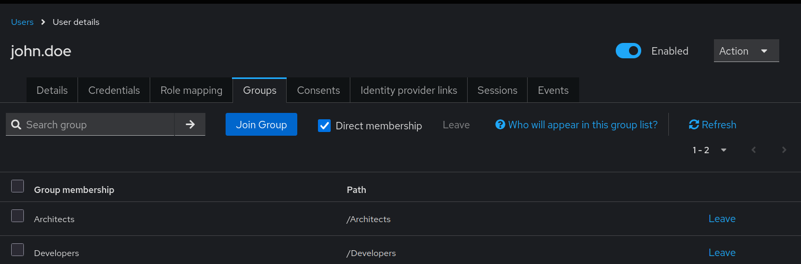
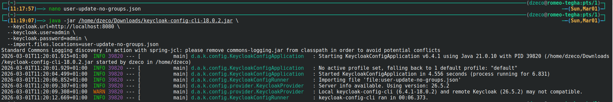
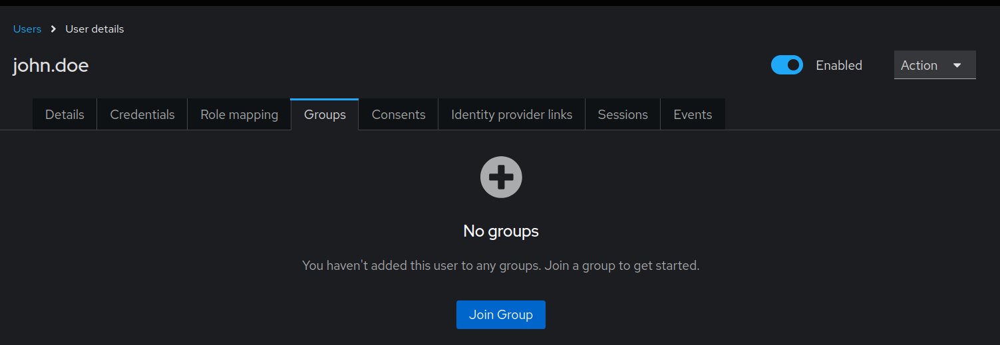
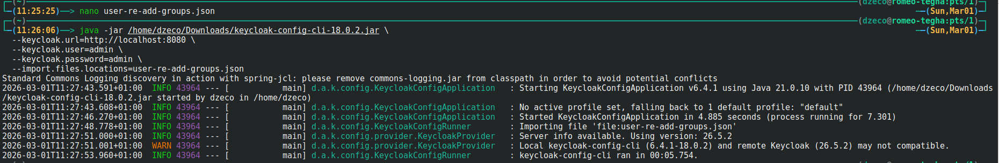

# User Group Update Behavior

When updating user configurations in keycloak-config-cli, omitting the `groups` field can unexpectedly remove the user's existing group memberships. Understanding how keycloak-config-cli handles user updates and group assignments is essential for maintaining user group memberships across configuration imports.

Related issues: [#1132](https://github.com/adorsys/keycloak-config-cli/issues/1132)

## The Problem

Users encounter unexpected group removal when updating user configurations because:
- Omitting the `groups` field removes all existing group memberships
- keycloak-config-cli treats missing `groups` as "set groups to empty"
- It's unclear whether updates are additive or replace existing data
- Partial user updates can unintentionally affect group memberships
- Different fields have different update behaviors (some merge, some replace)
- No warning when groups will be removed
- Existing configuration files may not include complete user state

## Understanding User Update Behavior

### How keycloak-config-cli Updates Users

When a user exists and is updated:

1. **Field Presence Matters**
   - Fields present in config: Updated to specified values
   - Fields absent from config: Behavior varies by field type
   - Arrays (like groups): Absence means "set to empty"

2. **Groups Are Replaced, Not Merged**
   - Configuration `groups: []` → All groups removed
   - Configuration missing `groups` → All groups removed
   - Configuration `groups: ["/New"]` → Only "/New", others removed

3. **Remote State Tracking**
   - With `import.remote-state.enabled=true` (default)
   - Tracks which groups were assigned by keycloak-config-cli
   - Only removes groups it previously assigned

---

## The Error Scenario

### Initial User Creation

**First Import:**
```json
{
  "realm": "master",
  "users": [
    {
      "username": "john.doe",
      "email": "john.doe@example.com",
      "firstName": "John",
      "lastName": "Doe",
      "enabled": true,
      "groups": ["/Developers", "/Architects"]
    }
  ]
}
```

**Result:** User created with both groups

step1


step2



*User john.doe successfully created with memberships in both Developers and Architects groups.*

---

### User Update Without Groups

**Second Import (updating email):**
```json
{
  "realm": "master",
  "users": [
    {
      "username": "john.doe",
      "email": "john.doe.updated@example.com",
      "enabled": true
    }
  ]
}
```

**Result:** User's groups removed

step1


step2



*After updating without the groups field, user is removed from all groups. Email was updated to john.doe.updated@example.com, but group memberships were lost.*

---

### What Users Expected

Users typically expect:
- Only specified fields to be updated
- Omitted fields to remain unchanged
- Additive behavior for arrays like groups

**But keycloak-config-cli behavior:**
- Omitted array fields are set to empty
- Groups are replaced, not merged
- Full user state must be specified

---

## Solutions

### Solution 1: Always Include Complete User State (Recommended)

**Strategy:** Always specify all user attributes in every import, including groups.
```json
{
  "realm": "master",
  "users": [
    {
      "username": "john.doe",
      "email": "john.doe.final@example.com",
      "enabled": true,
      "groups": ["/Developers", "/Architects"]
    }
  ]
}
```
step1


step2


*When groups are explicitly included in the configuration, they are maintained across updates. Email updated to john.doe.final@example.com while preserving group memberships.*

**Benefits:**
- Predictable behavior
- No unexpected deletions
- Configuration represents complete desired state
- Easy to review what groups user should have

**Best Practice:**
```json
{
  "users": [
    {
      "username": "USERNAME",
      "email": "EMAIL",
      "firstName": "FIRST",
      "lastName": "LAST",
      "enabled": true,
      "emailVerified": false,
      "groups": [],
      "realmRoles": [],
      "clientRoles": {},
      "attributes": {}
    }
  ]
}
```

---

### Solution 2: Separate User Management from Group Management

**Strategy:** Manage users and their group memberships in separate, focused imports.

**Structure:**
```
config/
├── users-base.json         # User definitions without groups
├── groups.json             # Group definitions
└── user-groups.json        # User-to-group mappings
```

**users-base.json:**
```json
{
  "realm": "myrealm",
  "users": [
    {
      "username": "john.doe",
      "email": "john.doe@example.com",
      "firstName": "John",
      "lastName": "Doe",
      "enabled": true,
      "emailVerified": true
    },
    {
      "username": "jane.smith",
      "email": "jane.smith@example.com",
      "firstName": "Jane",
      "lastName": "Smith",
      "enabled": true,
      "emailVerified": true
    }
  ]
}
```

**groups.json:**
```json
{
  "realm": "myrealm",
  "groups": [
    {
      "name": "Developers",
      "path": "/Developers"
    },
    {
      "name": "Architects",
      "path": "/Architects"
    },
    {
      "name": "Managers",
      "path": "/Managers"
    }
  ]
}
```

**user-groups.json:**
```json
{
  "realm": "myrealm",
  "users": [
    {
      "username": "john.doe",
      "groups": ["/Developers", "/Architects"]
    },
    {
      "username": "jane.smith",
      "groups": ["/Developers", "/Managers"]
    }
  ]
}
```

**Import workflow:**
```bash
java -jar keycloak-config-cli.jar \
  --import.files.locations=config/users-base.json

java -jar keycloak-config-cli.jar \
  --import.files.locations=config/groups.json

java -jar keycloak-config-cli.jar \
  --import.files.locations=config/user-groups.json
```

**Benefits:**
- Clear separation of concerns
- Can update user profiles without affecting groups
- Can update groups without affecting users
- Easier to review group assignments

**Trade-offs:**
- More files to manage
- Must run multiple imports
- Need to coordinate import order

---

### Solution 3: Use Minimal User Updates

**Strategy:** Only update users when absolutely necessary; manage groups separately via Admin Console or API.
```json
{
  "realm": "myrealm",
  "users": [
    {
      "username": "john.doe",
      "email": "john.doe.new@example.com"
    }
  ]
}
```

**With this approach:**
- Accept that groups are managed outside config files
- Use keycloak-config-cli for user creation only
- Manual group management via Admin Console
- Or use separate tooling for group management

**Not recommended for:**
- Full automation requirements
- GitOps workflows
- Environments requiring reproducibility

---

### Solution 4: Use Placeholder for Empty Groups

**Strategy:** Always include `groups: []` explicitly, even when empty.
```json
{
  "realm": "myrealm",
  "users": [
    {
      "username": "john.doe",
      "email": "john.doe@example.com",
      "enabled": true,
      "groups": ["/Developers", "/Architects"]
    },
    {
      "username": "jane.smith",
      "email": "jane.smith@example.com",
      "enabled": true,
      "groups": []
    },
    {
      "username": "bob.wilson",
      "email": "bob.wilson.new@example.com",
      "enabled": true,
      "groups": ["/Developers"]
    }
  ]
}
```

**Benefits:**
- Makes intent clear
- No ambiguity about group membership
- Easy to see who has groups and who doesn't
- Prevents accidental removal

---

## Remote State Behavior

### With Remote State Enabled (Default)
```bash
--import.remote-state.enabled=true
```

**Behavior:**
- keycloak-config-cli tracks which groups it assigned
- Only removes groups it previously assigned
- Groups assigned manually in Admin Console remain

**Example:**

**Initial Import:**
```json
{
  "users": [
    {
      "username": "john.doe",
      "groups": ["/Developers"]
    }
  ]
}
```

**Manual Assignment in Admin Console:**
- Admin adds john.doe to "/Managers" group

**Second Import (without groups field):**
```json
{
  "users": [
    {
      "username": "john.doe",
      "email": "john.doe.new@example.com"
    }
  ]
}
```

**Result:**
- "/Developers" removed (was managed by keycloak-config-cli)
- "/Managers" preserved (was manually assigned)

**Important:** Even with remote state, omitting groups removes managed groups.

---

### Without Remote State
```bash
--import.remote-state.enabled=false
```

**Behavior:**
- No tracking of managed vs. manual groups
- All groups treated the same
- Omitting groups field removes ALL groups

**Not recommended** for most use cases.

---

## Array Field Behavior Summary

Understanding how different array fields behave:

| Field | Omitted | Empty Array `[]` | With Values |
|-------|---------|------------------|-------------|
| `groups` | All removed | All removed | Set to specified |
| `realmRoles` | All removed | All removed | Set to specified |
| `clientRoles` | All removed | All removed | Set to specified |
| `requiredActions` | All removed | All removed | Set to specified |
| `credentials` | Unchanged | All removed | Set to specified |

**Key Takeaway:** Always specify array fields explicitly to avoid unintended removal.

---

## Complete Configuration Examples

### Example 1: Full User State Management
```json
{
  "realm": "corporate",
  "enabled": true,
  "groups": [
    {
      "name": "Engineering",
      "path": "/Engineering",
      "subGroups": [
        {
          "name": "Backend",
          "path": "/Engineering/Backend"
        },
        {
          "name": "Frontend",
          "path": "/Engineering/Frontend"
        }
      ]
    },
    {
      "name": "Management",
      "path": "/Management"
    }
  ],
  "roles": {
    "realm": [
      {
        "name": "employee",
        "description": "Standard employee"
      },
      {
        "name": "manager",
        "description": "People manager"
      }
    ]
  },
  "users": [
    {
      "username": "john.doe",
      "email": "john.doe@corporate.com",
      "firstName": "John",
      "lastName": "Doe",
      "enabled": true,
      "emailVerified": true,
      "groups": ["/Engineering/Backend"],
      "realmRoles": ["employee"],
      "attributes": {
        "department": ["Engineering"],
        "employeeId": ["ENG-001"]
      },
      "credentials": [
        {
          "type": "password",
          "value": "TempPassword123",
          "temporary": true
        }
      ]
    },
    {
      "username": "jane.smith",
      "email": "jane.smith@corporate.com",
      "firstName": "Jane",
      "lastName": "Smith",
      "enabled": true,
      "emailVerified": true,
      "groups": ["/Engineering/Frontend", "/Management"],
      "realmRoles": ["employee", "manager"],
      "attributes": {
        "department": ["Engineering"],
        "employeeId": ["ENG-002"]
      },
      "credentials": [
        {
          "type": "password",
          "value": "TempPassword456",
          "temporary": true
        }
      ]
    },
    {
      "username": "api-service",
      "email": "api@corporate.com",
      "enabled": true,
      "serviceAccountClientId": "backend-api",
      "groups": [],
      "realmRoles": [],
      "attributes": {}
    }
  ]
}
```

---

### Example 2: Separate Files Strategy

**config/01-groups.json:**
```json
{
  "realm": "corporate",
  "groups": [
    {
      "name": "Engineering",
      "path": "/Engineering"
    },
    {
      "name": "Sales",
      "path": "/Sales"
    },
    {
      "name": "Support",
      "path": "/Support"
    }
  ]
}
```

**config/02-users-profiles.json:**
```json
{
  "realm": "corporate",
  "users": [
    {
      "username": "john.doe",
      "email": "john.doe@corporate.com",
      "firstName": "John",
      "lastName": "Doe",
      "enabled": true,
      "emailVerified": true,
      "attributes": {
        "department": ["Engineering"],
        "employeeId": ["ENG-001"]
      }
    },
    {
      "username": "jane.smith",
      "email": "jane.smith@corporate.com",
      "firstName": "Jane",
      "lastName": "Smith",
      "enabled": true,
      "emailVerified": true,
      "attributes": {
        "department": ["Sales"],
        "employeeId": ["SALES-001"]
      }
    }
  ]
}


**config/03-user-groups.json:**
```json
{
  "realm": "corporate",
  "users": [
    {
      "username": "john.doe",
      "groups": ["/Engineering"]
    },
    {
      "username": "jane.smith",
      "groups": ["/Sales"]
    }
  ]
}


---

### Example 3: Conditional Groups Based on Attributes
```json
{
  "realm": "corporate",
  "groups": [
    {
      "name": "Employees",
      "path": "/Employees"
    },
    {
      "name": "Contractors",
      "path": "/Contractors"
    },
    {
      "name": "Engineering",
      "path": "/Engineering"
    },
    {
      "name": "Sales",
      "path": "/Sales"
    }
  ],
  "users": [
    {
      "username": "john.doe",
      "email": "john.doe@corporate.com",
      "enabled": true,
      "attributes": {
        "employeeType": ["FTE"],
        "department": ["Engineering"]
      },
      "groups": ["/Employees", "/Engineering"]
    },
    {
      "username": "jane.contractor",
      "email": "jane@contractor.com",
      "enabled": true,
      "attributes": {
        "employeeType": ["Contractor"],
        "department": ["Engineering"]
      },
      "groups": ["/Contractors", "/Engineering"]
    },
    {
      "username": "bob.sales",
      "email": "bob@corporate.com",
      "enabled": true,
      "attributes": {
        "employeeType": ["FTE"],
        "department": ["Sales"]
      },
      "groups": ["/Employees", "/Sales"]
    }
  ]
}
```

---

## Common Pitfalls

### 1. Updating User Without Specifying Groups

**Problem:**
```json
{
  "users": [
    {
      "username": "john.doe",
      "email": "john@example.com",
      "groups": ["/Developers"]
    }
  ]
}
```

Later update (different file or import):
```json
{
  "users": [
    {
      "username": "john.doe",
      "email": "john.updated@example.com"
    }
  ]
}
```

**Result:** john.doe removed from "/Developers"

**Solution:**
```json
{
  "users": [
    {
      "username": "john.doe",
      "email": "john.updated@example.com",
      "groups": ["/Developers"]
    }
  ]
}
```

---

### 2. Assuming Additive Behavior

**Misconception:** "Adding groups will append to existing groups"

**Reality:** Groups are replaced completely

**Example:**

Initial:
```json
{
  "users": [
    {
      "username": "john.doe",
      "groups": ["/Developers"]
    }
  ]
}
```

Later (expecting to ADD /Architects):
```json
{
  "users": [
    {
      "username": "john.doe",
      "groups": ["/Architects"]
    }
  ]
}
```

**Result:** Only "/Architects", "/Developers" removed

**Solution:** Always specify complete list:
```json
{
  "users": [
    {
      "username": "john.doe",
      "groups": ["/Developers", "/Architects"]
    }
  ]
}
```

---

### 3. Inconsistent Configuration Sources

**Problem:** Multiple people/systems updating same users

**Scenario:**

Team A's config:
```json
{
  "users": [
    {
      "username": "john.doe",
      "email": "john@example.com",
      "groups": ["/Developers"]
    }
  ]
}
```

Team B's config (doesn't know about Team A's groups):
```json
{
  "users": [
    {
      "username": "john.doe",
      "attributes": {
        "department": ["Engineering"]
      }
    }
  ]
}
```

**Solution:** Centralized user configuration:
```json
{
  "users": [
    {
      "username": "john.doe",
      "email": "john@example.com",
      "attributes": {
        "department": ["Engineering"]
      },
      "groups": ["/Developers"]
    }
  ]
}
```

---

### 4. Copy-Paste User Templates

**Problem:** Using incomplete templates

**Bad template:**
```json
{
  "username": "USERNAME",
  "email": "EMAIL",
  "enabled": true
}
```

**Good template:**
```json
{
  "username": "USERNAME",
  "email": "EMAIL",
  "firstName": "FIRST",
  "lastName": "LAST",
  "enabled": true,
  "emailVerified": false,
  "groups": [],
  "realmRoles": [],
  "clientRoles": {},
  "attributes": {},
  "credentials": [],
  "requiredActions": []
}
```

---

### 5. Not Testing Import Repeatability

**Problem:** Not verifying that imports are idempotent

**Test:**
```bash
java -jar keycloak-config-cli.jar \
  --import.files.locations=config.json

curl "http://localhost:8080/admin/realms/myrealm/users/{user-id}/groups" \
  -H "Authorization: Bearer $TOKEN"

java -jar keycloak-config-cli.jar \
  --import.files.locations=config.json

curl "http://localhost:8080/admin/realms/myrealm/users/{user-id}/groups" \
  -H "Authorization: Bearer $TOKEN"
```

---

## Best Practices

1. **Always Include Complete User State**
```json
{
  "users": [
    {
      "username": "john.doe",
      "email": "john@example.com",
      "firstName": "John",
      "lastName": "Doe",
      "enabled": true,
      "groups": ["/Developers"],
      "realmRoles": ["employee"],
      "attributes": {
        "department": ["Engineering"]
      }
    }
  ]
}
```

2. **Use Configuration Templates**
```json
{
  "username": "REPLACE_USERNAME",
  "email": "REPLACE_EMAIL",
  "firstName": "REPLACE_FIRST",
  "lastName": "REPLACE_LAST",
  "enabled": true,
  "emailVerified": false,
  "groups": [],
  "realmRoles": [],
  "clientRoles": {},
  "attributes": {}
}
```

3. **Validate Before Import**
```bash
jq '.users[] | select(has("groups") | not) | .username' config.json
```

4. **Document Expected State**
```json
{
  "users": [
    {
      "username": "john.doe",
      "groups": ["/Engineering/Backend"]
    }
  ]
}


8. **Separate Concerns When Needed**
   - users-profiles.json (email, names, attributes)
   - user-groups.json (group assignments only)
   - user-roles.json (role assignments only)

---

## Troubleshooting

### Groups Unexpectedly Removed

**Symptom:** User's group memberships disappear after import

**Diagnosis:**
```bash
grep "Removing.*from group" keycloak-config-cli.log

curl "http://localhost:8080/admin/realms/myrealm/users/{user-id}/groups" \
  -H "Authorization: Bearer $TOKEN"

grep -A 10 "username: john.doe" config.json | grep "groups"
```

**Cause:** Groups field omitted or empty in configuration

**Solution:** Add groups back to configuration:
```json
{
  "users": [
    {
      "username": "john.doe",
      "email": "john@example.com",
      "groups": ["/Developers", "/Architects"]
    }
  ]
}
```

---

### User Has More Groups Than Expected

**Symptom:** User has groups not in configuration

**Possible causes:**
1. Manual assignment via Admin Console
2. Groups assigned by different config file
3. Previous import with different groups

**Check remote state:**

With remote state enabled, manually assigned groups are preserved.

**Solution:**
- If groups should be there: Add to configuration
- If groups should not be there: Remove manually or explicitly set full list

---

### Cannot Remove User from Group

**Symptom:** User remains in group despite not being in configuration

**Possible cause:** Group was manually assigned, not via keycloak-config-cli

**With remote state enabled:**
- Only groups assigned by keycloak-config-cli are removed
- Manual groups remain

**Solution:**

Remove manually via Admin Console or disable remote state (not recommended).

---

## Configuration Options
```bash
--import.remote-state.enabled=true

--import.validate=true

--import.parallel=true
```

---

## Consequences

When managing user groups in keycloak-config-cli:

1. **Omitted Groups Are Removed:** Not specifying `groups` field removes group memberships
2. **Groups Are Replaced, Not Merged:** Specifying groups sets the complete list, removing others
3. **Remote State Provides Partial Protection:** Only managed groups are removed, manual groups preserved
4. **Array Fields Behave Similarly:** roles, requiredActions, etc. also replaced when specified
5. **Complete State Required:** Must always specify full desired state for predictable results
6. **No Additive Operations:** Cannot add/remove individual groups, must specify complete list

---
