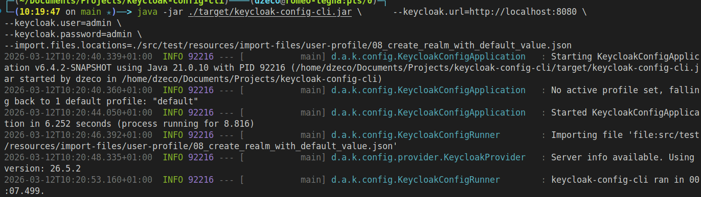
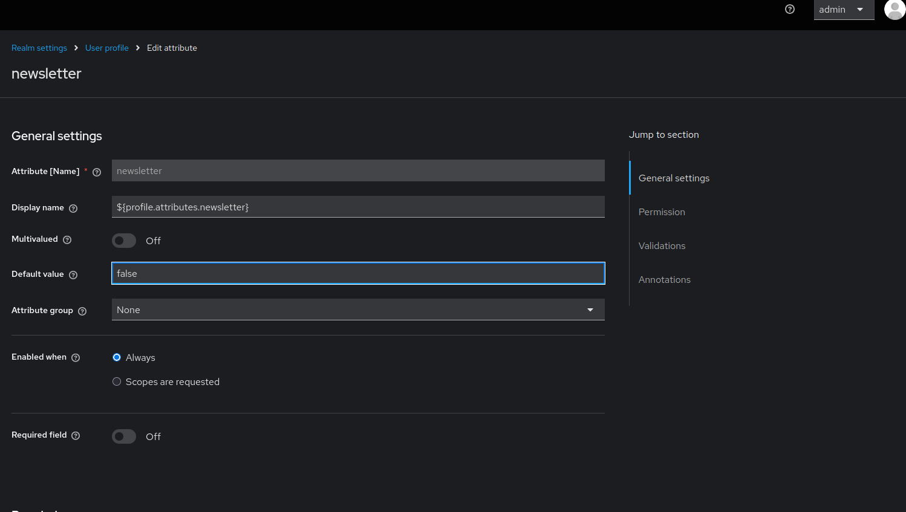

# User Profile Default Values

Keycloak's User Profile feature allows you to define default values for user attributes. This is essential for ensuring consistent data, simplifying user registration, and providing fallback values for optional fields. Understanding how to configure default values through keycloak-config-cli helps maintain data integrity across your user base.

Related issues: [#1330](https://github.com/adorsys/keycloak-config-cli/issues/1330)

## The Problem

Users encounter challenges with user profile attributes because:
- Custom attributes require default values for consistency
- New users may not provide values for optional fields
- Registration forms need sensible defaults
- Existing users may have missing attribute values
- It's unclear how to set default values via configuration
- Default values must work with different attribute types (text, select, boolean)
- Multi-valued attributes need special handling

## Understanding User Profile Default Values

### What are Default Values?

Default values are automatically assigned to user attributes when:

1. **User Registration**
   - New users get default values for unspecified attributes
   - Simplifies registration forms
   - Ensures required data exists

2. **Attribute Creation**
   - Existing users receive default values when new attributes are added
   - Maintains data consistency
   - Avoids null/empty values

3. **Form Display**
   - Pre-populates form fields
   - Improves user experience
   - Reduces data entry errors

---

## Basic Configuration

### Simple Default Value
```json
{
  "realm": "master",
  "attributes": {
    "userProfileEnabled": true
  },
  "userProfile": {
    "attributes": [
      {
        "name": "newsletter",
        "displayName": "Newsletter Subscription",
        "defaultValue": "false",
        "permissions": {
          "view": ["admin", "user"],
          "edit": ["admin", "user"]
        }
      }
    ]
  }
}
```

---

## Complete Example with Default Values

### Newsletter Subscription with Default
```json
{
  "enabled": true,
  "realm": "realmWithDefaultValue",
  "attributes": {
    "userProfileEnabled": true
  },
  "userProfile": {
    "attributes": [
      {
        "name": "username",
        "displayName": "${username}",
        "validations": {
          "length": {
            "min": 1,
            "max": 20
          },
          "username-prohibited-characters": {}
        }
      },
      {
        "name": "email",
        "displayName": "${email}",
        "validations": {
          "email": {},
          "length": {
            "max": 255
          }
        }
      },
      {
        "name": "newsletter",
        "displayName": "${profile.attributes.newsletter}",
        "defaultValue": "false",
        "validations": {
          "options": {
            "options": [
              "true",
              "false"
            ]
          }
        },
        "annotations": {
          "inputType": "select-radiobuttons"
        },
        "permissions": {
          "view": ["admin", "user"],
          "edit": ["admin", "user"]
        },
        "multivalued": false
      }
    ]
  }
}
```
step1



step2




*User profile configuration showing the newsletter attribute with a default value of "false". The attribute uses radio buttons for input and is visible/editable by both admins and users.*

---

## Default Value Patterns

### Pattern 1: Boolean Attributes
```json
{
  "userProfile": {
    "attributes": [
      {
        "name": "termsAccepted",
        "displayName": "Terms and Conditions",
        "defaultValue": "false",
        "validations": {
          "options": {
            "options": ["true", "false"]
          }
        },
        "annotations": {
          "inputType": "select-radiobuttons"
        },
        "permissions": {
          "view": ["admin", "user"],
          "edit": ["user"]
        }
      }
    ]
  }
}
```

---

### Pattern 2: Select Dropdown with Default
```json
{
  "userProfile": {
    "attributes": [
      {
        "name": "language",
        "displayName": "Preferred Language",
        "defaultValue": "en",
        "validations": {
          "options": {
            "options": ["en", "fr", "de", "es"]
          }
        },
        "annotations": {
          "inputType": "select"
        },
        "permissions": {
          "view": ["admin", "user"],
          "edit": ["admin", "user"]
        }
      }
    ]
  }
}
```

---

### Pattern 3: Text Field with Default
```json
{
  "userProfile": {
    "attributes": [
      {
        "name": "country",
        "displayName": "Country",
        "defaultValue": "USA",
        "validations": {
          "length": {
            "min": 2,
            "max": 50
          }
        },
        "permissions": {
          "view": ["admin", "user"],
          "edit": ["admin", "user"]
        }
      }
    ]
  }
}
```

---

### Pattern 4: Multi-Select with Default Values
```json
{
  "userProfile": {
    "attributes": [
      {
        "name": "interests",
        "displayName": "Interests",
        "defaultValue": {
          "0": "technology"
        },
        "validations": {
          "options": {
            "options": ["technology", "sports", "music", "art", "science"]
          }
        },
        "annotations": {
          "inputType": "multiselect"
        },
        "permissions": {
          "view": ["admin", "user"],
          "edit": ["admin", "user"]
        },
        "multivalued": true
      }
    ]
  }
}
```

---

### Pattern 5: Role-Based Default
```json
{
  "userProfile": {
    "attributes": [
      {
        "name": "userType",
        "displayName": "User Type",
        "defaultValue": "standard",
        "validations": {
          "options": {
            "options": ["standard", "premium", "enterprise"]
          }
        },
        "annotations": {
          "inputType": "select"
        },
        "permissions": {
          "view": ["admin", "user"],
          "edit": ["admin"]
        }
      }
    ]
  }
}
```

---

## Complete Configuration Examples

### Example 1: User Registration Form with Defaults
```json
{
  "realm": "corporate",
  "enabled": true,
  "attributes": {
    "userProfileEnabled": true
  },
  "userProfile": {
    "attributes": [
      {
        "name": "username",
        "displayName": "${username}",
        "validations": {
          "length": {
            "min": 3,
            "max": 50
          },
          "username-prohibited-characters": {}
        },
        "permissions": {
          "view": ["admin", "user"],
          "edit": ["admin"]
        }
      },
      {
        "name": "email",
        "displayName": "${email}",
        "validations": {
          "email": {},
          "length": {
            "max": 255
          }
        },
        "permissions": {
          "view": ["admin", "user"],
          "edit": ["admin", "user"]
        }
      },
      {
        "name": "firstName",
        "displayName": "${firstName}",
        "validations": {
          "length": {
            "min": 1,
            "max": 100
          }
        },
        "permissions": {
          "view": ["admin", "user"],
          "edit": ["admin", "user"]
        }
      },
      {
        "name": "lastName",
        "displayName": "${lastName}",
        "validations": {
          "length": {
            "min": 1,
            "max": 100
          }
        },
        "permissions": {
          "view": ["admin", "user"],
          "edit": ["admin", "user"]
        }
      },
      {
        "name": "department",
        "displayName": "Department",
        "defaultValue": "General",
        "validations": {
          "options": {
            "options": ["Engineering", "Sales", "Marketing", "HR", "General"]
          }
        },
        "annotations": {
          "inputType": "select"
        },
        "permissions": {
          "view": ["admin", "user"],
          "edit": ["admin"]
        }
      },
      {
        "name": "newsletter",
        "displayName": "Subscribe to Newsletter",
        "defaultValue": "false",
        "validations": {
          "options": {
            "options": ["true", "false"]
          }
        },
        "annotations": {
          "inputType": "select-radiobuttons"
        },
        "permissions": {
          "view": ["admin", "user"],
          "edit": ["admin", "user"]
        }
      },
      {
        "name": "timezone",
        "displayName": "Timezone",
        "defaultValue": "UTC",
        "validations": {
          "options": {
            "options": ["UTC", "EST", "PST", "CET", "JST"]
          }
        },
        "annotations": {
          "inputType": "select"
        },
        "permissions": {
          "view": ["admin", "user"],
          "edit": ["admin", "user"]
        }
      }
    ]
  }
}
```

---

### Example 2: E-commerce User Profile
```json
{
  "realm": "ecommerce",
  "enabled": true,
  "attributes": {
    "userProfileEnabled": true
  },
  "userProfile": {
    "attributes": [
      {
        "name": "username",
        "displayName": "${username}",
        "validations": {
          "length": {
            "min": 3,
            "max": 30
          }
        }
      },
      {
        "name": "email",
        "displayName": "${email}",
        "validations": {
          "email": {}
        }
      },
      {
        "name": "marketingEmails",
        "displayName": "Receive Marketing Emails",
        "defaultValue": "true",
        "validations": {
          "options": {
            "options": ["true", "false"]
          }
        },
        "annotations": {
          "inputType": "select-radiobuttons"
        },
        "permissions": {
          "view": ["admin", "user"],
          "edit": ["admin", "user"]
        }
      },
      {
        "name": "preferredCurrency",
        "displayName": "Preferred Currency",
        "defaultValue": "USD",
        "validations": {
          "options": {
            "options": ["USD", "EUR", "GBP", "JPY", "CAD"]
          }
        },
        "annotations": {
          "inputType": "select"
        },
        "permissions": {
          "view": ["admin", "user"],
          "edit": ["admin", "user"]
        }
      },
      {
        "name": "loyaltyTier",
        "displayName": "Loyalty Tier",
        "defaultValue": "bronze",
        "validations": {
          "options": {
            "options": ["bronze", "silver", "gold", "platinum"]
          }
        },
        "permissions": {
          "view": ["admin", "user"],
          "edit": ["admin"]
        }
      }
    ]
  }
}
```

---

### Example 3: SaaS Application User Profile
```json
{
  "realm": "saas-app",
  "enabled": true,
  "attributes": {
    "userProfileEnabled": true
  },
  "userProfile": {
    "attributes": [
      {
        "name": "username",
        "displayName": "${username}",
        "validations": {
          "length": {
            "min": 3,
            "max": 50
          }
        }
      },
      {
        "name": "email",
        "displayName": "${email}",
        "validations": {
          "email": {}
        }
      },
      {
        "name": "accountType",
        "displayName": "Account Type",
        "defaultValue": "free",
        "validations": {
          "options": {
            "options": ["free", "pro", "enterprise"]
          }
        },
        "permissions": {
          "view": ["admin", "user"],
          "edit": ["admin"]
        }
      },
      {
        "name": "theme",
        "displayName": "UI Theme",
        "defaultValue": "light",
        "validations": {
          "options": {
            "options": ["light", "dark", "auto"]
          }
        },
        "annotations": {
          "inputType": "select-radiobuttons"
        },
        "permissions": {
          "view": ["admin", "user"],
          "edit": ["admin", "user"]
        }
      },
      {
        "name": "notifications",
        "displayName": "Email Notifications",
        "defaultValue": "true",
        "validations": {
          "options": {
            "options": ["true", "false"]
          }
        },
        "annotations": {
          "inputType": "select-radiobuttons"
        },
        "permissions": {
          "view": ["admin", "user"],
          "edit": ["admin", "user"]
        }
      }
    ]
  }
}
```

---

## Input Types and Default Values

### Available Input Types
```json
{
  "annotations": {
    "inputType": "text"              // Default text input
    "inputType": "textarea"          // Multi-line text
    "inputType": "select"            // Dropdown select
    "inputType": "select-radiobuttons" // Radio buttons
    "inputType": "multiselect"       // Multi-select dropdown
    "inputType": "html5-email"       // Email input
    "inputType": "html5-tel"         // Phone input
  }
}
```

### Default Values by Type

| Input Type | Default Value Format | Example |
|------------|---------------------|---------|
| text | String | `"defaultValue": "USA"` |
| textarea | String | `"defaultValue": "Default text"` |
| select | String (must match option) | `"defaultValue": "en"` |
| select-radiobuttons | String (must match option) | `"defaultValue": "false"` |
| multiselect | Object with indices | `"defaultValue": {"0": "option1"}` |
| html5-email | Email string | `"defaultValue": "user@example.com"` |

---

## Common Pitfalls

### 1. Default Value Not in Options List

**Problem:**
```json
{
  "name": "country",
  "defaultValue": "Canada",
  "validations": {
    "options": {
      "options": ["USA", "UK", "Germany"]
    }
  }
}
```

**Error:** Default value validation fails

**Solution:**
```json
{
  "name": "country",
  "defaultValue": "USA",
  "validations": {
    "options": {
      "options": ["USA", "UK", "Germany", "Canada"]
    }
  }
}
```

---

### 2. Wrong Format for Multi-valued Attributes

**Problem:**
```json
{
  "name": "roles",
  "defaultValue": "user",
  "multivalued": true
}
```

**Solution:**
```json
{
  "name": "roles",
  "defaultValue": {
    "0": "user"
  },
  "multivalued": true
}
```

---

### 3. Missing User Profile Enabled

**Problem:**
```json
{
  "realm": "test",
  "userProfile": {
    "attributes": [
      {
        "name": "custom",
        "defaultValue": "value"
      }
    ]
  }
}
```

**Solution:**
```json
{
  "realm": "test",
  "attributes": {
    "userProfileEnabled": true
  },
  "userProfile": {
    "attributes": [
      {
        "name": "custom",
        "defaultValue": "value"
      }
    ]
  }
}
```

---

### 4. Default Value Type Mismatch

**Problem:**
```json
{
  "name": "age",
  "defaultValue": 25,
  "validations": {
    "integer": {}
  }
}
```

**Solution:** All default values should be strings:
```json
{
  "name": "age",
  "defaultValue": "25",
  "validations": {
    "integer": {
      "min": 0,
      "max": 150
    }
  }
}
```

---

### 5. Forgetting Permissions

**Problem:**
```json
{
  "name": "newsletter",
  "defaultValue": "false"
}
```

**Result:** Attribute not visible to users

**Solution:**
```json
{
  "name": "newsletter",
  "defaultValue": "false",
  "permissions": {
    "view": ["admin", "user"],
    "edit": ["admin", "user"]
  }
}
```

---

## Best Practices

1. **Always Enable User Profile First**
```json
{
  "attributes": {
    "userProfileEnabled": true
  }
}
```

2. **Provide Sensible Defaults**
```json
{
  "name": "language",
  "defaultValue": "en"
}
```

3. **Use String Values**

Even for booleans and numbers:
```json
{
  "defaultValue": "false",  // Not false
  "defaultValue": "25"      // Not 25
}
```

4. **Match Default to Options**
```json
{
  "defaultValue": "option1",
  "validations": {
    "options": {
      "options": ["option1", "option2", "option3"]
    }
  }
}
```

5. **Set Appropriate Permissions**
```json
{
  "permissions": {
    "view": ["admin", "user"],
    "edit": ["admin", "user"]  // Or just ["admin"] for read-only
  }
}
```

6. **Use Localization Keys**
```json
{
  "displayName": "${profile.attributes.newsletter}"
}
```

7. **Validate Default Values**

Test that default values work in registration and profile edit forms.

8. **Document Custom Attributes**

Maintain documentation of custom attributes and their default values.

---

## Troubleshooting

### Default Value Not Applied

**Symptom:** New users don't have default value

**Diagnosis:**

1. Check if user profile is enabled
2. Verify attribute permissions
3. Check if attribute is in registration form

**Solution:**
```json
{
  "attributes": {
    "userProfileEnabled": true
  },
  "userProfile": {
    "attributes": [
      {
        "name": "newsletter",
        "defaultValue": "false",
        "permissions": {
          "view": ["admin", "user"],
          "edit": ["admin", "user"]
        }
      }
    ]
  }
}
```

---

### Validation Error on Default Value

**Symptom:** Import fails with validation error

**Cause:** Default value doesn't match validation rules

**Solution:** Ensure default value passes all validations:
```json
{
  "name": "country",
  "defaultValue": "USA",
  "validations": {
    "options": {
      "options": ["USA", "UK", "Canada"]
    },
    "length": {
      "min": 2,
      "max": 50
    }
  }
}
```

---

### Existing Users Don't Have Default Value

**Symptom:** Only new users get default value

**Explanation:** Default values are applied during user creation, not retroactively

**Solution:** Update existing users via API or Admin Console if needed.

---

## Configuration Options
```bash
# Enable variable substitution
--import.var-substitution.enabled=true

# Validate configuration
--import.validate=true

# Remote state tracking
--import.remote-state.enabled=true
```

---

## Consequences

When using default values in user profiles:

1. **User Creation:** Default values applied to new users automatically
2. **Registration Forms:** Fields pre-populated with defaults
3. **Data Consistency:** Ensures all users have values for optional fields
4. **Not Retroactive:** Existing users don't automatically receive defaults
5. **Validation Required:** Defaults must pass all validation rules
6. **String Format:** All default values must be strings
7. **Permission Impact:** Attributes need proper view/edit permissions

---
