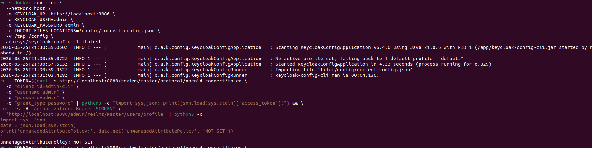
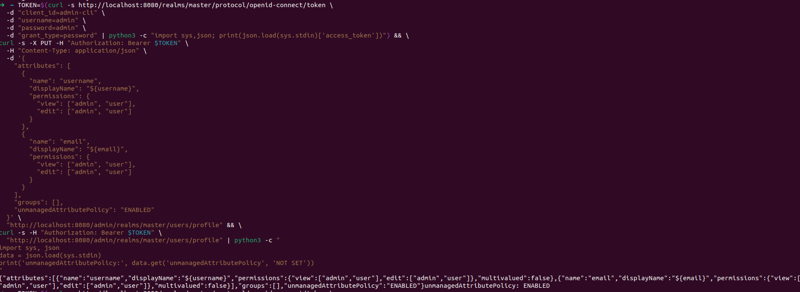

# User Profile Unmanaged Attribute Policy

When configuring Keycloak user profiles, the `unmanagedAttributePolicy` setting controls how Keycloak handles user attributes that are **not explicitly defined** in the user profile configuration.

Related issue: [#1016](https://github.com/adorsys/keycloak-config-cli/issues/1016)

---

# What is `unmanagedAttributePolicy`?

The `unmanagedAttributePolicy` determines how Keycloak handles attributes that are **not listed** in the `attributes` section of the user profile configuration.

These are called **unmanaged attributes**.

Examples:
- `department`
- `phone_extension`
- `legacy_system_id`

---

# Policy Values

| Value | Behavior | Typical Use Case |
|---|---|---|
| `ENABLED` | Users can create and edit unmanaged attributes | Flexible/self-service environments |
| `ADMIN_EDIT` | Only admins can create or edit unmanaged attributes | Controlled enterprise environments |
| `ADMIN_VIEW` | Only admins can view unmanaged attributes | Sensitive/system-managed metadata |

---

# Correct Configuration Structure

## Incorrect Configuration

```json
{
  "realm": "myrealm",
  "userProfile": {
    "unmanagedAttributePolicy": "ENABLED",
    "attributes": [
      {
        "name": "username"
      }
    ]
  }
}
```



---

## Correct Configuration

```json
{
  "realm": "myrealm",
  "userProfile": {
    "attributes": [
      {
        "name": "username",
        "required": true
      },
      {
        "name": "email",
        "required": true
      }
    ],
    "unmanagedAttributePolicy": "ENABLED"
  }
}
```


### Key Points

- `unmanagedAttributePolicy` belongs inside `userProfile`
- It is at the same level as `attributes`
- Core attributes should be explicitly defined

---

# Managed vs Unmanaged Attributes

| Type | Defined in `attributes` | Validations | Permissions |
|---|---|---|---|
| Managed | Yes | Yes | Yes |
| Unmanaged | No | No | Controlled by policy |

---

# Policy Behavior

Assume the following unmanaged attribute exists:

```text
phone_extension=1234
```

| Policy | User Can View | User Can Edit | Admin Can Edit |
|---|---|---|---|
| `ENABLED` | Yes | Yes | Yes |
| `ADMIN_EDIT` | Yes | No | Yes |
| `ADMIN_VIEW` | No | No | Yes |

---

# Testing in the Keycloak Admin UI

After importing the configuration:

1. Open the Admin Console
2. Navigate to:

```text
Realm Settings → User Profile
```

3. Create a test user
4. Add an unmanaged attribute:

```text
phone_extension=1234
```

5. Test behavior using:
- `ENABLED`
- `ADMIN_EDIT`
- `ADMIN_VIEW`

---

# Importing Configuration with keycloak-config-cli

```bash
java -jar keycloak-config-cli.jar \
  --keycloak.url=http://localhost:8080 \
  --keycloak.user=admin \
  --keycloak.password=admin \
  --import.files.locations=user-profile-config.json
```

---

# Common Pitfalls

## 1. Wrong Configuration Level

Incorrect:

```json
{
  "realm": "myrealm",
  "unmanagedAttributePolicy": "ENABLED"
}
```

Correct:

```json
{
  "realm": "myrealm",
  "userProfile": {
    "unmanagedAttributePolicy": "ENABLED"
  }
}
```

---

## 2. Missing Required Attributes

Avoid enabling user profiles without defining standard attributes such as:
- `username`
- `email`

---

## 3. Confusing Managed and Unmanaged Attributes

A managed attribute behaves differently from an unmanaged attribute even if they have the same name.

Example:
- Managed `department` → permissions and validations apply
- Unmanaged `department` → behavior controlled only by policy

---

# Best Practices

1. Define important business attributes as managed attributes
2. Use `ADMIN_EDIT` for most production environments
3. Use `ADMIN_VIEW` for sensitive internal attributes
4. Keep unmanaged attributes to a minimum
5. Validate imported configurations in the Admin UI
6. Version control your user profile configuration

---

# Security Considerations

| Policy | Security Level | Notes |
|---|---|---|
| `ENABLED` | Lowest | Users can add arbitrary attributes |
| `ADMIN_EDIT` | Medium | Recommended default |
| `ADMIN_VIEW` | Highest | Users cannot access unmanaged attributes |

---

# Keycloak Version Compatibility

| Keycloak Version | User Profile Support |
|---|---|
| < 15.0.0 | Not supported |
| 15.x - 18.x | Experimental |
| 19.x+ | Stable |
| 21.x+ | Recommended |

---

# Summary

- `unmanagedAttributePolicy` controls attributes not defined in the profile schema
- Managed attributes should be explicitly configured whenever possible
- `ADMIN_EDIT` is the recommended default for most environments
- Unmanaged attributes do not support validations or explicit permissions