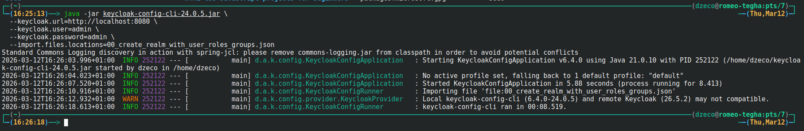
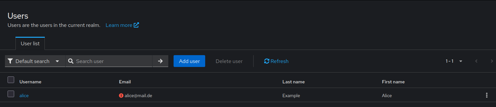
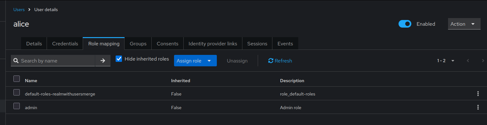
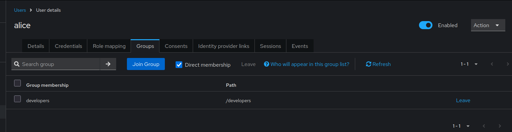
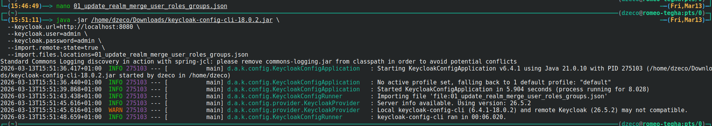
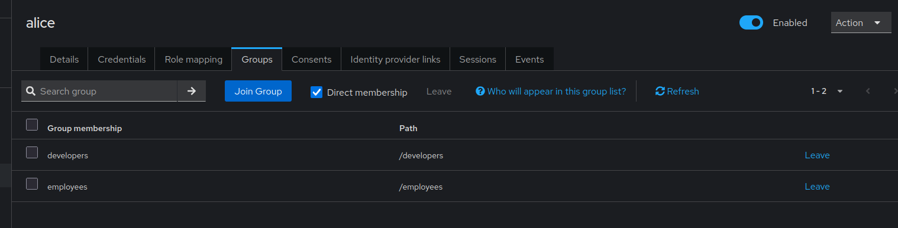
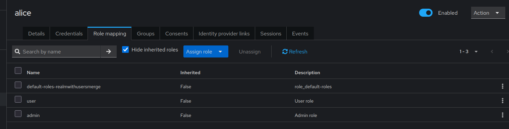

# User Roles and Groups Merge Behavior

By default, keycloak-config-cli replaces user roles and groups entirely when updating users. However, with the merge configuration option, you can add new roles and groups without removing existing ones. Understanding the merge behavior is essential for managing user permissions incrementally across multiple configuration imports.

Related issues: [#1293](https://github.com/adorsys/keycloak-config-cli/issues/1293)

## The Problem

Users encounter unexpected role and group removals when updating user configurations because:
- Default behavior replaces roles and groups completely
- Partial updates remove existing roles and groups
- Multiple teams managing different aspects of user permissions face conflicts
- It's unclear whether updates are additive or replace existing data
- No way to add roles/groups without specifying all existing ones
- Different import files can overwrite each other's changes
- Incremental permission grants are difficult to manage

## Understanding Default vs. Merge Behavior

### Default Behavior (Replace)

When updating a user without merge:
```json
{
  "users": [
    {
      "username": "alice",
      "realmRoles": ["admin"]
    }
  ]
}
```

**Result:** All existing roles are removed, only "admin" remains.

---

### Merge Behavior (Additive)

With merge enabled:
```bash
java -jar keycloak-config-cli.jar \
  --import.behaviors.merge-users-realm-roles=true \
  --import.behaviors.merge-users-groups=true \
  --import.files.locations=config.json
```
```json
{
  "users": [
    {
      "username": "alice",
      "realmRoles": ["admin"]
    }
  ]
}
```

**Result:** "admin" role is added, existing roles are preserved.

---

## Configuration Options

### Enable Role Merging
```bash
--import.behaviors.merge-users-realm-roles=true
```

### Enable Group Merging
```bash
--import.behaviors.merge-users-groups=true
```

### Enable Both
```bash
--import.behaviors.merge-users-realm-roles=true \
--import.behaviors.merge-users-groups=true
```

---

## Complete Example: Incremental Role and Group Assignment

### Step 1: Initial User Creation

**File:** `00_create_realm_with_user_roles_groups.json`
```json
{
  "enabled": true,
  "realm": "realmWithUsersMerge",
  "roles": {
    "realm": [
      {
        "name": "user",
        "description": "User role",
        "composite": false,
        "clientRole": false
      },
      {
        "name": "admin",
        "description": "Admin role",
        "composite": false,
        "clientRole": false
      }
    ]
  },
  "groups": [
    {
      "name": "employees"
    },
    {
      "name": "developers"
    }
  ],
  "users": [
    {
      "username": "alice",
      "email": "alice@mail.de",
      "enabled": true,
      "firstName": "Alice",
      "lastName": "Example",
      "realmRoles": [
        "user"
      ],
      "groups": [
        "employees"
      ]
    }
  ]
}
```

**Import:**
```bash
java -jar keycloak-config-cli.jar \
  --keycloak.url=http://localhost:8080 \
  --keycloak.user=admin \
  --keycloak.password=admin \
  --import.files.locations=00_create_realm_with_user_roles_groups.json
```

**Result:**
- User "alice" created
- Role: "user"
- Group: "employees"

step1


step2


step3


step4


*User alice initially created with "user" role and "employees" group membership.*

---

### Step 2: Add Additional Roles and Groups (Without Merge)

**File:** `01_update_realm_merge_user_roles_groups.json`
```json
{
  "enabled": true,
  "realm": "realmWithUsersMerge",
  "roles": {
    "realm": [
      {
        "name": "user",
        "description": "User role",
        "composite": false,
        "clientRole": false
      },
      {
        "name": "admin",
        "description": "Admin role",
        "composite": false,
        "clientRole": false
      }
    ]
  },
  "groups": [
    {
      "name": "employees"
    },
    {
      "name": "developers"
    }
  ],
  "users": [
    {
      "username": "alice",
      "email": "alice@mail.de",
      "enabled": true,
      "firstName": "Alice",
      "lastName": "Example",
      "realmRoles": [
        "admin"
      ],
      "groups": [
        "developers"
      ]
    }
  ]
}
```

**Import WITHOUT merge:**
```bash
java -jar keycloak-config-cli.jar \
  --keycloak.url=http://localhost:8080 \
  --keycloak.user=admin \
  --keycloak.password=admin \
  --import.files.locations=01_update_realm_merge_user_roles_groups.json
```

**Result (Replace behavior):**
- Role "user" removed, only "admin" remains
- Group "employees" removed, only "developers" remains

step1


step2


*Without merge behavior: alice now has only "admin" role and "developers" group. Previous "user" role and "employees" group were removed.*

---

### Step 3: Add Additional Roles and Groups (WITH Merge)

**Re-import initial state first:**
```bash
java -jar keycloak-config-cli.jar \
  --keycloak.url=http://localhost:8080 \
  --keycloak.user=admin \
  --keycloak.password=admin \
  --import.files.locations=00_create_realm_with_user_roles_groups.json
```

**Then import WITH merge:**
```bash
java -jar keycloak-config-cli.jar \
  --keycloak.url=http://localhost:8080 \
  --keycloak.user=admin \
  --keycloak.password=admin \
  --import.behaviors.merge-users-realm-roles=true \
  --import.behaviors.merge-users-groups=true \
  --import.files.locations=01_update_realm_merge_user_roles_groups.json
```

**Result (Merge behavior):**
- Roles: "user" + "admin" (both present)
- Groups: "employees" + "developers" (both present)

step1


step2


step3


*With merge behavior enabled: alice now has both "user" and "admin" roles, and memberships in both "employees" and "developers" groups.*

---

## Use Cases

### Use Case 1: Incremental Permission Grants

**Scenario:** Different teams manage different aspects of user permissions.

**Team A (HR) - Assigns base roles:**
```json
{
  "users": [
    {
      "username": "john.doe",
      "realmRoles": ["employee"],
      "groups": ["all-staff"]
    }
  ]
}
```

**Team B (Engineering) - Adds technical roles:**
```json
{
  "users": [
    {
      "username": "john.doe",
      "realmRoles": ["developer"],
      "groups": ["engineering"]
    }
  ]
}
```

**With merge enabled:**
```bash
--import.behaviors.merge-users-realm-roles=true \
--import.behaviors.merge-users-groups=true
```

**Result:** User has all roles and groups from both teams.

---

### Use Case 2: Progressive Access Grant

**Scenario:** User starts with basic access, gains more over time.

**Day 1 - Onboarding:**
```json
{
  "users": [
    {
      "username": "new.employee",
      "realmRoles": ["user"],
      "groups": ["onboarding"]
    }
  ]
}
```

**Week 1 - Training Complete:**
```json
{
  "users": [
    {
      "username": "new.employee",
      "realmRoles": ["contributor"],
      "groups": ["team-alpha"]
    }
  ]
}
```

**Month 1 - Full Access:**
```json
{
  "users": [
    {
      "username": "new.employee",
      "realmRoles": ["senior-contributor"],
      "groups": ["project-leads"]
    }
  ]
}
```

**With merge:** User accumulates all roles and groups through onboarding process.

---

### Use Case 3: Environment-Specific Roles

**Scenario:** Same user, different environments with additional roles.

**Base configuration:**
```json
{
  "users": [
    {
      "username": "devops.user",
      "realmRoles": ["user"],
      "groups": ["engineering"]
    }
  ]
}
```

**Dev environment add-on:**
```json
{
  "users": [
    {
      "username": "devops.user",
      "realmRoles": ["dev-admin"],
      "groups": ["dev-environment"]
    }
  ]
}
```

**Staging environment add-on:**
```json
{
  "users": [
    {
      "username": "devops.user",
      "realmRoles": ["staging-admin"],
      "groups": ["staging-environment"]
    }
  ]
}
```

---

## Comparison: Default vs. Merge Behavior

| Scenario | Default (Replace) | Merge Enabled |
|----------|-------------------|---------------|
| Initial: `["user"]` | `["user"]` | `["user"]` |
| Update with `["admin"]` | `["admin"]` | `["user", "admin"]` |
| Update with `["manager"]` | `["manager"]` | `["user", "admin", "manager"]` |
| Update with `[]` | `[]` (all removed) | No change (empty ignored) |

---

## Configuration Examples

### Example 1: Multi-Team User Management
```bash
#!/bin/bash

# Base user configuration (HR team)
java -jar keycloak-config-cli.jar \
  --import.behaviors.merge-users-realm-roles=true \
  --import.behaviors.merge-users-groups=true \
  --import.files.locations=config/01-hr-base-users.json

# Engineering roles (Engineering team)
java -jar keycloak-config-cli.jar \
  --import.behaviors.merge-users-realm-roles=true \
  --import.behaviors.merge-users-groups=true \
  --import.files.locations=config/02-engineering-roles.json

# Project-specific access (Project managers)
java -jar keycloak-config-cli.jar \
  --import.behaviors.merge-users-realm-roles=true \
  --import.behaviors.merge-users-groups=true \
  --import.files.locations=config/03-project-access.json
```

---

### Example 2: Progressive Onboarding

**config/onboarding-day1.json:**
```json
{
  "realm": "corporate",
  "users": [
    {
      "username": "john.new",
      "email": "john.new@company.com",
      "enabled": true,
      "realmRoles": ["user"],
      "groups": ["onboarding", "all-employees"]
    }
  ]
}
```

**config/onboarding-week1.json:**
```json
{
  "realm": "corporate",
  "users": [
    {
      "username": "john.new",
      "realmRoles": ["contributor"],
      "groups": ["engineering-team"]
    }
  ]
}
```

**config/onboarding-month1.json:**
```json
{
  "realm": "corporate",
  "users": [
    {
      "username": "john.new",
      "realmRoles": ["developer", "code-reviewer"],
      "groups": ["project-alpha", "senior-developers"]
    }
  ]
}
```

**Import workflow:**
```bash
# Day 1
java -jar keycloak-config-cli.jar \
  --import.behaviors.merge-users-realm-roles=true \
  --import.behaviors.merge-users-groups=true \
  --import.files.locations=config/onboarding-day1.json

# Week 1
java -jar keycloak-config-cli.jar \
  --import.behaviors.merge-users-realm-roles=true \
  --import.behaviors.merge-users-groups=true \
  --import.files.locations=config/onboarding-week1.json

# Month 1
java -jar keycloak-config-cli.jar \
  --import.behaviors.merge-users-realm-roles=true \
  --import.behaviors.merge-users-groups=true \
  --import.files.locations=config/onboarding-month1.json
```

**Final result:**
- Roles: `["user", "contributor", "developer", "code-reviewer"]`
- Groups: `["onboarding", "all-employees", "engineering-team", "project-alpha", "senior-developers"]`

---

### Example 3: Client Roles with Merge
```json
{
  "realm": "application",
  "clients": [
    {
      "clientId": "app-backend",
      "roles": [
        {
          "name": "read"
        },
        {
          "name": "write"
        },
        {
          "name": "admin"
        }
      ]
    }
  ],
  "users": [
    {
      "username": "app.user",
      "email": "user@app.com",
      "enabled": true,
      "clientRoles": {
        "app-backend": ["read"]
      }
    }
  ]
}
```

**Later, add write access:**
```json
{
  "users": [
    {
      "username": "app.user",
      "clientRoles": {
        "app-backend": ["write"]
      }
    }
  ]
}
```

**Import with merge:**
```bash
java -jar keycloak-config-cli.jar \
  --import.behaviors.merge-users-client-roles=true \
  --import.files.locations=add-write-access.json
```

**Result:** User has both "read" and "write" client roles.

---

## Common Pitfalls

### 1. Forgetting to Enable Merge

**Problem:**
```bash
# Merge flags not set
java -jar keycloak-config-cli.jar \
  --import.files.locations=update-roles.json
```

**Result:** Roles and groups replaced instead of merged.

**Solution:**
```bash
java -jar keycloak-config-cli.jar \
  --import.behaviors.merge-users-realm-roles=true \
  --import.behaviors.merge-users-groups=true \
  --import.files.locations=update-roles.json
```

---

### 2. Inconsistent Merge Settings

**Problem:** Merge enabled for roles but not groups:
```bash
--import.behaviors.merge-users-realm-roles=true
```

**Result:** Roles are merged, but groups are replaced.

**Solution:** Enable both consistently:
```bash
--import.behaviors.merge-users-realm-roles=true \
--import.behaviors.merge-users-groups=true
```

---

### 3. Empty Arrays Remove All

**Problem:**
```json
{
  "users": [
    {
      "username": "alice",
      "realmRoles": [],
      "groups": []
    }
  ]
}
```

**With merge enabled:** Behavior may vary based on version.

**Solution:** Omit the fields entirely if you don't want to change them:
```json
{
  "users": [
    {
      "username": "alice",
      "email": "alice@example.com"
    }
  ]
}
```

---

### 4. Conflicting Configuration Sources

**Problem:** Multiple configuration files managing same users without merge.

**Team A's config:**
```json
{
  "users": [
    {
      "username": "john",
      "realmRoles": ["developer"]
    }
  ]
}
```

**Team B's config:**
```json
{
  "users": [
    {
      "username": "john",
      "realmRoles": ["manager"]
    }
  ]
}
```

**Without merge:** Last import wins, other roles lost.

**Solution:** Use merge or consolidate configurations.

---

### 5. Not Understanding Merge is Additive Only

**Misconception:** Merge can remove roles/groups.

**Reality:** Merge only adds, never removes.

**To remove:** Must explicitly set the complete desired list without merge, or remove manually.

---

## Best Practices

1. **Use Merge for Incremental Updates**
```bash
--import.behaviors.merge-users-realm-roles=true \
--import.behaviors.merge-users-groups=true
```

2. **Document Merge Strategy**

Clearly document which configurations use merge and why.

3. **Separate Base from Incremental**
```
config/
├── 00-base-users.json       # Base users (no merge needed)
├── 01-team-roles.json       # Team-specific roles (use merge)
└── 02-project-access.json   # Project access (use merge)
```

4. **Use Consistent Import Order**
```bash
for file in config/*.json; do
  java -jar keycloak-config-cli.jar \
    --import.behaviors.merge-users-realm-roles=true \
    --import.behaviors.merge-users-groups=true \
    --import.files.locations=$file
done
```

5. **Test Merge Behavior**

Always test in development before applying to production.

6. **Version Control Configuration**
```bash
git log --oneline -- config/user-roles.json
```

7. **Audit Role and Group Assignments**

Regularly review accumulated roles and groups to ensure they're still needed.

8. **Use Remote State for Tracking**
```bash
--import.remote-state.enabled=true
```

---

## Troubleshooting

### Roles Not Merging as Expected

**Symptom:** Roles replaced instead of merged

**Diagnosis:**

Check if merge flag is set:
```bash
ps aux | grep keycloak-config-cli
```

**Solution:** Ensure merge flag is enabled:
```bash
--import.behaviors.merge-users-realm-roles=true
```

---

### Groups Not Merging

**Symptom:** Groups replaced instead of merged

**Solution:** Enable group merge:
```bash
--import.behaviors.merge-users-groups=true
```

---

### Unexpected Role Accumulation

**Symptom:** User has too many roles

**Cause:** Multiple imports with merge have accumulated roles over time

**Solution:** Do a full import without merge to reset:
```json
{
  "users": [
    {
      "username": "alice",
      "realmRoles": ["user", "developer"],
      "groups": ["engineering"]
    }
  ]
}
```
```bash
# Import without merge to replace
java -jar keycloak-config-cli.jar \
  --import.files.locations=reset-user-roles.json
```

---

### Client Roles Not Merging

**Symptom:** Client roles replaced

**Solution:** Use client role merge flag:
```bash
--import.behaviors.merge-users-client-roles=true
```

---

## Configuration Options
```bash
# Merge realm roles
--import.behaviors.merge-users-realm-roles=true

# Merge groups
--import.behaviors.merge-users-groups=true

# Merge client roles
--import.behaviors.merge-users-client-roles=true

# Enable all merging
--import.behaviors.merge-users-realm-roles=true \
--import.behaviors.merge-users-groups=true \
--import.behaviors.merge-users-client-roles=true

# Combine with other behaviors
--import.behaviors.merge-users-realm-roles=true \
--import.remote-state.enabled=true \
--import.validate=true
```

---

## Consequences

When using merge behavior:

1. **Additive Only:** Merge only adds, never removes roles or groups
2. **Accumulation:** Roles and groups accumulate over multiple imports
3. **Manual Cleanup:** To remove roles/groups, must import without merge or remove manually
4. **Team Collaboration:** Multiple teams can manage different aspects of user permissions
5. **Import Order Matters:** Order of imports determines final state
6. **Testing Required:** Thoroughly test merge behavior before production use
7. **Audit Needed:** Regularly audit accumulated permissions

---

## Related Issues

- [#1293 - Add the ability to merge users realmRoles and groups](https://github.com/adorsys/keycloak-config-cli/issues/1293)
- [#1132 - User update without groups deletes previously set groups](user-group-update-behavior.md)
- [#1237 - Working with Arrays](https://github.com/adorsys/keycloak-config-cli/issues/1237)

---

## Additional Resources

- [Keycloak User Management](https://www.keycloak.org/docs/latest/server_admin/#user-management)
- [Realm Roles](https://www.keycloak.org/docs/latest/server_admin/#realm-roles)
- [Groups](https://www.keycloak.org/docs/latest/server_admin/#groups)
- [Import Behaviors](../config/import-settings.md)