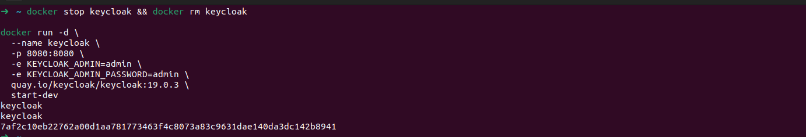
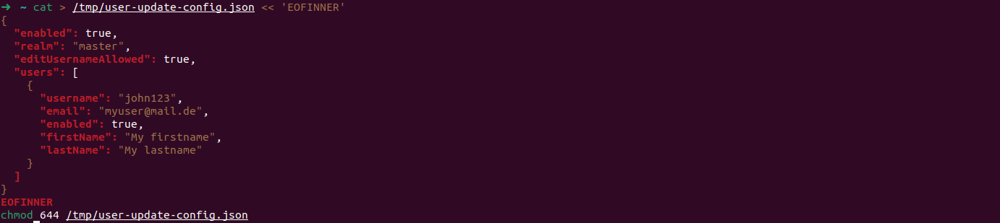
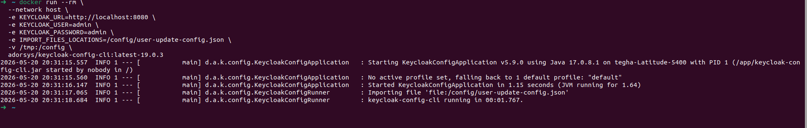
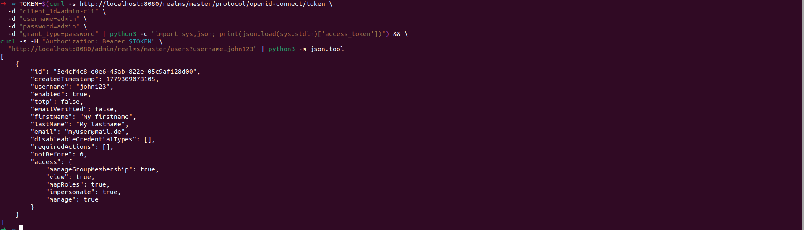
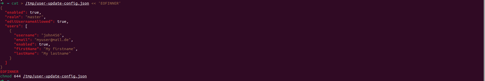
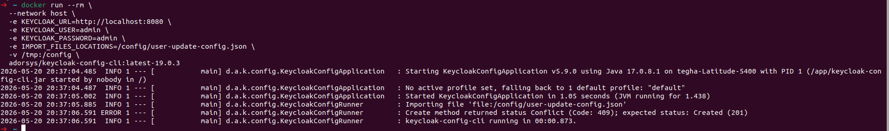
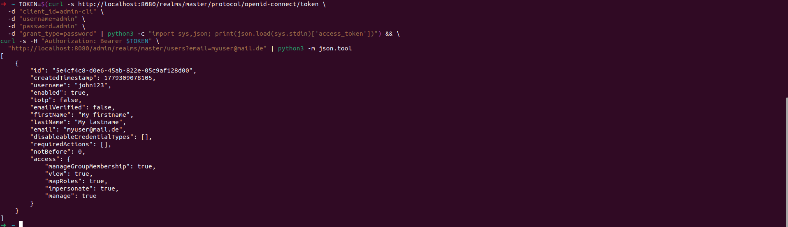
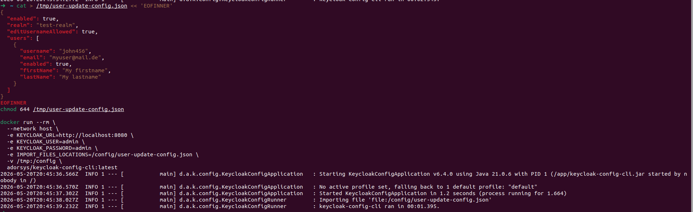
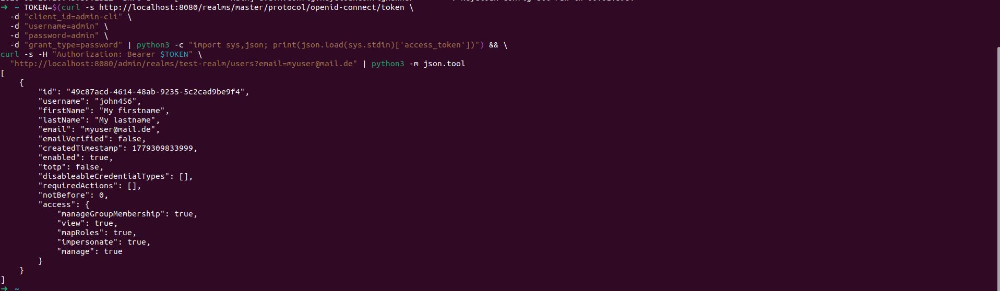

# User Username Cannot Be Updated via Configuration

Related issue: [#810](https://github.com/adorsys/keycloak-config-cli/issues/810)
Fixed in: [PR #1204](https://github.com/adorsys/keycloak-config-cli/pull/1204)

## The Problem

When a user's username is changed in the import configuration file,
keycloak-config-cli does not update the existing user. Instead it tries
to create a new user with the new username, resulting in a `409 Conflict`
error because the email address already exists.

## Environment

| Component | Version |
|---|---|
| Keycloak | `19.0.3` |
| keycloak-config-cli | `latest-19.0.3` (`v5.9.0`) |
| Java | `17` |

---

## Steps To Reproduce

### 1. Start Keycloak 19.0.3

```bash
docker run -d \
  --name keycloak \
  -p 8080:8080 \
  -e KEYCLOAK_ADMIN=admin \
  -e KEYCLOAK_ADMIN_PASSWORD=admin \
  quay.io/keycloak/keycloak:19.0.3 \
  start-dev
```



---

### 2. Create the Initial Config File with username `john123`

```bash
cat > /tmp/user-update-config.json << 'EOFINNER'
{
  "enabled": true,
  "realm": "master",
  "editUsernameAllowed": true,
  "users": [
    {
      "username": "john123",
      "email": "myuser@mail.de",
      "enabled": true,
      "firstName": "My firstname",
      "lastName": "My lastname"
    }
  ]
}
EOFINNER
chmod 644 /tmp/user-update-config.json
```



### 3. Import to Create the User

```bash
docker run --rm \
  --network host \
  -e KEYCLOAK_URL=http://localhost:8080 \
  -e KEYCLOAK_USER=admin \
  -e KEYCLOAK_PASSWORD=admin \
  -e IMPORT_FILES_LOCATIONS=/config/user-update-config.json \
  -v /tmp:/config \
  adorsys/keycloak-config-cli:latest-19.0.3
```


Verify the user was created:

```bash
TOKEN=$(curl -s http://localhost:8080/realms/master/protocol/openid-connect/token \
  -d "client_id=admin-cli" \
  -d "username=admin" \
  -d "password=admin" \
  -d "grant_type=password" | python3 -c "import sys,json; print(json.load(sys.stdin)['access_token'])") && \
curl -s -H "Authorization: Bearer $TOKEN" \
  "http://localhost:8080/admin/realms/master/users?username=john123" | python3 -m json.tool
```

Expected output:

```json
[
  {
    "id": "1f5ca967-7aee-42c1-b6e8-7552d87e24d6",
    "username": "john123",
    "email": "myuser@mail.de",
    "enabled": true,
    "firstName": "My firstname",
    "lastName": "My lastname"
  }
]
```


---

### 4. Update the Config File with New Username `john456`

```bash
cat > /tmp/user-update-config.json << 'EOFINNER'
{
  "enabled": true,
  "realm": "master",
  "editUsernameAllowed": true,
  "users": [
    {
      "username": "john456",
      "email": "myuser@mail.de",
      "enabled": true,
      "firstName": "My firstname",
      "lastName": "My lastname"
    }
  ]
}
EOFINNER
chmod 644 /tmp/user-update-config.json
```


---

### 5. Import the Updated Config

```bash
docker run --rm \
  --network host \
  -e KEYCLOAK_URL=http://localhost:8080 \
  -e KEYCLOAK_USER=admin \
  -e KEYCLOAK_PASSWORD=admin \
  -e IMPORT_FILES_LOCATIONS=/config/user-update-config.json \
  -v /tmp:/config \
  adorsys/keycloak-config-cli:latest-19.0.3
```


**Actual output — bug confirmed:**

ERROR 1 --- [main] d.a.k.config.KeycloakConfigRunner : Create method returned status Conflict (Code: 409); expected status: Created (201)


---

### 6. Verify Username Was Not Updated

```bash
TOKEN=$(curl -s http://localhost:8080/realms/master/protocol/openid-connect/token \
  -d "client_id=admin-cli" \
  -d "username=admin" \
  -d "password=admin" \
  -d "grant_type=password" | python3 -c "import sys,json; print(json.load(sys.stdin)['access_token'])") && \
curl -s -H "Authorization: Bearer $TOKEN" \
  "http://localhost:8080/admin/realms/master/users?email=myuser@mail.de" | python3 -m json.tool
```

Output — username is still `john123`, not updated to `john456`:

```json
[
  {
    "id": "1f5ca967-7aee-42c1-b6e8-7552d87e24d6",
    "username": "john123",
    "email": "myuser@mail.de",
    "enabled": true,
    "firstName": "My firstname",
    "lastName": "My lastname"
  }
]
```



---

## Root Cause

keycloak-config-cli searched for existing users by **username only**. When the
username changes in the config, it can no longer find the existing user and
attempts to create a new one. Since the email is already taken by the existing
user, Keycloak returns a `409 Conflict` error.

---

## Solution

The fix was introduced in keycloak-config-cli `v6.4.0` via
[PR #1204](https://github.com/adorsys/keycloak-config-cli/pull/1204).
The user lookup now also searches by **email address**, so when a username
changes, the existing user is found by email and the username is updated
instead of creating a duplicate.

Two conditions must be met for the username update to work:

1. The user must have an **email address** set in the configuration
2. `editUsernameAllowed` must be set to `true` in the realm configuration

---

## Fix Steps

### Step 1 — Upgrade to Keycloak 26.1.0 and keycloak-config-cli v6.4.0

```bash
docker stop keycloak && docker rm keycloak

docker run -d \
  --name keycloak \
  -p 8080:8080 \
  -e KEYCLOAK_ADMIN=admin \
  -e KEYCLOAK_ADMIN_PASSWORD=admin \
  quay.io/keycloak/keycloak:26.1.0 \
  start-dev
```

### Step 2 — Create realm and user `john123`

```bash
cat > /tmp/user-update-config.json << 'EOFINNER'
{
  "enabled": true,
  "realm": "test-realm",
  "editUsernameAllowed": true,
  "users": [
    {
      "username": "john123",
      "email": "myuser@mail.de",
      "enabled": true,
      "firstName": "My firstname",
      "lastName": "My lastname"
    }
  ]
}
EOFINNER
chmod 644 /tmp/user-update-config.json

docker run --rm \
  --network host \
  -e KEYCLOAK_URL=http://localhost:8080 \
  -e KEYCLOAK_USER=admin \
  -e KEYCLOAK_PASSWORD=admin \
  -e IMPORT_FILES_LOCATIONS=/config/user-update-config.json \
  -v /tmp:/config \
  adorsys/keycloak-config-cli:latest
```


### Step 3 — Update username to `john456` and import

```bash
cat > /tmp/user-update-config.json << 'EOFINNER'
{
  "enabled": true,
  "realm": "test-realm",
  "editUsernameAllowed": true,
  "users": [
    {
      "username": "john456",
      "email": "myuser@mail.de",
      "enabled": true,
      "firstName": "My firstname",
      "lastName": "My lastname"
    }
  ]
}
EOFINNER
chmod 644 /tmp/user-update-config.json

docker run --rm \
  --network host \
  -e KEYCLOAK_URL=http://localhost:8080 \
  -e KEYCLOAK_USER=admin \
  -e KEYCLOAK_PASSWORD=admin \
  -e IMPORT_FILES_LOCATIONS=/config/user-update-config.json \
  -v /tmp:/config \
  adorsys/keycloak-config-cli:latest
```


Import completes successfully with no errors.

### Step 4 — Verify username was updated

```bash
TOKEN=$(curl -s http://localhost:8080/realms/master/protocol/openid-connect/token \
  -d "client_id=admin-cli" \
  -d "username=admin" \
  -d "password=admin" \
  -d "grant_type=password" | python3 -c "import sys,json; print(json.load(sys.stdin)['access_token'])") && \
curl -s -H "Authorization: Bearer $TOKEN" \
  "http://localhost:8080/admin/realms/test-realm/users?email=myuser@mail.de" | python3 -m json.tool
```

Expected output — username updated to `john456`, same user ID preserved:

```json
[
  {
    "id": "5901fddc-a7e3-4564-8c0e-d4e4c861fe54",
    "username": "john456",
    "email": "myuser@mail.de",
    "enabled": true,
    "firstName": "My firstname",
    "lastName": "My lastname"
  }
]
```


---

## Expected Behavior

When `editUsernameAllowed` is set to `true` in the realm and the user has an
email address, changing the username in the import config should update the
existing user's username rather than attempting to create a new user.

---

## Summary

| | Detail |
|---|---|
| **Error** | `409 Conflict` when trying to update a username |
| **Cause** | keycloak-config-cli searched users by username only, not by email |
| **Fix** | Upgrade to keycloak-config-cli `v6.4.0+` |
| **Requirement 1** | `editUsernameAllowed: true` in realm config |
| **Requirement 2** | User must have an email address set |
| **Fixed in** | [PR #1204](https://github.com/adorsys/keycloak-config-cli/pull/1204) |
EOF