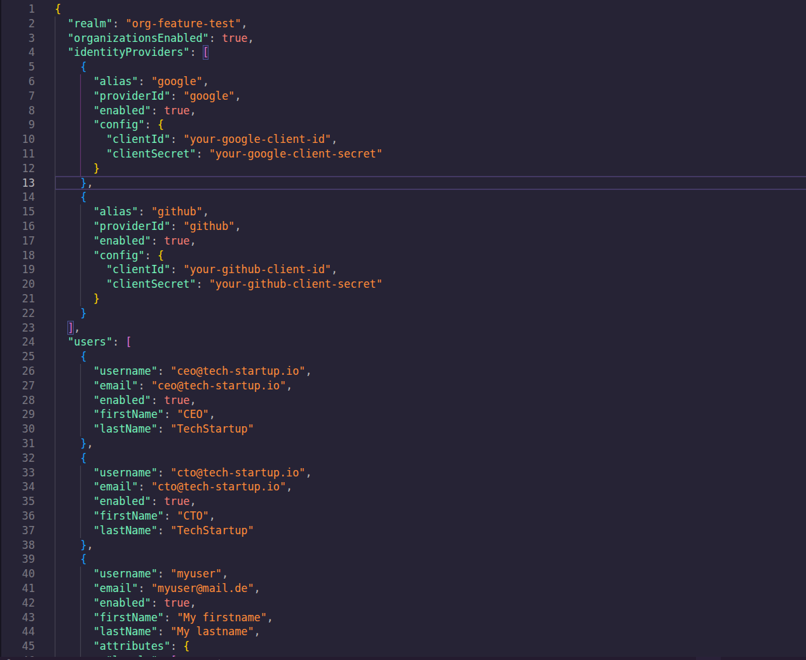
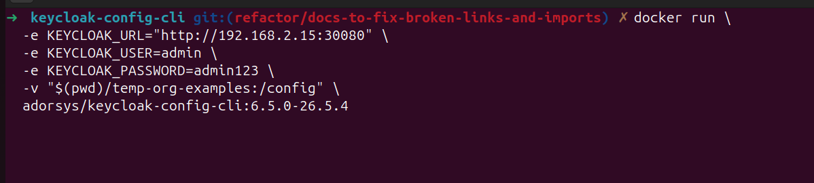
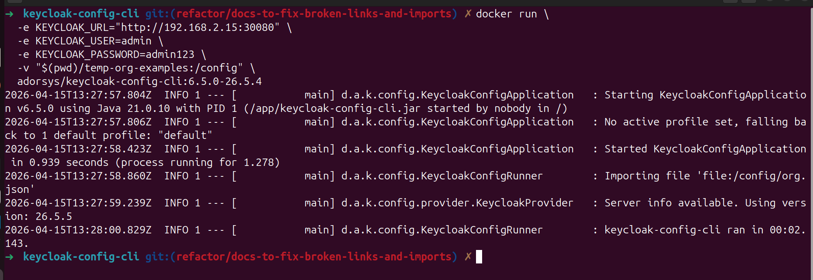
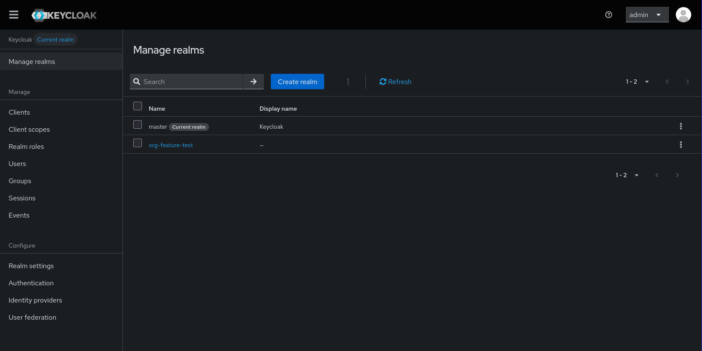
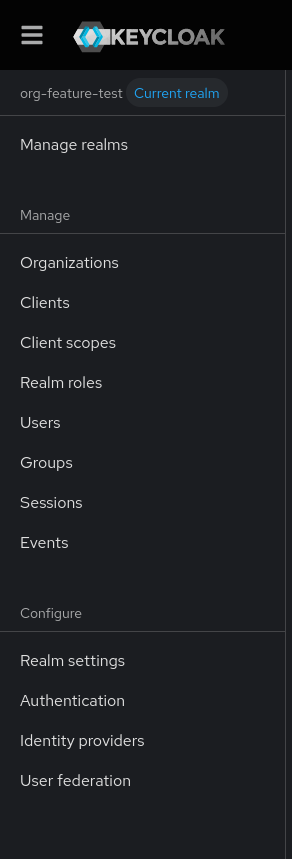
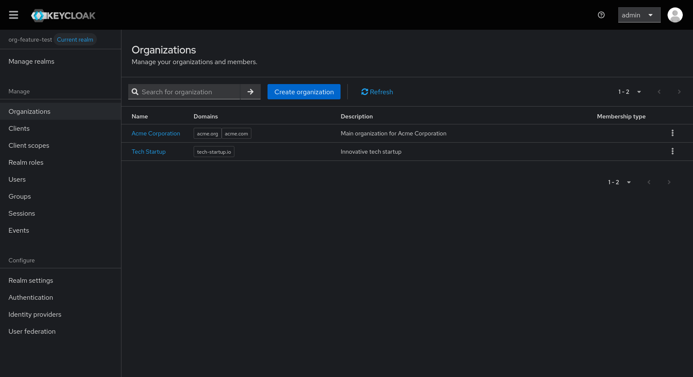

# Organization Examples

This section provides complete scenarios with examples and screenshots demonstrating organization setup and management.

## Complete Multi-Tenant SaaS Scenario

### Scenario Overview

A SaaS platform serving multiple enterprise clients with:
- Client-specific authentication methods
- Isolated user management
- Domain-based routing
- Custom organization settings


### Organization Configuration

Create organizations with members and IDP associations:

```json
{
  "realm": "org-feature-test",
  "organizationsEnabled": true,
  "identityProviders": [
    {
      "alias": "google",
      "providerId": "google",
      "enabled": true,
      "config": {
        "clientId": "your-google-client-id",
        "clientSecret": "your-google-client-secret"
      }
    },
    {
      "alias": "github",
      "providerId": "github",
      "enabled": true,
      "config": {
        "clientId": "your-github-client-id",
        "clientSecret": "your-github-client-secret"
      }
    }
  ],
  "users": [
    {
      "username": "ceo@tech-startup.io",
      "email": "ceo@tech-startup.io",
      "enabled": true,
      "firstName": "CEO",
      "lastName": "TechStartup"
    },
    {
      "username": "cto@tech-startup.io",
      "email": "cto@tech-startup.io",
      "enabled": true,
      "firstName": "CTO",
      "lastName": "TechStartup"
    },
    {
      "username": "myuser",
      "email": "myuser@mail.de",
      "enabled": true,
      "firstName": "My firstname",
      "lastName": "My lastname",
      "attributes": {
        "locale": [
          "de"
        ]
      }
    },
    {
      "username": "myclientuser",
      "email": "myclientuser@mail.de",
      "enabled": true,
      "firstName": "My clientuser's firstname",
      "lastName": "My clientuser's lastname",
      "credentials": [
        {
          "type": "password",
          "value": "myclientuser123"
        }
      ]
    }
  ],
  "organizations": [
    {
      "name": "Acme Corporation",
      "alias": "acme",
      "redirectUrl": "https://acme.com/redirect",
      "description": "Main organization for Acme Corporation",
      "domains": [
        {
          "name": "acme.com",
          "verified": false
        },
        {
          "name": "acme.org",
          "verified": true
        }
      ],
      "attributes": {
        "industry": [
          "Technology"
        ],
        "location": [
          "San Francisco"
        ],
        "employeeCount": [
          "1000+"
        ]
      },
      "members": [
        {
          "username": "myuser"
        },
        {
          "username": "myclientuser"
        }
      ],
      "enabled": true,
      "identityProviders": [
        {
          "alias": "github"
        }
      ]
    },
    {
      "name": "Tech Startup",
      "alias": "tech-startup",
      "redirectUrl": "https://tech-startup.io/redirect",
      "description": "Innovative tech startup",
      "domains": [
        {
          "name": "tech-startup.io",
          "verified": false
        }
      ],
      "attributes": {
        "industry": [
          "Software"
        ],
        "stage": [
          "Series A"
        ],
        "funding": [
          "$5M"
        ]
      }
    }
  ]
}
```

## Import Process Screenshots

### Step 1: Prepare Configuration File

<br />



<br />

Create your JSON configuration file with organizations, members, and IDP settings from above.


### Step 2: Run Import Command

Execute the keycloak-config-cli import command with your configuration file.

```bash
docker run \
  -e KEYCLOAK_URL="http://<keycloak-url>" \
  -e KEYCLOAK_USER=admin \
  -e KEYCLOAK_PASSWORD=admin123 \
  -v "$(pwd)/temp-org-examples:/config" \
  adorsys/keycloak-config-cli:6.5.0-26.5.4
```

<br />



<br />

Execute the keycloak-config-cli import command with your configuration file.


### Step 3: Verify Import Results

<br />

Check the import output for successful organization creation.

<br />




### Step 4: Verify in Keycloak Admin Console

<br />

- Navigate to the Keycloak admin console, under realms select the `org-feature-test` realm

<br />  



<br />

- Under the Manage section, click on organizations.

<br />



<br />

- Now you can see the organizations that were created. You can choose any and navigate to it's details.

<br />



<br />

## Best Practices Summary

### Configuration Structure

1. **Plan Before Import**: Design your organization hierarchy first
2. **Use Consistent Naming**: Standardize aliases and naming conventions

### Security Considerations

1. **Principle of Least Privilege**: Assign minimum necessary roles
2. **Regular Audits**: Monitor organization membership changes
3. **Secure IDPs**: Use proper authentication provider configurations
4. **Access Controls**: Implement appropriate restrictions

## Related Topics

- [Configuration](configuration.md) - Detailed configuration options
- [Member Management](member-management.md) - Managing organization users
- [Identity Providers](identity-providers.md) - IDP integration
