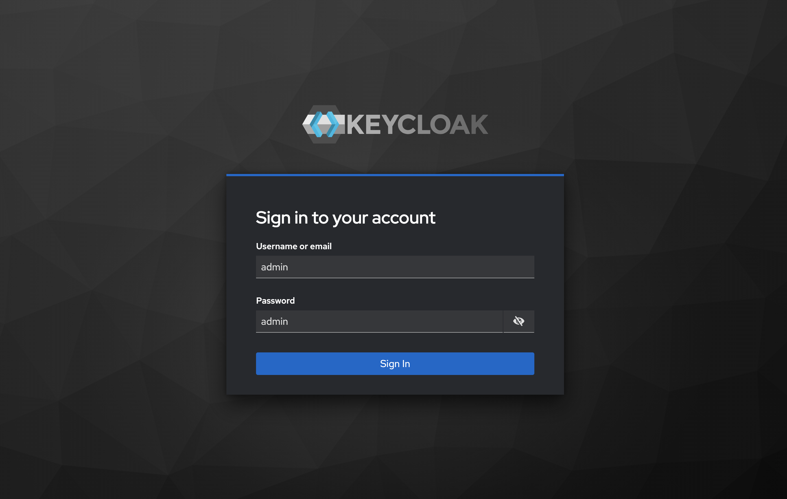
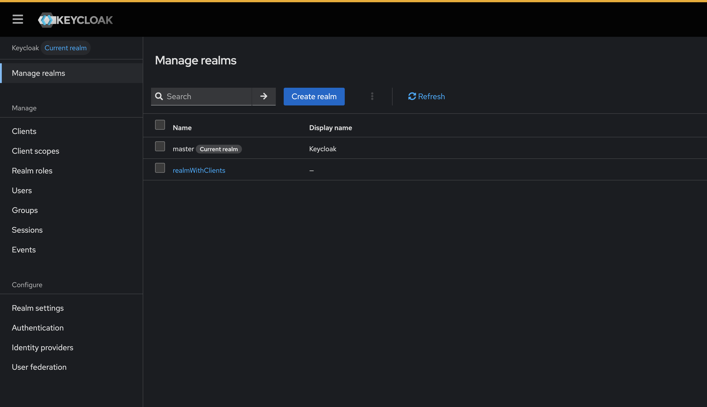
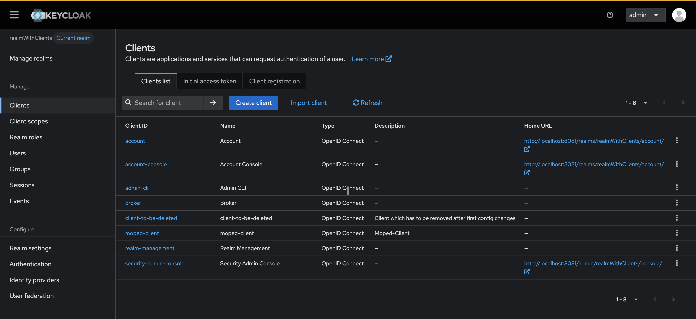
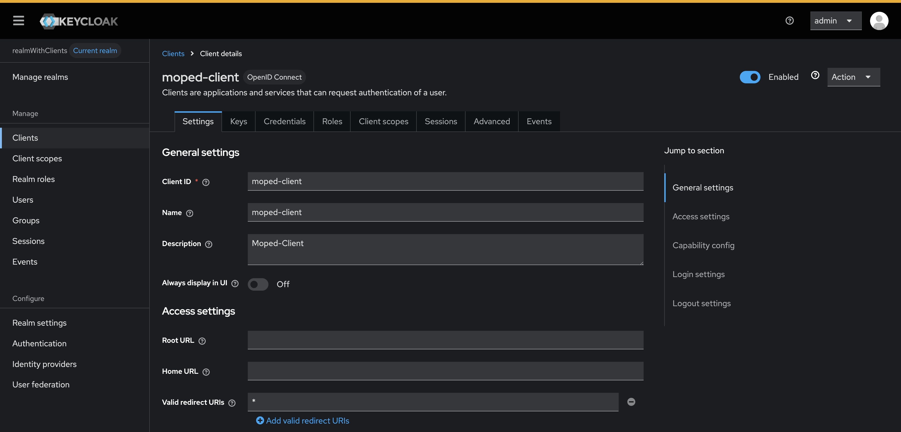
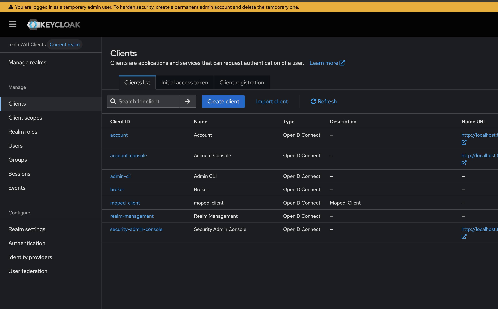

# Quick Start

Get started with keycloak-config-cli in just a few minutes.

## Prerequisites

- [Docker](https://docs.docker.com/get-started/get-docker/) for isolation
- [Java 21+](https://adoptium.net/temurin/releases?version=21&os=any&arch=any) (optional, for running CLI locally)

## Step 1: Start Keycloak

Launch a Keycloak instance with the latest version:

```bash
docker run --rm -p 8080:8080 \
  -e KEYCLOAK_ADMIN=admin \
  -e KEYCLOAK_ADMIN_PASSWORD=admin \
  quay.io/keycloak/keycloak:26.5.5 start-dev
```

Wait for Keycloak to start (you'll see "Listening on: http://localhost:8080").

## Step 2: Create Configuration

Create a file named `realm-config.json`:

```json
{
  "enabled": true,
  "realm": "realmWithClients",
  "clients": [
    {
      "clientId": "moped-client",
      "name": "moped-client",
      "description": "Moped-Client",
      "enabled": true,
      "clientAuthenticatorType": "client-secret",
      "secret": "my-special-client-secret",
      "redirectUris": [
        "*"
      ],
      "webOrigins": [
        "*"
      ]
    },
    {
      "clientId": "client-to-be-deleted",
      "name": "client-to-be-deleted",
      "description": "Client which has to be removed after first config changes",
      "enabled": true,
      "clientAuthenticatorType": "client-secret",
      "secret": "my-special-client-secret",
      "redirectUris": [
        "*"
      ],
      "webOrigins": [
        "*"
      ]
    }
  ],
  "attributes": {
    "custom": "test-step00"
  }
}
```

## Step 3: Import Configuration

### Using Docker (Recommended)

```bash
docker run --rm \
  -v "$(pwd)/realm-config.json:/config/realm-config.json:ro" \
  -e KEYCLOAK_URL="http://localhost:8080" \
  -e KEYCLOAK_USER="admin" \
  -e KEYCLOAK_PASSWORD="admin" \
  -e IMPORT_FILES_LOCATIONS="/config/realm-config.json" \
  adorsys/keycloak-config-cli:26.5.5
```

### Using Local JAR

```bash
# Download the latest CLI
wget https://github.com/adorsys/keycloak-config-cli/releases/download/v6.5.0/keycloak-config-cli-26.5.4.jar

# Run the import
java -jar keycloak-config-cli-26.5.4.jar \
  --keycloak.url=http://localhost:8080 \
  --keycloak.user=admin \
  --keycloak.password=admin \
  --import.files.locations=realm-config.json
```

## Step 4: Verify Results

Open your browser and navigate to the Keycloak Admin Console:

1. Go to http://localhost:8080
<br />
<br />
2. Sign in with `admin` / `admin`
<br />
<br />
   
<br />
<br />
3. Select the **realmWithClients** realm from the dropdown
<br />
<br />
   
<br />
<br />
4. Navigate to **Clients** in the left menu Click on **moped-client** to view details
<br />
<br />
   
<br />
<br />
5. Confirm values matching the configuration file
<br />
<br />
   

You have should seen that:
- ✅ `moped-client` (enabled)
- ✅ `client-to-be-deleted` (enabled)

## Step 5: Update Configuration

Modify your `realm-config.json` to remove the client:

```json
{
  "enabled": true,
  "realm": "realmWithClients",
  "clients": [
    {
      "clientId": "moped-client",
      "name": "moped-client",
      "description": "Moped-Client",
      "enabled": true,
      "clientAuthenticatorType": "client-secret",
      "secret": "my-special-client-secret",
      "redirectUris": [
        "*"
      ],
      "webOrigins": [
        "*"
      ]
    }
  ],
  "attributes": {
    "custom": "test-step00"
  }
}
```

Run the import again (same command as Step 3). The CLI will:
- ✅ Keep `moped-client` (unchanged)
- ✅ Delete `client-to-be-deleted` (removed from config)
<br />
<br />

<br />
<br />


## Next Steps

- Explore [configuration options](index.md#configuration)
- Check [supported features](supported-features.md)
- View more [example configurations](https://github.com/adorsys/keycloak-config-cli/tree/main/src/test/resources/import-files)
