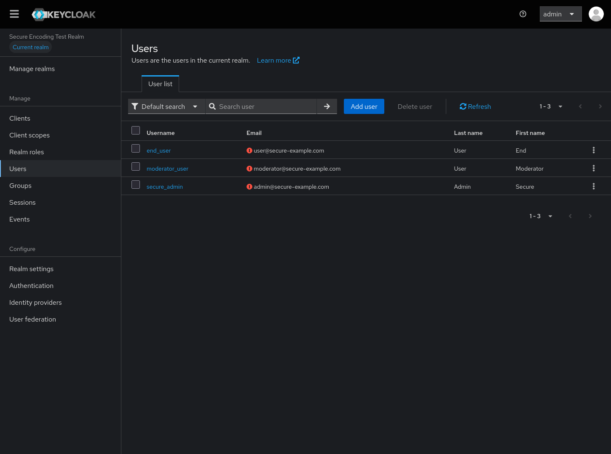

# Encoding & Decoding

Encoding and decoding operations in variable substitution allow you to transform data between different formats, including Base64 encoding/decoding and URL encoding/decoding.

## Overview

Encoding operations enable you to:
- Encode data to Base64 format
- Decode Base64 data back to original format
- Encode special characters for URLs
- Decode URL-encoded strings
- Handle character encoding transformations

## Base64 Encoding

### Basic Base64 Encoding

Encode a string to Base64:

```json
{
  "realm": "$(base64Encoder:HelloWorld!)",
  "secret": "$(base64Encoder:my-secret-password)"
}
```

### Syntax

```
$(base64Encoder:INPUT_STRING)
```

**Parameters:**
- `INPUT_STRING` - String to encode to Base64

### Examples

**Encoding a client secret:**
```json
{
  "clients": [
    {
      "clientId": "my-app",
      "secret": "$(base64Encoder:my-secret-password-123)"
    }
  ]
}
```

**Encoding realm name:**
```json
{
  "realm": "$(base64Encoder:production-realm)"
}
```

**Encoding from environment variable:**
```json
{
  "secret": "$(base64Encoder:$(env:CLIENT_SECRET))"
}
```

**Result:**
- `HelloWorld!` → `SGVsbG9Xb3JsZCE=`
- `my-secret-password` → `bXktc2VjcmV0LXBhc3N3b3Jk`

---

## Base64 Decoding

### Basic Base64 Decoding

Decode a Base64 string back to original format:

```json
{
  "realm": "$(base64Decoder:SGVsbG9Xb3JsZCE=)",
  "secret": "$(base64Decoder:bXktc2VjcmV0LXBhc3N3b3Jk)"
}
```

### Syntax

```
$(base64Decoder:BASE64_STRING)
```

**Parameters:**
- `BASE64_STRING` - Base64 encoded string to decode

### Examples

**Decoding a stored secret:**
```json
{
  "clients": [
    {
      "clientId": "my-app",
      "secret": "$(base64Decoder:$(file:UTF-8:/run/secrets/encoded-secret))"
    }
  ]
}
```

**Decoding from environment variable:**
```json
{
  "realm": "$(base64Decoder:$(env:ENCODED_REALM_NAME))"
}
```

**Result:**
- `SGVsbG9Xb3JsZCE=` → `HelloWorld!`
- `bXktc2VjcmV0LXBhc3N3b3Jk` → `my-secret-password`

---

## URL Encoding

### Basic URL Encoding

Encode special characters for safe use in URLs:

```json
{
  "redirectUri": "$(urlEncoder:Hello World!)",
  "webOrigin": "$(urlEncoder:https://example.com/path with spaces)"
}
```

### Syntax

```
$(urlEncoder:INPUT_STRING)
```

**Parameters:**
- `INPUT_STRING` - String to URL encode

### Examples

**Encoding redirect URIs:**
```json
{
  "clients": [
    {
      "clientId": "my-app",
      "redirectUris": [
        "$(urlEncoder:https://example.com/callback?param=value)",
        "$(urlEncoder:https://example.com/path with spaces)"
      ]
    }
  ]
}
```

**Encoding web origins:**
```json
{
  "clients": [
    {
      "clientId": "my-app",
      "webOrigins": [
        "$(urlEncoder:https://example.com)",
        "$(urlEncoder:https://app.example.com)"
      ]
    }
  ]
}
```

**Result:**
- `Hello World!` → `Hello%20World%21`
- `https://example.com/path with spaces` → `https%3A%2F%2Fexample.com%2Fpath%20with%20spaces`

---

## URL Decoding

### Basic URL Decoding

Decode URL-encoded strings back to original format:

```json
{
  "redirectUri": "$(urlDecoder:Hello%20World%21)",
  "webOrigin": "$(urlDecoder:https%3A%2F%2Fexample.com)"
}
```

### Syntax

```
$(urlDecoder:ENCODED_STRING)
```

**Parameters:**
- `ENCODED_STRING` - URL-encoded string to decode

### Examples

**Decoding redirect URIs:**
```json
{
  "clients": [
    {
      "clientId": "my-app",
      "redirectUris": [
        "$(urlDecoder:https%3A%2F%2Fexample.com%2Fcallback%3Fparam%3Dvalue)"
      ]
    }
  ]
}
```

**Decoding from file:**
```json
{
  "redirectUri": "$(urlDecoder:$(file:UTF-8:config/encoded-uri.txt))"
}
```

**Result:**
- `Hello%20World%21` → `Hello World!`
- `https%3A%2F%2Fexample.com` → `https://example.com`

---

## Common Use Cases

### Base64 for Secrets

**Storing secrets in encoded format:**
```json
{
  "clients": [
    {
      "clientId": "backend-api",
      "secret": "$(base64Decoder:$(env:ENCODED_SECRET))"
    }
  ]
}
```

**Encode secret before deployment:**

Encode

```bash
echo -n "my-secret-password" | base64
```

> Expected output: `bXktc2VjcmV0LXBhc3N3b3Jk`

Export

```bash
export ENCODED_SECRET=bXktc2VjcmV0LXBhc3N3b3Jk
```

### URL Encoding for Redirect URIs

**Safe redirect URI handling:**
```json
{
  "clients": [
    {
      "clientId": "my-app",
      "redirectUris": [
        "$(urlEncoder:$(env:APP_URL)/callback)",
        "$(urlEncoder:$(env:APP_URL)/login?return=$(env:RETURN_URL))"
      ]
    }
  ]
}
```

### Chaining Operations

**Encode then decode (for demonstration):**
```json
{
  "original": "Hello World!",
  "encoded": "$(base64Encoder:Hello World!)",
  "decoded": "$(base64Decoder:$(base64Encoder:Hello World!))"
}
```

**URL encode from file:**
```json
{
  "redirectUri": "$(urlEncoder:$(file:UTF-8:config/callback-url.txt))"
}
```

---

## Character Encoding Considerations

### UTF-8 Handling

**Base64 with UTF-8 characters:**
```json
{
  "realm": "$(base64Encoder:Production-Realm-中文)",
  "displayName": "$(base64Encoder:Application-émojis-🎉)"
}
```

**URL encoding with UTF-8:**
```json
{
  "redirectUri": "$(urlEncoder:https://example.com/path?name=José)"
}
```

### Special Characters

**Common special characters:**
- Space → `%20`
- `!` → `%21`
- `#` → `%23`
- `&` → `%26`
- `=` → `%3D`
- `?` → `%3F`

**Example:**
```json
{
  "redirectUri": "$(urlEncoder:https://example.com/callback?param=value&other=test)"
}
```

---

## Best Practices

### Base64 Usage

1. **For Transmission Only:** Use Base64 for data transmission, not security
2. **Document Encoding:** Clearly document when and why Base64 is used
3. **Consistent Encoding:** Use the same encoding method throughout
4. **Test Decoding:** Verify decoding works after encoding

### URL Encoding Usage

1. **Always Encode URLs:** Always URL-encode user-provided URLs
2. **Encode Components:** Encode URL components, not entire URLs
3. **Validate After Decoding:** Validate URLs after decoding
4. **Use HTTPS:** Always use HTTPS for sensitive redirects

### General Practices

1. **Prefer File Operations:** For secrets, use file operations instead of encoding
2. **Test Thoroughly:** Test encoding/decoding with real data
3. **Handle Errors:** Implement proper error handling
4. **Document Dependencies:** Document external encoding/decoding requirements

## Performance Considerations

### Encoding Overhead

- **Base64:** ~33% size increase
- **URL Encoding:** Variable size increase depending on special characters
- **Processing Time:** Minimal overhead for typical operations

### Optimization Tips

1. **Encode Once:** Encode values once and store, don't encode on every import
2. **Cache Results:** Cache encoded/decoded values when possible
3. **Batch Operations:** Process multiple values in single operation
4. **Monitor Performance:** Profile encoding/decoding in large configurations

---

## Complete Examples

### Client Configuration with Encoding

**secure-encoding-realm.json:**
```json
{
  "realm": "secure-encoding-test",
  "displayName": "$(base64Decoder:U2VjdXJlIEVuY29kaW5nIFRlc3QgUmVhbG0)",
  "enabled": true,
  "clients": [
    {
      "clientId": "$(base64Decoder:ZnJvbnRlbmQtYXBw)",
      "name": "$(base64Decoder:U2VjdXJlIEZyb250ZW5kIEFwcGxpY2F0aW9u)",
      "enabled": true,
      "publicClient": true,
      "standardFlowEnabled": true,
      "redirectUris": [
        "$(urlDecoder:aHR0cHMlM0ElMkYlMkZhcHAuc2VjdXJlLWV4YW1wbGUuY29tJTJGY2FsbGJhY2s)",
        "$(urlDecoder:aHR0cHMlM0ElMkYlMkZhcHAuc2VjdXJlLWV4YW1wbGUuY29tJTJGc2lsZW50LXJlbmV3)"
      ],
      "webOrigins": [
        "$(urlDecoder:aHR0cHMlM0ElMkYlMkZhcHAuc2VjdXJlLWV4YW1wbGUuY29t)"
      ]
    },
    {
      "clientId": "$(base64Decoder:YmFja2VuZC1hcGk)",
      "name": "$(base64Decoder:U2VjdXJlIEJhY2tlbmQgQVBJ)",
      "enabled": true,
      "publicClient": false,
      "standardFlowEnabled": true,
      "directAccessGrantsEnabled": true,
      "secret": "$(base64Decoder:YmFja2VuZF9hcGlfc2VjcmV0X2hpZ2hfc2VjdXJpdHlfMjAyNA)",
      "redirectUris": [
        "$(urlDecoder:aHR0cHMlM0ElMkYlMkZhcGkuc2VjdXJlLWV4YW1wbGUuY29tJTJGYXV0aCUyRmNhbGxiYWNr)"
      ],
      "webOrigins": [
        "$(urlDecoder:aHR0cHMlM0ElMkYlMkZhcGkuc2VjdXJlLWV4YW1wbGUuY29t)"
      ]
    },
    {
      "clientId": "$(base64Decoder:YmFja2VuZC1hcGk)",
      "name": "$(base64Decoder:U2VjdXJlIEJhY2tlbmQgQVBJ)",
      "enabled": true,
      "publicClient": false,
      "standardFlowEnabled": true,
      "directAccessGrantsEnabled": true,
      "secret": "$(base64Decoder:YmFja2VuZF9hcGlfc2VjcmV0X2hpZ2hfc2VjdXJpdHlfMjAyNA)",
      "redirectUris": [
        "$(urlDecoder:aHR0cHMlM0ElMkYlMkZhcGkuc2VjdXJlLWV4YW1wbGUuY29tJTJGYXV0aCUyRmNhbGxiYWNr)"
      ],
      "webOrigins": [
        "$(urlDecoder:aHR0cHMlM0ElMkYlMkZhcGkuc2VjdXJlLWV4YW1wbGUuY29t)"
      ]
    },
    {
      "clientId": "$(base64Decoder:bW9iaWxlLWFwcA)",
      "name": "$(base64Decoder:U2VjdXJlIE1vYmlsZSBBcHBsaWNhdGlvbg)",
      "enabled": true,
      "publicClient": true,
      "standardFlowEnabled": true,
      "redirectUris": [
        "$(urlDecoder:aHR0cHMlM0ElMkYlMkZtb2JpbGUuc2VjdXJlLWV4YW1wbGUuY29tJTJGY2FsbGJhY2s)",
        "$(urlDecoder:bXlzZWN1cmVhcHAlM0ElMkYlMkY)"
      ],
      "webOrigins": [
        "$(urlDecoder:aHR0cHMlM0ElMkYlMkZtb2JpbGUuc2VjdXJlLWV4YW1wbGUuY29t)"
      ]
    }
  ],
  "roles": {
    "realm": [
      {
        "name": "$(base64Decoder:YWRtaW4)",
        "description": "$(base64Decoder:U3lzdGVtIGFkbWluaXN0cmF0b3Igd2l0aCBmdWxsIGFjY2Vzcw)"
      },
      {
        "name": "$(base64Decoder:bW9kZXJhdG9y)",
        "description": "$(base64Decoder:Q29udGVudCBtb2RlcmF0b3Igd2l0aCBtYW5hZ2VtZW50IHJpZ2h0cw)"
      },
      {
        "name": "$(base64Decoder:dXNlcg)",
        "description": "$(base64Decoder:U3RhbmRhcmQgdXNlciB3aXRoIGJhc2ljIGFjY2Vzcw)"
      }
    ]
  },
  "users": [
    {
      "username": "$(base64Decoder:c2VjdXJlX2FkbWlu)",
      "email": "$(base64Decoder:YWRtaW5Ac2VjdXJlLWV4YW1wbGUuY29t)",
      "enabled": true,
      "firstName": "$(base64Decoder:U2VjdXJl)",
      "lastName": "$(base64Decoder:QWRtaW4)",
      "realmRoles": ["$(base64Decoder:YWRtaW4)"],
      "credentials": [
        {
          "type": "password",
          "value": "$(base64Decoder:U2VjdXJlQWRtaW5QYXNzMTIzIQ)",
          "temporary": false
        }
      ]
    },
    {
      "username": "$(base64Decoder:bW9kZXJhdG9yX3VzZXI)",
      "email": "$(base64Decoder:bW9kZXJhdG9yQHNlY3VyZS1leGFtcGxlLmNvbQ)",
      "enabled": true,
      "firstName": "$(base64Decoder:TW9kZXJhdG9y)",
      "lastName": "$(base64Decoder:VXNlcg)",
      "realmRoles": ["$(base64Decoder:bW9kZXJhdG9y)", "$(base64Decoder:dXNlcg)"],
      "credentials": [
        {
          "type": "password",
          "value": "$(base64Decoder:TW9kZXJhdG9yUGFzczQ1Ng)",
          "temporary": false
        }
      ]
    },
    {
      "username": "$(base64Decoder:ZW5kX3VzZXI)",
      "email": "$(base64Decoder:dXNlckBzZWN1cmUtZXhhbXBsZS5jb20)",
      "enabled": true,
      "firstName": "$(base64Decoder:RW5k)",
      "lastName": "$(base64Decoder:VXNlcg)",
      "realmRoles": ["$(base64Decoder:dXNlcg)"],
      "credentials": [
        {
          "type": "password",
          "value": "$(base64Decoder:RW5kVXNlclBhc3M3ODk)",
          "temporary": false
        }
      ]
    }
  ]
}
```


#### Step 1: Encode Your Values

Before creating the JSON file, encode your sensitive values:

To encode use this syntax for Base64

```bash
echo -n "Secure Encoding Test Realm" | base64
echo -n "my_super_secret_jwt_key_2024" | base64
echo -n "admin@secure-example.com" | base64
```

To encode use this syntax for UrlEncoding


```bash
python3 -c "import urllib.parse; print(urllib.parse.quote('https://secure.example.com/webhooks/callback'))"
python3 -c "import urllib.parse; print(urllib.parse.quote('https://app.secure-example.com/callback'))"
```


### Step 2: Run Import

```bash
java -jar ./target/keycloak-config-cli.jar \
  --keycloak.url="http://<keycloak-url>" \
  --keycloak.user="<admin-username>" \
  --keycloak.password="<admin-password>" \
  --import.var-substitution.enabled=true \
  --import.files.locations=secure-encoding-realm.json
```

### Step 3: Verify

#### Verify in UI

In the Keycloak Admin Console, verify:

- **Realm name**: `secure-encoding-test`
- **Display name**: `Secure Encoding Test Realm`
- **Clients**: `frontend-app`, `backend-api`, and `mobile-app` created successfully
- **Users**: `secure_admin`, `moderator_user`, and `end_user` created successfully


<br />



<br />

### What This Demonstrates

This example demonstrates all encoding and decoding operations:

- **Base64 Encoding**: Converting secrets to Base64 format
- **Base64 Decoding**: Converting Base64 back to original format
- **URL Encoding**: Encoding URLs for safe transport
- **URL Decoding**: Decoding URLs back to original format
- **Nested Operations**: Using encode-then-decode chains
- **Complex URLs**: Encoding URLs with parameters and special characters
- **Client Configuration**: Using encoding in client secrets and URLs
- **User Attributes**: Storing encoded/decoded values in user attributes

### Security Benefits

**No Plain Text Secrets**: Sensitive data never appears in plain text in configuration files

**Version Control Safe**: Encoded values can be safely committed to version control

**Runtime Decoding**: Values are only decoded in memory during import

**Audit Trail**: Encoded values maintain auditability without exposing secrets

**Compliance**: Helps meet security compliance requirements for secret management

### Best Practices for Secure Encoding

1. **Use Strong Base64**: Always use standard Base64 encoding
2. **Separate Keys**: Store encoding keys separately from configuration
3. **Environment-Specific**: Use different encoded values per environment
4. **Regular Rotation**: Rotate and re-encode sensitive values regularly
5. **Access Control**: Limit access to files with encoded values
6. **Validation**: Validate decoded values during import process


## Next Steps

- [Overview](overview.md) - Variable substitution introduction
- [File Operations](file-operations.md) - File content and properties
- [Environment Variables](environment-variables.md) - Environment variable access
- [JavaScript Substitution](javascript-substitution.md) - Advanced JavaScript evaluation
