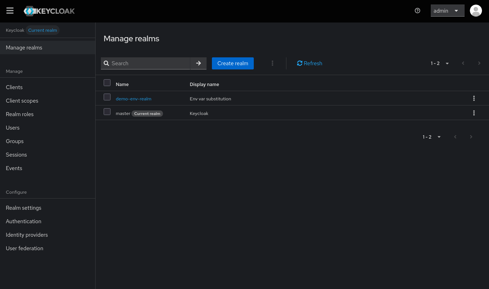

# Environment Variables

Environment variables are essential for creating dynamic, environment-specific configurations with keycloak-config-cli.

## Keycloak Configuration Variables

### Connection Settings

#### Keycloak server URL

```bash
export KEYCLOAK_URL=https://<your-keycloak-url>
```

#### Authentication credentials

```bash
export KEYCLOAK_USER=<admin-username>
export KEYCLOAK_PASSWORD=<admin-password>
```

#### Realm to manage

```bash
export KEYCLOAK_REALM=<realm-name>
```

### SSL/TLS Configuration

#### SSL verification
```bash
export KEYCLOAK_TRUSTSTORE=/path/to/truststore.jks
export KEYCLOAK_TRUSTSTORE_PASSWORD=changeit
export KEYCLOAK_SSL_SKIP_VERIFICATION=true
```

## Managing Environment Variables

### Using .env Files

Create environment-specific `.env` files:

```bash
# .env
KEYCLOAK_URL=https://<your-keycloak-url>
KEYCLOAK_USER=<admin-username>
KEYCLOAK_PASSWORD=<admin-password>
KEYCLOAK_REALM=<realm-name>
```

Load environment variables:

# Using source

```bash
source .env
```

# Using export

```bash
export $(cat .env | xargs)
```


## Step-by-Step: Realm Import via JAR + Env Vars

This example shows how to use environment variables inside a realm JSON file and import it using the JAR.

### Step 1: Create an `.env` file

Create a file named `.env`:

```bash
REALM_NAME='demo-env-realm'
REALM_DISPLAY_NAME='Env var substitution'
```

Load it (pick one):

```bash
source .env
```

or:

```bash
export $(cat .env | xargs)
```

### Step 2: Create a realm JSON using `$(env:...)`

Create `realm-env.json`:

```json
{
  "realm": "$(env:REALM_NAME)",
  "enabled": true,
  "displayName": "$(env:REALM_DISPLAY_NAME)"
}
```

### Step 3: Run keycloak-config-cli (JAR)

Run the import with variable substitution enabled:

```bash
java -jar ./target/keycloak-config-cli.jar \
  --keycloak.url="https://<your-keycloak-url>" \
  --keycloak.user="<admin-username>" \
  --keycloak.password="<admin-password>" \
  --import.var-substitution.enabled=true \
  --import.files.locations=realm-env.json
```

### Step 4: Verify

Verify in the Keycloak Admin Console:

- **Realm name** should be the value of `REALM_NAME`.
- **Display name** should be the value of `REALM_DISPLAY_NAME`.

<br />



<br />

## Best Practices

1. **Use Descriptive Names**: Clear, meaningful variable names
2. **Group by Environment**: Separate `.env` files per environment
3. **Document Variables**: Maintain documentation of required variables
4. **Validate Early**: Check required variables before running
5. **Secure Secrets**: Use proper secret management
6. **Version Control**: Exclude sensitive files from git

## Next Steps

- [JavaScript Substitution](javascript-substitution.md) - Advanced substitution techniques
- [Configuration](../config/overview.md) - General configuration options
- [Docker & Helm](../docker-helm/overview.md) - Container deployment
