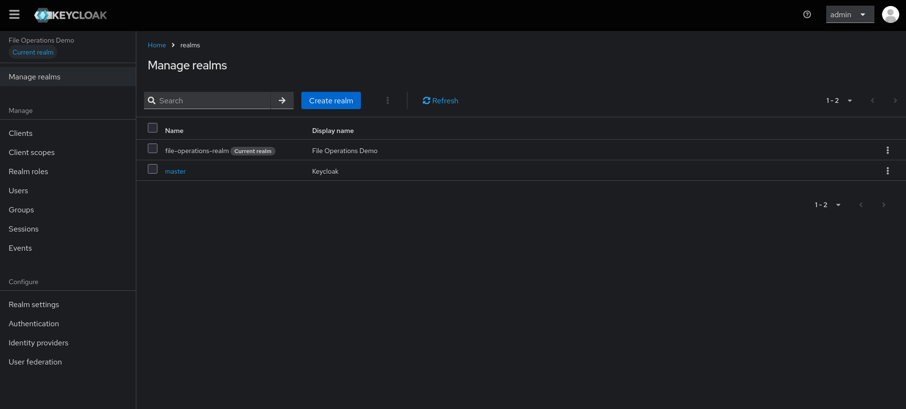

# File Operations

File operations in variable substitution allow you to read content from files, properties files, resource bundles, and XML documents to dynamically populate your Keycloak configuration.

## Overview

File operations enable you to:
- Read entire file contents
- Extract specific values from properties files
- Access resource bundle values
- Query XML documents using XPath
- Handle different character encodings

## File Content

### Basic File Reading

Read the entire content of a file:

```json
{
  "realm": "$(file:UTF-8:src/test/resources/document.properties)",
  "displayName": "$(file:UTF-8:/path/to/display-name.txt)"
}
```

### Syntax

```
$(file:ENCODING:PATH)
```

**Parameters:**
- `ENCODING` - Character encoding (e.g., UTF-8, ISO-8859-1)
- `PATH` - File path (relative or absolute)

### Examples

**Reading a realm name from file:**
```json
{
  "realm": "$(file:UTF-8:config/realm-name.txt)"
}
```

**Reading a secret from file:**
```json
{
  "clients": [
    {
      "clientId": "my-app",
      "secret": "$(file:UTF-8:/run/secrets/client-secret)"
    }
  ]
}
```

**Using absolute path with system property:**
```json
{
  "secret": "$(file:UTF-8:file:///$(sys:user.dir)/secrets/password.txt)"
}
```

---

## Properties File

### Reading Properties

Extract specific values from Java properties files:

```json
{
  "realm": "$(properties:config/application.properties::realm.name)",
  "displayName": "$(properties:config/application.properties::app.display.name)"
}
```

### Syntax

```
$(properties:FILE_PATH::KEY)
```

**Parameters:**
- `FILE_PATH` - Path to the properties file
- `KEY` - Property key to extract

### Properties File Example

**application.properties:**
```properties
realm.name=production-realm
app.display.name=My Application
keycloak.url=https://keycloak.company.com
admin.email=admin@company.com
```

**Configuration:**
```json
{
  "realm": "$(properties:config/application.properties::realm.name)",
  "displayName": "$(properties:config/application.properties::app.display.name)",
  "attributes": {
    "keycloak_url": "$(properties:config/application.properties::keycloak.url)",
    "admin_email": "$(properties:config/application.properties::admin.email)"
  }
}
```

### Multiple Properties

You can read multiple properties from the same file:

```json
{
  "realm": "$(properties:config/realm.properties::name)",
  "enabled": "$(properties:config/realm.properties::enabled)",
  "sslRequired": "$(properties:config/realm.properties::ssl.required)"
}
```

---


## XML XPath

### Querying XML Documents

Extract values from XML documents using XPath expressions:

```json
{
  "realm": "$(xml:config/realm-config.xml:/realm/@name)",
  "displayName": "$(xml:config/realm-config.xml:/realm/displayName)"
}
```

### Syntax

```
$(xml:FILE_PATH:EXPRESSION)
```

**Parameters:**
- `FILE_PATH` - Path to the XML file
- `EXPRESSION` - XPath expression to evaluate

### XML Document Example

**realm-config.xml:**
```xml
<?xml version="1.0" encoding="UTF-8"?>
<realm name="production-realm">
  <displayName>Production Realm</displayName>
  <settings>
    <sslRequired>external</sslRequired>
    <registrationAllowed>false</registrationAllowed>
  </settings>
  <attributes>
    <attribute name="environment">production</attribute>
    <attribute name="region">us-east-1</attribute>
  </attributes>
</realm>
```

**Configuration:**
```json
{
  "realm": "$(xml:config/realm-config.xml:/realm/@name)",
  "displayName": "$(xml:config/realm-config.xml:/realm/displayName)",
  "sslRequired": "$(xml:config/realm-config.xml:/realm/settings/sslRequired)",
  "registrationAllowed": "$(xml:config/realm-config.xml:/realm/settings/registrationAllowed)"
}
```

### Advanced XPath Examples

**Extract attributes:**
```json
{
  "realm": "$(xml:config/config.xml:/configuration/realm/@id)",
  "enabled": "$(xml:config/config.xml:/configuration/realm/@enabled)"
}
```

**Extract nested elements:**
```json
{
  "passwordPolicy": "$(xml:config/security.xml:/security/passwordPolicy/@value)"
}
```

**Extract list values:**
```json
{
  "attributes": {
    "supported_locales": "$(xml:config/i18n.xml:/locales/locale/text())"
  }
}
```

---

## Character Encodings

### Common Encodings

**UTF-8 (Recommended):**
```json
{
  "realm": "$(file:UTF-8:config/realm.txt)"
}
```

**ISO-8859-1:**
```json
{
  "realm": "$(file:ISO-8859-1:config/realm.txt)"
}
```

**US-ASCII:**
```json
{
  "realm": "$(file:US-ASCII:config/realm.txt)"
}
```

### Encoding Best Practices

1. **Use UTF-8**: Default to UTF-8 for maximum compatibility
2. **Match File Encoding**: Ensure encoding matches the actual file encoding
3. **Test Special Characters**: Verify special characters render correctly
4. **Document Encoding**: Document the encoding used for each file

---

## Security Considerations

### Sensitive Files

**Never commit sensitive files:**

add to the .gitignore

```bash
secrets/
*.key
*.pem
passwords.txt
```

**Use secure file locations:**
```json
{
  "secret": "$(file:UTF-8:/run/secrets/client-secret)"
}
```

### File Permissions

Ensure proper file permissions:

Restrict access to sensitive files

```bash
chmod 600 /run/secrets/client-secret
chmod 600 ~/.secrets/password.txt
```

# Complete Import Example

This example demonstrates all file operations working together: file reading, properties extraction, and XML querying.

## Step 1: Create Supporting Files

### realm-name.txt
```txt
file-operations-realm
```

### application.properties
```properties
realm.display.name=File Operations Demo
app.redirect.uris=http://localhost:8080/callback,http://localhost:8080/silent-renew
client.secret=file-operations-secret-123
ssl.required=external
registration.allowed=false
```

### realm-config.xml
```xml
<?xml version="1.0" encoding="UTF-8"?>
<realm name="file-operations-realm" enabled="true">
  <displayName>File Operations Demo Realm</displayName>
  <settings>
    <sslRequired>external</sslRequired>
    <registrationAllowed>false</registrationAllowed>
    <passwordPolicy>length(8) and upperCase(1) and digits(1)</passwordPolicy>
  </settings>
  <attributes>
    <attribute name="environment">demo</attribute>
    <attribute name="region">eu-west-1</attribute>
    <attribute name="version">1.0.0</attribute>
  </attributes>
</realm>
```

### client-secret.txt
```txt
super-secret-client-password-456
```

## Step 2: Create Realm Configuration

### file-operations-realm.json
```json
{
  "realm": "$(file:UTF-8:/path/to/config/realm-name.txt)",
  "displayName": "$(properties:/path/to/config/application.properties::realm.display.name)",
  "enabled": "$(xml:/path/to/config/realm-config.xml:/realm/@enabled)",
  "sslRequired": "$(xml:/path/to/config/realm-config.xml:/realm/settings/sslRequired)",
  "registrationAllowed": "$(xml:/path/to/config/realm-config.xml:/realm/settings/registrationAllowed)",
  "passwordPolicy": "$(xml:/path/to/config/realm-config.xml:/realm/settings/passwordPolicy)",
  "internationalizationEnabled": true,
  "attributes": {
    "welcome_message": "Welcome to the File Operations Demo!",
    "realm_description": "This realm demonstrates file, properties, and XML operations",
    "environment": "demo",
    "region": "eu-west-1", 
    "version": "1.0.0",
    "file_based_config": "true"
  },
  "roles": {
    "realm": [
      {
        "name": "user",
        "description": "Regular user role from file operations demo"
      },
      {
        "name": "admin", 
        "description": "Administrator role from file operations demo"
      }
    ]
  },
  "users": [
    {
      "username": "file-demo-user",
      "email": "file-demo@example.com",
      "enabled": true,
      "firstName": "File",
      "lastName": "Demo",
      "realmRoles": ["user"],
      "credentials": [
        {
          "type": "password",
          "value": "Demo12345",
          "temporary": false
        }
      ]
    }
  ],
  "clients": [
    {
      "clientId": "file-operations-client",
      "name": "File Operations Demo",
      "description": "Demo client with file-based configuration",
      "enabled": true,
      "publicClient": false,
      "standardFlowEnabled": true,
      "directAccessGrantsEnabled": true,
      "secret": "$(file:UTF-8:/path/to/secrets/client-secret.txt)",
      "redirectUris": ["http://localhost:8080/callback", "http://localhost:8080/silent-renew"],
      "webOrigins": ["http://localhost:8080"]
    }
  ]
}
```

## Step 3: Run Import

```bash
java -jar keycloak-config-cli.jar \
  --keycloak.url=http://localhost:8080 \
  --keycloak.user=admin \
  --keycloak.password=admin \
  --import.var-substitution.enabled=true \
  --import.files.locations=file-operations-realm.json
```

## Step 4: Verify Results

<br />



<br />

### Expected Results

In the Keycloak Admin Console, verify:

- **Realm name**: `file-operations-realm` (from text file)
- **Display name**: `File Operations Demo` (from properties file)
- **Realm enabled**: `true` (from XML attribute)
- **SSL required**: `external` (from XML element)
- **Registration allowed**: `false` (from XML element)
- **Password policy**: `length(8) and upperCase(1) and digits(1)` (from XML element)
- **Client secret**: `super-secret-client-password-456` (from secret file)
- **User**: `file-demo-user` created successfully
- **Roles**: `user` and `admin` roles created

### What This Demonstrates

- **File Content Reading**: Reading realm name from text file  
- **Properties Extraction**: Extracting display name from properties file  
- **XML Attribute Query**: Getting realm enabled status from XML attribute  
- **XML Element Query**: Extracting settings from XML elements  
- **Secret Management**: Reading client secret from secure file  
- **Mixed Operations**: Combining all file operation types in one configuration  

---

## Next Steps

- [Overview](overview.md) - Variable substitution introduction
- [Environment Variables](environment-variables.md) - Environment variable access
- [JavaScript Substitution](javascript-substitution.md) - Advanced JavaScript evaluation
- [Encoding & Decoding](encoding-decoding.md) - Base64 and URL operations
