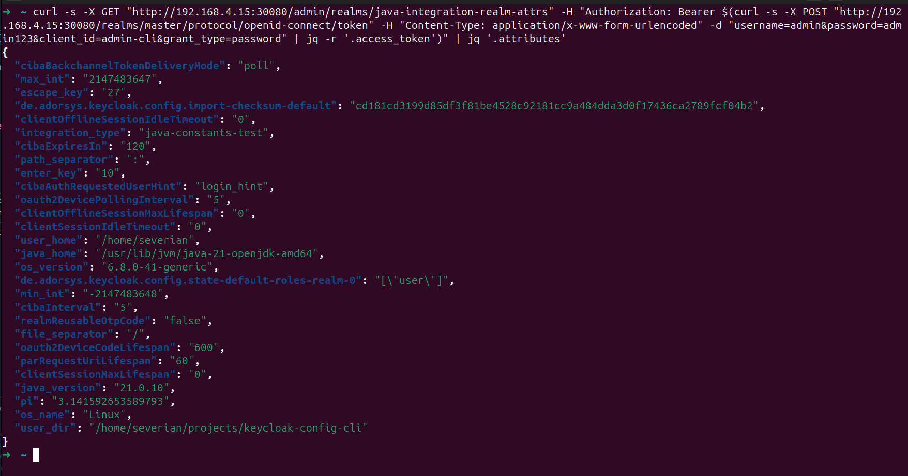

# Java Integration

Java integration in variable substitution allows you to access Java constants and version information, enabling dynamic configuration based on Java runtime environment and standard library values.

## Overview

Java integration enables you to:
- Access Java constants from standard library classes
- Retrieve Java version information
- Use Java system properties
- Reference static final fields from Java classes

## Java Constants

### Basic Java Constant Access

Access static final fields from Java classes:

```json
{
  "realm": "$(const:java.awt.event.KeyEvent.VK_ESCAPE)",
  "attributes": {
    "escape_key": "$(const:java.awt.event.KeyEvent.VK_ESCAPE)"
  }
}
```

### Syntax

```
$(const:FULLY_QUALIFIED_CLASS_NAME.FIELD_NAME)
```

**Parameters:**
- `FULLY_QUALIFIED_CLASS_NAME` - Complete Java class name including package
- `FIELD_NAME` - Name of the static final field

### Common Java Constants

**AWT Event Constants:**
```json
{
  "attributes": {
    "escape_key": "$(const:java.awt.event.KeyEvent.VK_ESCAPE)",
    "enter_key": "$(const:java.awt.event.KeyEvent.VK_ENTER)",
    "space_key": "$(const:java.awt.event.KeyEvent.VK_SPACE)"
  }
}
```

**Character Constants:**
```json
{
  "attributes": {
    "separator": "$(const:java.io.File.separator)",
    "path_separator": "$(const:java.io.File.pathSeparator)"
  }
}
```

**Math Constants:**
```json
{
  "attributes": {
    "pi": "$(const:java.lang.Math.PI)",
    "max_int": "$(const:java.lang.Integer.MAX_VALUE)",
    "min_int": "$(const:java.lang.Integer.MIN_VALUE)"
  }
}
```

### Examples

**Using file separator for cross-platform paths:**
```json
{
  "realm": "production",
  "attributes": {
    "config_path": "config$(const:java.io.File.separator)realm.json",
    "separator": "$(const:java.io.File.separator)"
  }
}
```

**Using character encoding constants:**
```json
{
  "realm": "production",
  "attributes": {
    "encoding": "$(const:java.nio.charset.StandardCharsets.UTF_8)"
  }
}
```

**Using time constants:**
```json
{
  "realm": "production",
  "attributes": {
    "milliseconds_per_second": "$(const:java.util.concurrent.TimeUnit.MILLISECONDS.convert(1,SECONDS))",
    "seconds_per_minute": "60"
  }
}
```

---

## System Properties

### Java System Properties

Access Java system properties (also available via `$(sys:PROPERTY_NAME)`):

```json
{
  "realm": "production",
  "attributes": {
    "user_dir": "$(sys:user.dir)",
    "user_home": "$(sys:user.home)",
    "java_home": "$(sys:java.home)",
    "os_name": "$(sys:os.name)"
  }
}
```

---

## Classpath Requirements

### Available Classes

Java constants require the classes to be available on the classpath:

**Standard Library Classes (Always Available):**
- `java.lang.*` - Core language classes
- `java.io.*` - Input/output classes
- `java.util.*` - Utility classes
- `java.nio.*` - New I/O classes
- `java.awt.*` - AWT classes (if AWT is available)
- `java.math.*` - Mathematical classes

**Third-Party Classes:**
- Must be on the classpath
- May not be available in all environments
- Use with caution

### Custom Classes

To use custom classes, ensure they are on the classpath:

```json
{
  "attributes": {
    "custom_constant": "$(const:com.example.Constants.API_VERSION)"
  }
}
```

**Add to classpath:**
```bash
java -cp /path/to/custom.jar:keycloak-config-cli.jar \
  -jar keycloak-config-cli.jar \
  --import.files.locations=config.json
```

---

### Classpath Security

**Be careful with classpath:**
- Only add trusted JARs to classpath
- Avoid loading arbitrary classes
- Review third-party dependencies

---

## Performance Considerations

### Constant Access Overhead

- **Minimal overhead:** Direct field access is very fast
- **No reflection overhead:** Uses direct field access
- **Cached values:** Static final values are cached by JVM

### Optimization Tips

1. **Use Standard Library:** Prefer standard library classes
2. **Avoid Complex Lookups:** Simple constant access is faster
3. **Cache Results:** Cache constant values if used repeatedly
4. **Profile Usage:** Profile constant access in large configurations

---

## Complete Import Example

This example demonstrates Java integration by accessing Java constants and system properties in a Keycloak realm configuration.

### Step 1: Create Realm Configuration

### java-integration-realm.json
```json
{
  "realm": "java-integration-realm-attrs",
  "displayName": "Java Integration Realm Attributes Test",
  "enabled": true,
  "attributes": {
    "escape_key": "$(const:java.awt.event.KeyEvent.VK_ESCAPE)",
    "enter_key": "$(const:java.awt.event.KeyEvent.VK_ENTER)",
    "file_separator": "$(const:java.io.File.separator)",
    "path_separator": "$(const:java.io.File.pathSeparator)",
    "pi": "$(const:java.lang.Math.PI)",
    "max_int": "$(const:java.lang.Integer.MAX_VALUE)",
    "min_int": "$(const:java.lang.Integer.MIN_VALUE)",
    "user_dir": "$(sys:user.dir)",
    "user_home": "$(sys:user.home)",
    "java_home": "$(sys:java.home)",
    "os_name": "$(sys:os.name)",
    "os_version": "$(sys:os.version)",
    "java_version": "$(sys:java.version)",
    "integration_type": "java-constants-test"
  },
  "roles": {
    "realm": [
      {
        "name": "user",
        "description": "Test user role"
      }
    ]
  },
  "users": [
    {
      "username": "java-test-user",
      "email": "java-test@example.com",
      "enabled": true,
      "firstName": "Java",
      "lastName": "Test",
      "realmRoles": ["user"],
      "credentials": [
        {
          "type": "password",
          "value": "JavaTest123",
          "temporary": false
        }
      ]
    }
  ]
}
```

### Step 2: Run Import

```bash
java -jar keycloak-config-cli.jar \
  --keycloak.url=http://<keycloak-url> \
  --keycloak.user=<keycloak-user> \
  --keycloak.password=<keycloak-password> \
  --import.var-substitution.enabled=true \
  --import.files.locations=java-integration-realm.json
```

### Step 3: Verify Results

**Note**: Realm attributes set programmatically may not be visible in the Keycloak Admin Console UI. Use the Keycloak Admin API to verify the attributes were set correctly.

#### Verify via API

Get admin access token

```bash
TOKEN=$(curl -s -X POST "http://<keycloak-url>/realms/master/protocol/openid-connect/token" \
  -H "Content-Type: application/x-www-form-urlencoded" \
  -d "username=<keycloak-user>&password=<keycloak-password>&client_id=admin-cli&grant_type=password" | jq -r '.access_token')
```

Get realm details with attributes

```bash
curl -s -X GET "http://<keycloak-url>/admin/realms/java-integration-realm-attrs" \
  -H "Authorization: Bearer $TOKEN" | jq '.attributes'
```

#### Expected Results

The API response should show the following attributes:

- `escape_key`: `27` (VK_ESCAPE constant value)
- `enter_key`: `10` (VK_ENTER constant value)
- `file_separator`: `/` on Linux, `\` on Windows
- `path_separator`: `:` on Linux, `;` on Windows
- `pi`: `3.141592653589793` (Math.PI constant)
- `max_int`: `2147483647` (Integer.MAX_VALUE)
- `min_int`: `-2147483648` (Integer.MIN_VALUE)
- `user_dir`: Current working directory path
- `user_home`: User home directory path
- `java_home`: Java installation directory
- `os_name`: Operating system name (e.g., "Linux")
- `os_version`: OS version
- `java_version`: Java runtime version
- `integration_type`: `java-constants-test`

#### Verify in UI

In the Keycloak Admin Console, verify:

- **Realm name**: `java-integration-realm-attrs`
- **Display name**: `Java Integration Realm Attributes Test`
- **User**: `java-test-user` created successfully
- **Role**: `user` role created

<br />



### What This Demonstrates

- **AWT Constants**: Accessing keyboard event constants (VK_ESCAPE, VK_ENTER)
- **File System Constants**: Using platform-specific separators (File.separator, pathSeparator)
- **Math Constants**: Accessing mathematical constants (Math.PI, Integer.MAX_VALUE)
- **System Properties**: Retrieving Java system properties (user.dir, os.name, java.version)
- **Cross-Platform Configuration**: Using constants for platform-independent paths
- **Runtime Environment Access**: Getting Java runtime information
- **Mixed Integration**: Combining constants and system properties in one configuration

### Notes

- **AWT Availability**: AWT constants may not be available in headless environments
- **Platform Differences**: File separators vary by operating system
- **Java Version**: System properties reflect the Java runtime version used
- **Classpath**: Only standard library classes are guaranteed to be available
- **Performance**: Constant access is very fast with minimal overhead

---

## Complete Examples

---

## Next Steps

- [Overview](overview.md) - Variable substitution introduction
- [System Information](system-information.md) - Date and localhost information
- [Environment Variables](environment-variables.md) - Environment variable access
- [JavaScript Substitution](javascript-substitution.md) - Advanced JavaScript evaluation
