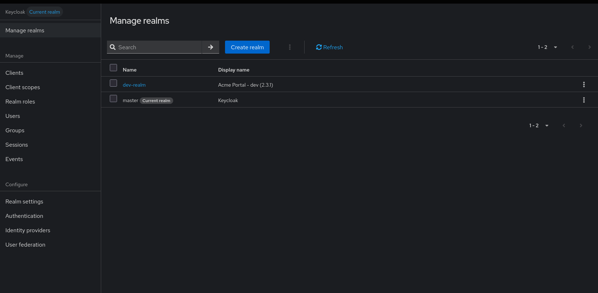

# JavaScript Substitution

JavaScript substitution allows you to use JavaScript expressions to dynamically generate configuration values. This enables complex logic, calculations, and transformations that go beyond simple variable replacement.

## Enabling JavaScript Substitution

To enable JavaScript substitution, use the following configuration:

```bash
--import.var-substitution.script-evaluation-enabled=true
```

#### Or via command line

```bash
export IMPORT_VAR_SUBSTITUTION_SCRIPT_EVALUATION_ENABLED=true
```

## Syntax

JavaScript substitution uses the following syntax:

- For string substitution: `$(javascript:expression)`
- For script evaluation: `$${javascript:expression}`

The difference is:
- `$(javascript:...)` always returns a string
- `$${javascript:...)` can return any JSON type (string, number, boolean, array, object)

## Available Context

### Environment Variables

Access environment variables using the `env` object:

```json
{
  "realm": "$${javascript: 'realm-' + (env.APP_ENV || 'default').toLowerCase()}",
  "enabled": "$${javascript: env.APP_ENV !== 'maintenance'}"
}
```

### Date Operations

Use standard JavaScript Date operations:

```json
{
  "timestamp": "$(javascript:new Date().toISOString())",
  "year": "$(javascript:new Date().getFullYear())"
}
```

### System Properties

Access Java system properties:

```json
{
  "clientId": "$(javascript:system.getProperty('client.id') || 'default-client')"
}
```

## Performance Considerations

### Efficient JavaScript

- Keep expressions simple and fast
- Avoid complex loops in large arrays
- Cache expensive operations

### Example: Efficient vs Inefficient

Efficient - simple operations

```json
{
  "realm": "$(javascript:env.REALM_NAME || 'default')",
  "enabled": "$(javascript:env.ENVIRONMENT !== 'test')"
}

```

Complex - avoid

```json
{
  "users": "$(javascript:" +
    "  // This creates 1000 users and may be slow" +
    "  const users = [];" +
    "  for (let i = 0; i < 1000; i++) {" +
    "    users.push(/* complex user object */);" +
    "  }" +
    "  return users;" +
    ")"
} 
```

## Best Practices

1. **Keep it Simple**: Use JavaScript only when necessary
2. **Provide Defaults**: Always have fallback values
3. **Validate Input**: Check and validate environment variables
4. **Test Thoroughly**: Use dry-run mode before production
5. **Document Logic**: Comment complex expressions
6. **Consider Performance**: Avoid expensive operations
7. **Use Type Coercion**: Explicitly convert types when needed
8. **Handle Errors**: Implement proper error handling
9. **Avoid Side Effects**: Keep expressions pure and predictable
10. **Security First**: Never expose sensitive data in expressions

---

## Complete Example

### Comprehensive Configuration

### Step 1: Create an `.env` file

Create a file named `.env`:

```bash
export ENVIRONMENT='dev'
export APP_NAME='Acme Portal'
export APP_VERSION='2.3.1'
export COMPANY='Acme Inc'
export APP_URL='http://localhost:3000'
export CLIENT_SECRET='change-me'
export DEFAULT_PASSWORD='password123'
```

Load it:

```bash
source .env
```

### Step 2: Create a JSON file with JavaScript substitution

Create `realm-js.json`:

```json
{
  "realm": "$${javascript: (env.ENVIRONMENT === 'dev') ? 'dev-realm' : (env.ENVIRONMENT === 'staging') ? 'staging-realm' : (env.ENVIRONMENT === 'prod') ? 'prod-realm' : 'default-realm'}",
  "displayName": "$${javascript: (env.APP_NAME || 'My App') + ' - ' + (env.ENVIRONMENT || 'dev') + ' (' + (env.APP_VERSION || '1.0.0') + ')'}",
  "enabled": "$${javascript: env.ENVIRONMENT !== 'maintenance'}",
  "sslRequired": "$${javascript: ['prod', 'production', 'staging'].includes(env.ENVIRONMENT) ? 'all' : 'none'}",
  "registrationAllowed": "$${javascript: env.ENVIRONMENT === 'development'}",
  "attributes": {
    "version": "$${javascript: env.APP_VERSION || '1.0.0'}",
    "deployed_at": "$${javascript: new Date().toISOString()}",
    "company": "$${javascript: env.COMPANY || 'Default Company'}"
  },
  "roles": {
    "realm": [
      {
        "name": "$${javascript: 'role-user-' + (env.ENVIRONMENT || 'dev')}",
        "description": "$${javascript: 'Default user role for ' + (env.ENVIRONMENT || 'dev')}"
      },
      {
        "name": "$${javascript: 'role-admin-' + (env.ENVIRONMENT || 'dev')}",
        "description": "$${javascript: 'Admin role for ' + (env.APP_NAME || 'My App')}"
      }
    ]
  },
  "groups": [
    {
      "name": "$${javascript: 'team-' + (env.ENVIRONMENT || 'dev')}"
    }
  ],
  "users": [
    {
      "username": "$${javascript: 'demo-user-' + (env.ENVIRONMENT || 'dev')}",
      "email": "$${javascript: 'demo-user-' + (env.ENVIRONMENT || 'dev') + '@example.com'}",
      "enabled": true,
      "firstName": "Demo",
      "lastName": "User",
      "realmRoles": ["$${javascript: 'role-user-' + (env.ENVIRONMENT || 'dev')}"],
      "credentials": [
        {
          "type": "password",
          "value": "$${javascript: env.DEFAULT_PASSWORD || 'password123'}",
          "temporary": false
        }
      ]
    },
    {
      "username": "$${javascript: 'demo-admin-' + (env.ENVIRONMENT || 'dev')}",
      "email": "$${javascript: 'demo-admin-' + (env.ENVIRONMENT || 'dev') + '@example.com'}",
      "enabled": true,
      "firstName": "Demo",
      "lastName": "Admin",
      "realmRoles": ["$${javascript: 'role-admin-' + (env.ENVIRONMENT || 'dev')}"],
      "credentials": [
        {
          "type": "password",
          "value": "$${javascript: env.DEFAULT_PASSWORD || 'password123'}",
          "temporary": false
        }
      ]
    }
  ],
  "clients": [
    {
      "clientId": "$${javascript: 'app-' + (env.ENVIRONMENT || 'dev')}",
      "name": "$${javascript: (env.APP_NAME || 'My App') + ' Client'}",
      "description": "$${javascript: 'imported_from=' + (env.USER || 'cli') + '_at_' + new Date().toISOString()}",
      "enabled": true,
      "publicClient": false,
      "standardFlowEnabled": true,
      "directAccessGrantsEnabled": true,
      "secret": "$${javascript: env.CLIENT_SECRET || 'change-me'}",
      "redirectUris": [
        "$${javascript: (env.APP_URL || 'https://example.com') + '/callback'}",
        "$${javascript: (env.APP_URL || 'https://example.com') + '/silent-renew'}"
      ],
      "webOrigins": [
        "$${javascript: env.APP_URL || 'https://example.com'}"
      ]
    }
  ]
}
```

### Step 3: Run keycloak-config-cli (JAR)

Make sure JavaScript evaluation is enabled:

```bash
java -jar ./target/keycloak-config-cli.jar \
  --keycloak.url="http://<your-keycloak-url>" \
  --keycloak.user="<your-username>" \
  --keycloak.password="<your-password>" \
  --import.var-substitution.enabled=true \
  --import.var-substitution.script-evaluation-enabled=true \
  --import.files.locations=realm-js.json
```

### Step 4: Verify

You can enter the Realm and confirm the values

<br />



<br />

- **Realm** `dev-realm` exists
- **Display name** starts with `Acme Portal - dev` and ends with the version in parentheses, e.g. `(2.3.1)`
- **Realm settings**:
  - **Enabled** is `true`
  - **SSL required** is `none`
  - **User registration** is `false`
- **Client** `app-dev` exists
- **Client description** starts with `imported_from=` and contains a timestamp like `2026-04-23T15:59:48.123Z`
- **Redirect URIs** contain:
  - `http://localhost:3000/callback`
  - `http://localhost:3000/silent-renew`
- **Users** `demo-user-dev` and `demo-admin-dev` exist
- **Realm attributes** include:
  - `environment=dev`
  - `version=2.3.1`
  - `company=Acme Inc`

---

## Next Steps

- [Environment Variables](environment-variables.md) - Environment variable management
- [File Operations](file-operations.md) - File content and properties
- [Encoding & Decoding](encoding-decoding.md) - Base64 and URL operations
- [Network Operations](network-operations.md) - DNS and URL content
- [Java Integration](java-integration.md) - Java constants and version
- [System Information](system-information.md) - Date and localhost information
- [Configuration](../config/overview.md) - General configuration options
